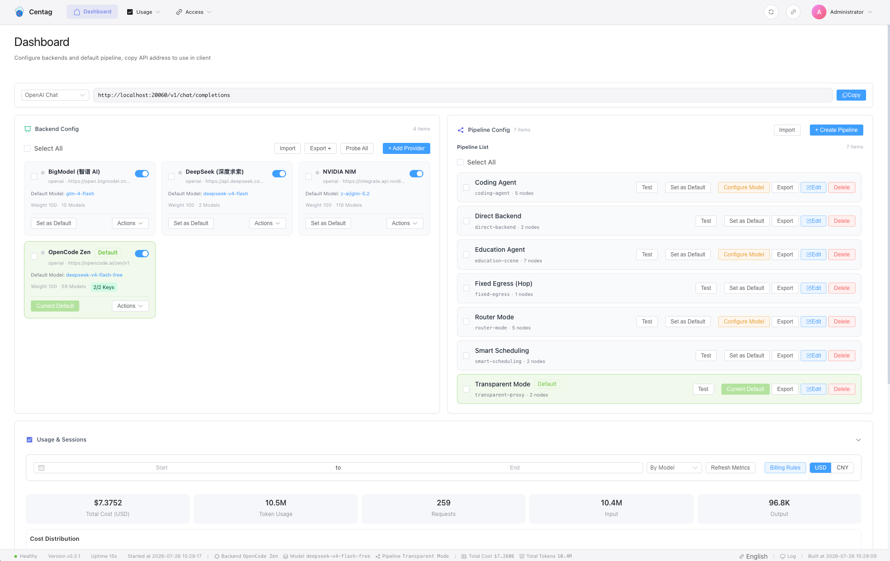
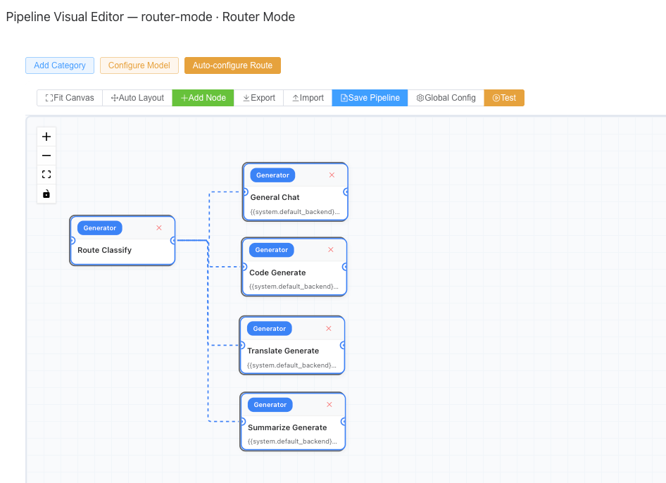
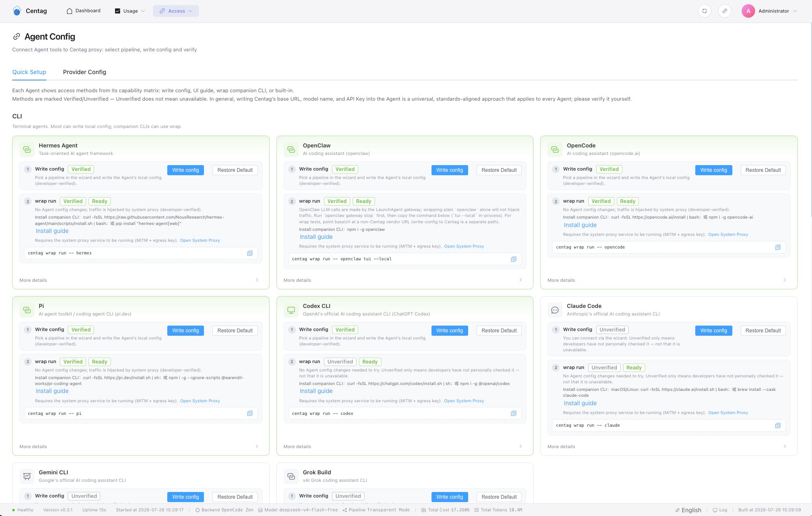
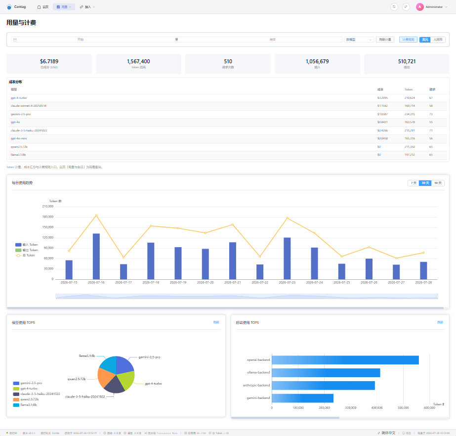

# Centag

<p align="center">
  <strong>Your LLM Proxy Hub — Pipelines as Strategy</strong><br/>
  A universal LLM proxy gateway. Unify backend providers, API key pools, and custom proxy strategies; define client Agent behavior with customizable pipelines and an open plugin architecture.<br/>
  <em>It can act as a relay — but it is more than a relay.</em>
</p>

<p align="center">
  <a href="https://github.com/atoml-ai/centag/blob/main/LICENSE"></a>
  
  <a href="https://github.com/atoml-ai/centag/releases"></a>
  <a href="https://github.com/atoml-ai/centag/releases"></a>
</p>

<p align="center">
  English | <a href="README.zh-CN.md">简体中文</a> | <a href="README.ja.md">日本語</a> | <a href="README.ko.md">한국어</a> | <a href="README.ru.md">Русский</a> | <a href="README.es.md">Español</a>
</p>

---

## The Problem We Solve

A typical LLM “relay” only forwards requests as-is. When a key dies you swap it by hand; when the model is wrong you reconfigure; every new Agent means another round of setup — strategy lives in each tool, not in the gateway.

**Centag is not just a relay — it is an orchestratable proxy hub:** backend pools, failover and degradation, scenario routing, and metering all converge in one pipeline, with almost no Agent-side awareness.

| Capability | What you get |
|---|---|
| **Backend LLM pool management** | OpenAI, Anthropic, Zhipu, Ollama, and any compatible endpoint in one place; multi-key, multi-backend config in the Web UI |
| **Auto failover · matching · degradation** | Rotate keys on rate limits; switch backends on failure; match the best egress by model capability and load |
| **Model routing** | Switch backend models in real time by question type — even within the same session and task — with no client reconfiguration |
| **Agent scenario switching** | Coding, Q&A, and other scenarios each get a pipeline — change scenario = change strategy, Agents stay unaware |
| **Fast Agent onboarding** | One-click config write for common Agents; or zero-change `centag wrap` process proxy; UI setup guides for Agents not yet one-click ready. Supported list keeps growing |
| **System Prompt strategy** | Passthrough, append, or replace the client system prompt — keep the Agent persona, layer gateway rules, or enforce a unified prompt at pipeline level |
| **Metering & billing** | Track tokens and cost per request, backend, and model |
| **High-performance lossless access** | Transparent forward and SSE passthrough — protocol-compatible, low overhead, minimal rewrite of upstream semantics |

---

## Why Centag

### Visual pipeline orchestration

Relays only forward. **Centag lets you design the full request lifecycle** — drag-and-drop a DAG on the canvas; the pipeline *is* your strategy.

**16 built-in node types**, freely combinable:

| Node | Kind | What it does |
|------|------|--------------|
| Generator | `llm.generate` | Call any LLM backend to generate content |
| Router | `route.decide` | Branch by intent, keyword, or LLM classification |
| Scheduler | `scheduling.decide` | Smart scheduling and matching across backends |
| Transparent Forward | `proxy.transparent_forward` | Raw HTTP proxy (SSE passthrough) |
| Aggregator | `aggregate.merge` | Merge / vote / pick best from parallel generators |
| Reviewer | `quality.review` | Score and audit upstream answers |
| Memory | `memory.query` | Recall context from cloud memory / local vectors |
| Audit | `audit.safety` | Content moderation and safety filtering |
| Token Usage | `metrics.token_usage` | Track token usage and cost |
| Cache | `cache.access` | Cache read/write (exact / semantic / hybrid) |
| Processor | `content.transform` | Content transform and post-processing |
| Tool Call | `inject.tool_call` | Inject function-calling tools |
| Prompt Ops | `prompt.ops` | User prompt preprocessing |
| Output Post-ops | `prompt.postprocess` | Output post-processing |
| Loop Controller | — | Loop control for iterative workflows |
| Plugin Node | *(remote / business)* | Custom nodes via HTTP or Go SDK |

**Pipeline = Strategy.** Switch scenario → switch pipeline → Agent unchanged.

| Scenario | Pipeline example |
|----------|------------------|
| Coding assistant | Router → code-specialized model → code review |
| Smart scheduling | Intent → model-capability match → failover |
| Enterprise compliance | Safety audit → generate → PII redact → compliance audit |
| Support / RAG | Memory or retrieval → generate → quality review |

### Unified backends & key pools

| Capability | Details |
|------------|---------|
| **Multi-backend management** | Major providers and OpenAI-compatible endpoints, managed in one Web UI |
| **API key pooling** | Multiple keys per backend; auto-rotate on rate limit or outage |
| **Auto failover & degradation** | Key fails → next key; backend fails → next backend |
| **Smart matching** | Weights, priorities, model-capability matching for the best egress |
| **Cost tracking** | Tokens and cost per request, backend, and model |

### Fast Agent onboarding — three ways

Connect an Agent to Centag without changing business code. Pick by adaptation level:

| Method | Best for | Details |
|--------|----------|---------|
| **One-click config write** | Common Agents already adapted | Web UI writes Base URL / API Key, ready to use |
| **centag wrap process proxy** | Zero config changes | Process-level transparent proxy; route traffic to Centag without touching Agent config or code |
| **UI setup guide** | Agents not yet one-click | In-page step-by-step instructions to point at the gateway |

Common Agents keep being added; others can use the guide or wrap first.

```bash
# Start Centag
centag

# wrap example — no Agent config changes
centag wrap run -- opencode

# Health check
centag wrap doctor
```

### Open plugin ecosystem

Pipeline nodes are extensible: local Go SDK plugins, or remote HTTP plugins in any language.

```go
type NodePlugin interface {
    Descriptor() NodePluginDescriptor
    ValidateConfig(config NodeConfig) error
    Execute(ctx context.Context, req *NodeExecutionRequest) (*NodeExecutionResponse, error)
}
```

Remote plugin contract:

```
GET  /.well-known/centag-node-plugin.json   →  auto-discovery
POST /validate                               →  config validation
POST /execute                                →  run the node
```

---

## Quickstart

```bash
# 1. Install (pick one)
curl -fsSL https://raw.githubusercontent.com/atoml-ai/centag/main/scripts/install.sh | bash
# or
npm install -g @atomlai/centag

# 2. Start
centag

# 3. Open Web UI → http://localhost:20060 → add your first backend

# 4. Connect an Agent (one-click config, or wrap with zero changes)
centag wrap run -- opencode
```

Done. Traffic flows through Centag: shared backend pools, failover, model routing, cost visibility.

> **Default login credentials:** username `admin` / password `centag123`
> (change after first login; override via `LLM_PROXY_ADMIN_PASSWORD` before first start)

### Other install methods

<details>
<summary>npm (without changing global paths)</summary>

```bash
npx --yes @atomlai/centag
```
</details>

<details>
<summary>Offline / air-gapped</summary>

```bash
npm install -g @atomlai/centag-offline
```
</details>

<details>
<summary>Docker (from source)</summary>

```bash
git clone https://github.com/atoml-ai/centag.git
cd centag
cp config/secrets/.env.example config/secrets/.env   # edit secrets as needed
./start.sh docker build personal                     # build image
./start.sh docker up personal                        # start container
```

Admin UI: http://localhost:20060 · Stop: `./start.sh docker down`

所有持久化数据在 `deploy/docker/data/` 目录（首次启动自动创建）。

<details>
<summary>Native Docker commands (alternative)</summary>

```bash
# Build
docker build -t centag-personal:latest \
  --build-arg DIST_NAME=personal \
  --build-arg INCLUDE_FRONTEND=true \
  -f deploy/docker/Dockerfile.dist .

# Run
docker run -d --name centag \
  --env-file config/secrets/.env \
  -e CENTAG_EDITION=personal \
  -e LLM_PROXY_DB_DRIVER=sqlite \
  -e SQLITE_PATH=/app/storage/centag.db \
  -e LLM_PROXY_LOG_OUTPUT=both \
  -e LLM_PROXY_LOG_FORMAT=console \
  -p 20060:20060 \
  -v $(pwd)/deploy/docker/data/storage:/app/storage \
  -v $(pwd)/deploy/docker/data/logs:/app/logs \
  centag-personal:latest

# Stop & remove
docker stop centag && docker rm centag
```

</details>
</details>

---

## Screenshots

<p align="center">
  <strong>Dashboard</strong><br/>
  
</p>

<p align="center">
  <strong>Pipeline Visual Editor</strong><br/>
  
</p>

<p align="center">
  <strong>Agent Config</strong><br/>
  
</p>

<p align="center">
  <strong>Token Usage & Billing</strong><br/>
  
</p>

---

## Proxy modes — ready to use

Built-in scenario pipeline templates (switch with `#` shortcuts):

| Mode | Shortcut | What it does |
|------|----------|--------------|
| Smart scheduling | (default) | Intelligent routing by model compatibility and backend load |
| Transparent proxy | `#t` | Pass through as-is — high-performance lossless, no system prompt injection |
| Direct backend | `#d` | Fixed egress + managed system prompt |
| Fallback | `#f` | Automatic degradation across backends |
| Router | `#r` | Intent-aware multi-branch routing (scenario / model auto-switch) |
| Audit | `#a` | Generate → quality audit → feedback |
| Optimize | `#o` | Generate → content optimization |
| Aggregator | `#ag` | Parallel multi-model generation → merge |
| Security firewall | `#sec` | Safety audit → generate → PII redact |
| RAG gateway | `#rag` | Cache-first retrieval-augmented generation |
| Geo routing | `#geo` | Rule-based region routing |
| Pi Agent | `#pi` | Code tasks → sandbox; Q&A → LLM |
| CI/CD Webhook | — | Trigger pipelines from external systems |

The real highlight is **custom pipelines** — design your own DAG on the canvas.

---

## Documentation

| Topic | Link |
|-------|------|
| Full docs index | [docs/README.md](docs/README.md) |
| Pipeline plugin standard | [docs/guide/pipeline-plugin-standard.md](docs/guide/pipeline-plugin-standard.md) |
| Processor plugins | [docs/guide/processor-plugins.md](docs/guide/processor-plugins.md) |
| Pipeline variables | [docs/guide/pipeline-variables.md](docs/guide/pipeline-variables.md) |
| Proxy modes | [docs/guide/proxy-modes.md](docs/guide/proxy-modes.md) |
| Backend configuration | [docs/guide/backend-configuration.md](docs/guide/backend-configuration.md) |
| Local proxy / wrap | [docs/guide/system-proxy-egress.md](docs/guide/system-proxy-egress.md) |
| Environment variables | [docs/guide/environment-variables.md](docs/guide/environment-variables.md) |
| API reference | [docs/api/API_REFERENCE.md](docs/api/API_REFERENCE.md) |
| Architecture | [docs/architecture/](docs/architecture/) |
| Security | [docs/security/](docs/security/) |

---

## Feedback & Support

Questions or suggestions? Open a [GitHub Issue](https://github.com/atoml-ai/centag/issues) or email **centag@atoml.com**.

---

## Contributing

Developers are welcome to help build and maintain Centag. Whether you fix bugs, add features, improve docs, or adapt more Agents — join via [Pull Requests](https://github.com/atoml-ai/centag/pulls) or [Issues](https://github.com/atoml-ai/centag/issues).

---

## License

MIT License (open-source editions: `minimal` / `personal`)
