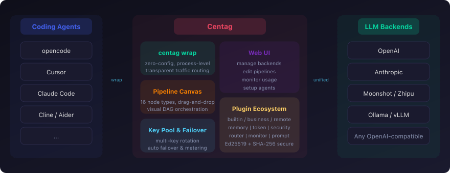
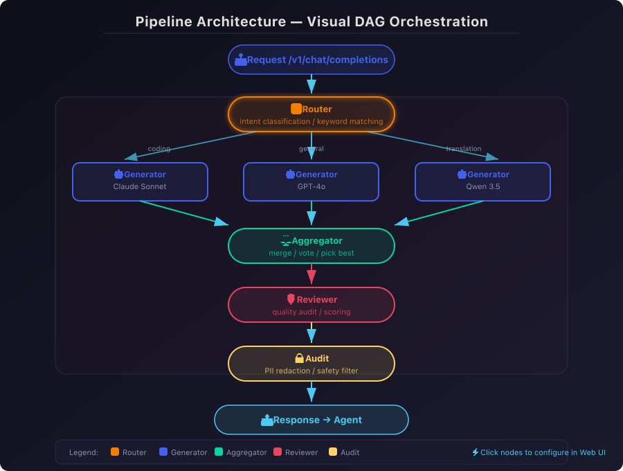
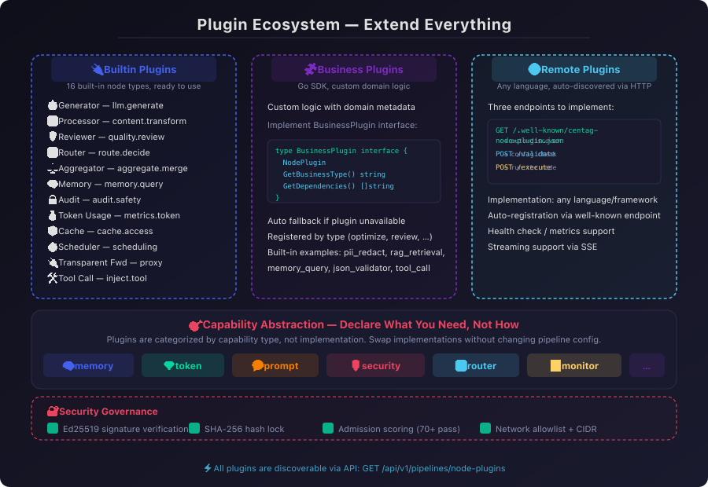
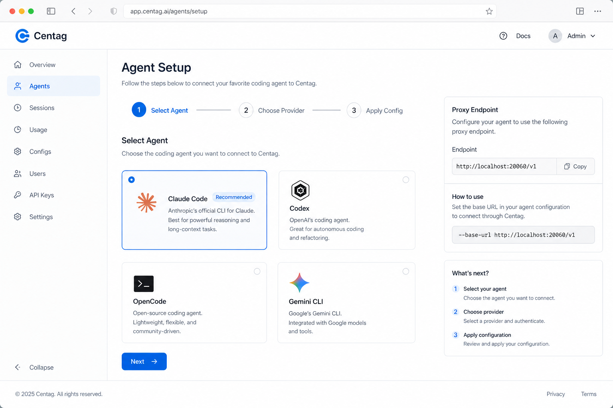
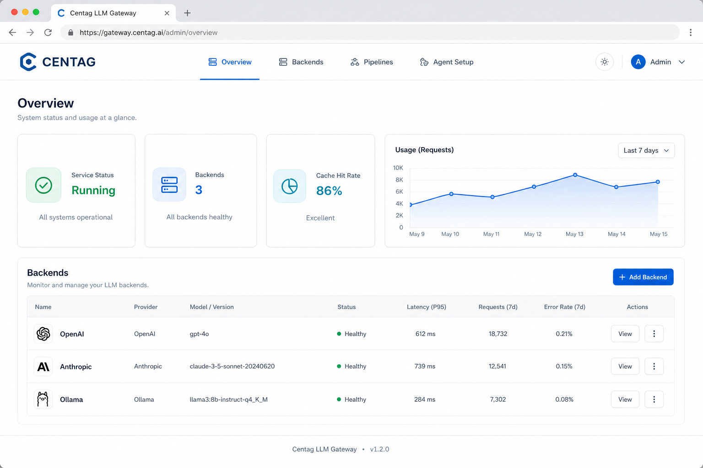

# Centag

<p align="center">
  <strong>Ваш LLM-прокси-хаб — пайплайн как стратегия</strong><br/>
  Универсальный шлюз-прокси для больших моделей. Единое управление провайдерами бэкендов, пулами API-ключей и настраиваемыми стратегиями прокси; поведение клиентских агентов задаётся кастомными пайплайнами и открытой плагинной архитектурой.<br/>
  <em>Может быть ретранслятором — но не только ретранслятором.</em>
</p>

<p align="center">
  <a href="https://github.com/atoml-ai/centag/blob/main/LICENSE"></a>
  
  <a href="https://github.com/atoml-ai/centag/releases"></a>
  <a href="https://github.com/atoml-ai/centag/releases"></a>
</p>

<p align="center">
  <a href="README.md">English</a> | <a href="README.zh-CN.md">简体中文</a> | <a href="README.ja.md">日本語</a> | <a href="README.ko.md">한국어</a> | Русский | <a href="README.es.md">Español</a>
</p>



---

## Какую задачу решаем

Типичный LLM-«ретранслятор» лишь пересылает запросы как есть. Ключ упал — меняете вручную; модель не та — снова настраиваете; каждый новый агент — ещё один круг конфигурации. Стратегия размазана по инструментам, у шлюза её нет.

**Centag — не ретранслятор, а оркестрируемый прокси-хаб:** пулы бэкендов, failover и деградация, маршрутизация по сценариям, учёт и биллинг сходятся в одном пайплайне; со стороны агента почти незаметно.

| Возможность | Что получаете |
|---|---|
| **Пул бэкендов LLM** | OpenAI, Anthropic, Zhipu, Ollama и любые совместимые endpoint в одном месте; несколько ключей и бэкендов — в Web UI |
| **Авто-failover · подбор · деградация** | Ротация ключей при лимитах; смена бэкенда при сбое; лучший egress по возможностям модели и нагрузке |
| **Маршрутизация моделей** | Переключение бэкенд-моделей в реальном времени по типу вопроса — даже в рамках одной сессии и задачи — без перенастройки клиента |
| **Смена сценариев агента** | Кодинг, Q&A и др. — у каждого свой пайплайн: смена сценария = смена стратегии, агент не замечает |
| **Быстрое подключение агента** | Однокнопочная запись конфига для распространённых агентов; или `centag wrap` без правок; для остальных — пошаговый гид в Web UI. Список поддержки растёт |
| **Стратегия System Prompt** | Пропуск, дополнение или замена клиентского system prompt — сохранить persona агента, наложить правила шлюза или единую замену на уровне пайплайна |
| **Учёт и биллинг** | Токены и стоимость по запросу, бэкенду и модели |
| **Высокопроизводительный lossless-доступ** | Прозрачный forward и SSE passthrough — совместимость протоколов, низкий overhead, минимум переписывания семантики upstream |

---

## Сильные стороны

### Визуальная оркестрация пайплайнов

Ретранслятор только форвардит. **Centag даёт спроектировать полный жизненный цикл запроса** — DAG на холсте drag-and-drop; пайплайн и есть стратегия.



**16 встроенных типов узлов**, свободно комбинируемых:

| Узел | Kind | Назначение |
|------|------|------------|
| Generator | `llm.generate` | Вызов любого LLM-бэкенда для генерации |
| Router | `route.decide` | Ветвление по намерению, ключевым словам или классификации LLM |
| Scheduler | `scheduling.decide` | Умное планирование и подбор между бэкендами |
| Transparent Forward | `proxy.transparent_forward` | Сырой HTTP-прокси (SSE passthrough) |
| Aggregator | `aggregate.merge` | Слияние / голосование / выбор лучшего из параллельных генераторов |
| Reviewer | `quality.review` | Оценка и аудит ответов upstream |
| Memory | `memory.query` | Контекст из облачной памяти / локальных векторов |
| Audit | `audit.safety` | Модерация и фильтры безопасности |
| Token Usage | `metrics.token_usage` | Учёт токенов и стоимости |
| Cache | `cache.access` | Кэш (точный / семантический / гибридный) |
| Processor | `content.transform` | Преобразование и постобработка контента |
| Tool Call | `inject.tool_call` | Внедрение инструментов Function Calling |
| Prompt Ops | `prompt.ops` | Предобработка user prompt |
| Output Post-ops | `prompt.postprocess` | Постобработка вывода |
| Loop Controller | — | Циклы для итеративных workflow |
| Plugin Node | *(remote / business)* | Свои узлы через HTTP или Go SDK |

**Пайплайн = стратегия.** Смена сценария → смена пайплайна → код агента без изменений.

| Сценарий | Пример пайплайна |
|----------|------------------|
| Ассистент по коду | Роутер → модель под код → code review |
| Умное планирование | Намерение → подбор по возможностям → failover |
| Корпоративный compliance | Safety → generate → PII redact → audit |
| Поддержка / RAG | Память или retrieval → generate → quality review |

### Единые бэкенды и пулы ключей

| Возможность | Описание |
|-------------|----------|
| **Мульти-бэкенд** | Крупные провайдеры и OpenAI-совместимые endpoint — в одном Web UI |
| **Пулинг API-ключей** | Несколько ключей на бэкенд; авто-ротация при лимитах или сбоях |
| **Авто-failover и деградация** | Ключ упал → следующий; бэкенд упал → следующий |
| **Умный подбор** | Веса, приоритеты, соответствие возможностям модели |
| **Учёт стоимости** | Токены и деньги по запросу, бэкенду и модели |

### Быстрое подключение агента — три способа

Подключить агента к Centag без правок бизнес-кода. Выберите по уровню адаптации:

| Способ | Когда | Описание |
|--------|-------|----------|
| **Однокнопочная запись конфига** | Уже поддержанные популярные агенты | Web UI записывает Base URL / API Key и т.п. |
| **Процессный прокси centag wrap** | Нулевые правки конфига | Прозрачный прокси на уровне процесса; трафик в Centag без изменений конфига и кода агента |
| **Гид в UI** | Пока нет one-click | Пошаговая инструкция, как вручную направить на шлюз |

Список популярных агентов расширяется; остальные можно подключить через гид или wrap.

```bash
# Запуск Centag
centag

# Пример wrap — без правок конфига агента
centag wrap run -- opencode

# Самопроверка
centag wrap doctor
```

### Открытая экосистема плагинов

Узлы пайплайна расширяемы: локальные плагины на Go SDK или удалённые HTTP-плагины на любом языке.



```go
type NodePlugin interface {
    Descriptor() NodePluginDescriptor
    ValidateConfig(config NodeConfig) error
    Execute(ctx context.Context, req *NodeExecutionRequest) (*NodeExecutionResponse, error)
}
```

Контракт удалённого плагина:

```
GET  /.well-known/centag-node-plugin.json   →  автообнаружение
POST /validate                               →  проверка конфига
POST /execute                                →  выполнение узла
```

---

## Быстрый старт

```bash
# 1. Установка (любой способ)
curl -fsSL https://raw.githubusercontent.com/atoml-ai/centag/main/scripts/install.sh | bash
# или
npm install -g @atomlai/centag

# 2. Запуск
centag

# 3. Web UI → http://localhost:20060 → добавить первый бэкенд

# 4. Подключить агента (one-click или wrap без правок)
centag wrap run -- opencode
```

Готово. Трафик через Centag: общие пулы бэкендов, failover, маршрутизация моделей, видимость затрат.

### Другие способы установки

<details>
<summary>npm (без изменения глобальных путей)</summary>

```bash
npx --yes @atomlai/centag
```
</details>

<details>
<summary>Офлайн / закрытая сеть</summary>

```bash
npm install -g @atomlai/centag-offline
```
</details>

<details>
<summary>Docker (из исходников)</summary>

```bash
git clone https://github.com/atoml-ai/centag.git
cd centag
cp config/secrets/.env.example config/secrets/.env   # при необходимости отредактируйте
./start.sh docker up                                 # по умолчанию: personal
```

Админка: http://localhost:20060 · Остановка: `./start.sh docker down`
</details>

---

## Скриншоты

| Холст пайплайна | Подключение Agent |
|-----------------|-------------------|
|  |  |

| Панель | Плагины узлов |
|--------|---------------|
|  |  |

---

## Режимы прокси — из коробки

Встроенные шаблоны пайплайнов по сценариям (переключение шорткатами `#`):

| Режим | Шорткат | Описание |
|-------|---------|----------|
| Умное планирование | (по умолчанию) | Маршрутизация по совместимости модели и нагрузке бэкенда |
| Прозрачный прокси | `#t` | Как есть — высокопроизводительный lossless, без инъекции system prompt |
| Прямой бэкенд | `#d` | Фиксированный egress + управляемый system prompt |
| Fallback | `#f` | Автодеградация между бэкендами |
| Роутер | `#r` | Многоветвевая маршрутизация по намерению (сценарий / модель) |
| Аудит | `#a` | Generate → quality audit → feedback |
| Оптимизация | `#o` | Generate → оптимизация контента |
| Агрегатор | `#ag` | Параллельная мультимодельная генерация → merge |
| Security firewall | `#sec` | Safety → generate → PII redact |
| RAG-шлюз | `#rag` | Cache-first retrieval-augmented generation |
| Geo-routing | `#geo` | Региональная маршрутизация по правилам |
| Pi Agent | `#pi` | Код → sandbox; Q&A → LLM |
| CI/CD Webhook | — | Запуск пайплайнов из внешних систем |

Главный плюс — **свои пайплайны**: проектируйте DAG на холсте.

---

## Документация

| Тема | Ссылка |
|------|--------|
| Полный индекс | [docs/README.md](docs/README.md) |
| Стандарт плагинов пайплайна | [docs/guide/pipeline-plugin-standard.md](docs/guide/pipeline-plugin-standard.md) |
| Плагины Processor | [docs/guide/processor-plugins.md](docs/guide/processor-plugins.md) |
| Переменные пайплайна | [docs/guide/pipeline-variables.md](docs/guide/pipeline-variables.md) |
| Режимы прокси | [docs/guide/proxy-modes.md](docs/guide/proxy-modes.md) |
| Конфигурация бэкендов | [docs/guide/backend-configuration.md](docs/guide/backend-configuration.md) |
| Локальный прокси / wrap | [docs/guide/system-proxy-egress.md](docs/guide/system-proxy-egress.md) |
| Переменные окружения | [docs/guide/environment-variables.md](docs/guide/environment-variables.md) |
| Справочник API | [docs/api/API_REFERENCE.md](docs/api/API_REFERENCE.md) |
| Архитектура | [docs/architecture/](docs/architecture/) |
| Безопасность | [docs/security/](docs/security/) |

---

## Обратная связь и поддержка

Вопросы и предложения: [GitHub Issues](https://github.com/atoml-ai/centag/issues) или **centag@atoml.com**.

---

## Участие в разработке

Приглашаем разработчиков вместе развивать и поддерживать Centag. Багфиксы, фичи, документация, адаптация новых агентов — через [Pull Requests](https://github.com/atoml-ai/centag/pulls) или [Issues](https://github.com/atoml-ai/centag/issues).

---

## Лицензия

MIT License (открытые редакции: `minimal` / `personal`)
