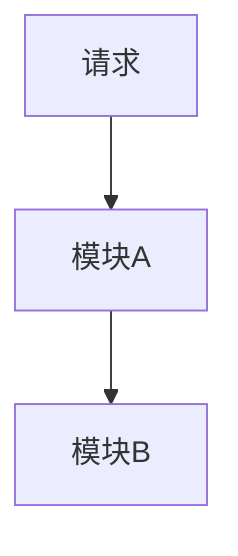

# 技术方案 — <需求名称>

> 版本：v<X.Y> | 日期：<YYYY-MM-DD> | 作者：<姓名/AI>

## 1. 背景与目标

### 1.1 问题描述

<!-- 描述当前的痛点或需求背景 -->

### 1.2 目标

<!-- 明确本方案要解决的核心问题 -->

### 1.3 非目标

<!-- 明确本轮不做的事项，防止范围膨胀 -->

## 2. 方案选型

### 2.1 候选方案对比

| 方案 | 优点 | 缺点 | 推荐 |
|------|------|------|------|
| 方案 A | ... | ... | ⭐ |
| 方案 B | ... | ... | |

### 2.2 选定方案

<!-- 说明为什么选择该方案 -->

## 3. 详细设计

### 3.1 接口设计

<!-- API 路径、请求/响应结构、配置项变更 -->

### 3.2 数据模型

<!-- 新增/修改的数据结构、数据库表变更 -->

### 3.3 模块影响

<!-- 涉及的 internal/ 模块及变更范围 -->

### 3.4 流程图（可选）

## 4. 兼容性与迁移

<!-- 向后兼容性考虑、数据迁移方案（若有） -->

## 5. 风险与应对

> **方案级**风险摘要（选型、架构、兼容）。**开发实现风险**必须另写独立产物：  
> `docs/versions/<版本>/<需求>/开发风险评估.md`（模板：`docs/harness/templates/开发风险评估模板.md`）。  
> Gate 1 以独立「开发风险评估」为准，不可仅用本节代替。

| 风险 | 影响 | 概率 | 应对策略 |
|------|------|------|---------|
| ... | ... | ... | ... |

## 6. 附录

<!-- 补充资料、参考链接 -->
