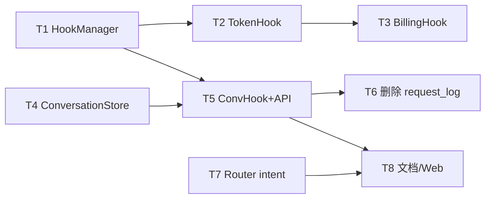

# 任务计划 — 钩子增值能力

> 来源方案：`docs/versions/v0.2.2/钩子增值能力/技术方案.md`  
> 风险评估：`docs/versions/v0.2.2/钩子增值能力/开发风险评估.md`  
> 分支：`feature/v0.2.2` | 日期：2026-07-17

## 开发风险与任务映射

| 风险 ID | 等级 | 归属任务 | 验收如何覆盖 |
|---------|------|----------|--------------|
| R01 | High | T2 | 单请求仅 1 条 usage |
| R02 | High | T1/T3/T5 | fail-open + 异步写测试 |
| R03 | High | T7 | IntentResolver；无循环依赖 |
| R04 | High | T6 | `rg` 清零 |
| R05 | High | T5 | stream 完成后写 message |
| R08 | High | T5 | 用户隔离 httptest |
| R06–R07,R09–R12 | Med/Low | 见风险评估 §4 | 对应任务验收 |

## 执行约束

- **可改文件**：
  - `core/pkg/hooks/**`
  - `core/internal/conversation/**`（新建）
  - `core/internal/tokenusage/**`、`core/internal/billing/**`
  - `core/internal/logging/**`（删除 request_log 相关）
  - `core/pkg/database/**`（conversation 迁移；删除 user_request_log）
  - `core/pkg/pipeline/**`（router 策略、钩子触发点若在此）
  - `core/internal/proxy/**`、`core/pkg/server/**`、`core/pkg/entrypoint/**`
  - `core/pkg/scheduler/**`（IntentResolver 暴露/轻量分类接口，控制面）
  - `config/initdata/pipeline-templates/**`
  - `dist/**`（仅必要时补注册）
  - `web/**`（会话列表最小页，P1）
  - `docs/api/**`、`docs/guide/**`、`docs/versions/v0.2.2/**`、`docs/harness/INTERFACES.md`（若有接口清单变更）
- **不可改文件**：无关重构、密钥、`deploy/stack` 大改、垂直业务专用路由
- **遵循规范**：`docs/harness/CONVENTIONS.md`、`ARCHITECTURE.md`、`CAPABILITY_BOUNDARY.md`、接口边界（禁止业务专用代理接口）
- **移植优先**：对照 `/Users/caijun/workspaces/proxyclaw` 已有实现再接线

## 功能点清单

| ID | 功能点 | 对应目标 |
|----|--------|----------|
| F1 | 钩子框架默认实现与主链路接线 | G1 |
| F2 | Token 计量经钩子统一 + 发行版行为 | G1 |
| F3 | Team 计费/配额经 BillingHook | G1 |
| F4 | ConversationStore 抽象 + file/sqlite/pg | G2 |
| F5 | 对话钩子写入 + Session API 浏览 | G2/G3 |
| F6 | 删除旧 request_log 代码与迁移收敛 | G2 |
| F7 | Router `keyword_then_intent` | G4 |
| F8 | 文档 / 模板 /（可选）Web 最小列表 | G3/G4 |

## 建议执行顺序

```text
T1 钩子 Manager
 → T2 TokenHook 接线
 → T3 BillingHook（team）
 → T4 ConversationStore 三后端
 → T5 ConversationHook + HTTP API
 → T6 删除 request_log
 → T7 Router keyword_then_intent
 → T8 文档与模板（Web 可并行于 T5 之后）
```

---

## 任务列表

### 任务 1：实现 DefaultHookManager 并组装到 Server

| 属性 | 值 |
|------|----|
| 功能点 | F1 |
| 前置依赖 | 无 |
| 难度 | M |
| 关联风险 | R02 |
| 验收标准 | `go test ./core/pkg/hooks/...` 通过；Server 启动日志可见 HookManager 已注册；单元测试覆盖注册顺序与「钩子错误不阻断主路径」 |
| 风险缓解 | 默认 fail-open；本任务只建框架，计量/对话接线在 T2/T5 |

**执行步骤**：

1. 新增 `core/pkg/hooks/manager.go`（及测试）：实现 `HookManager` 全部方法。
2. 在 `core/pkg/server` / entrypoint 组装并注入 `*hooks.DefaultHookManager`。
3. 在 proxy 入口预留 `TriggerRequestHooks` / `TriggerResponseHooks` 调用点（可先 no-op 适配器）。
4. `go test ./core/pkg/hooks/...`

---

### 任务 2：TokenHook 适配 tokenusage，收敛单一写入路径

| 属性 | 值 |
|------|----|
| 功能点 | F2 |
| 前置依赖 | 任务 1 |
| 难度 | M |
| 关联风险 | R01 |
| 验收标准 | 1) `go test ./core/internal/tokenusage/... ./core/pkg/hooks/... ./core/internal/proxy/... -count=1` 通过；2) 单次完成请求仅产生 **1** 条 usage 记录的测试断言；3) `GetModelStats` / `GetBackendStats` 仍可按 model、backend 聚合（已有 API 回归） |
| 风险缓解 | 收敛为单一 TriggerTokenUsedHooks 写入路径 |

**执行步骤**：

1. 扩展 `hooks.TokenUsage` 必要字段（TenantID/RequestID/SessionID/Cost/Success）。
2. 实现 TokenHook → `tokenusage.Service.RecordUsage`。
3. 收敛 `wireTokenUsagePersistence` / `maybeRecordTokenUsage` 为「收集 → TriggerTokenUsedHooks」。
4. minimal/personal：确认无多用户强制；backend×model 统计可用。
5. 运行验收测试命令。

---

### 任务 3：Team BillingHook 与配额触发

| 属性 | 值 |
|------|----|
| 功能点 | F3 |
| 前置依赖 | 任务 2 |
| 难度 | M |
| 关联风险 | R02 |
| 验收标准 | `go test ./core/internal/billing/... ./core/internal/tokenusage/... -count=1` 通过；team 路径下 OnTokenUsed 产生 billing event（MockHandler 可观测）；配额超限触发 `OnQuotaExceeded` 单测通过；personal/minimal 不注册扣费 Handler |
| 风险缓解 | 异步 channel；满则丢弃；不阻断主路径 |

**执行步骤**：

1. BillingHook 适配 `billing.Service.RecordEvent`。
2. team edition 组装时注册；对接现有 quota 检查失败路径 → `TriggerQuotaExceededHooks`。
3. 单测 + MockHandler 断言。

---

### 任务 4：ConversationStore 接口与三后端实现

| 属性 | 值 |
|------|----|
| 功能点 | F4 |
| 前置依赖 | 无（可与 T1 并行，但建议 T1 后） |
| 难度 | L |
| 关联风险 | R06, R09, R11 |
| 验收标准 | `go test ./core/internal/conversation/... -count=1` 通过；File / SQLite / PG（可用 sqlite 代替 PG 方言测试 + PG 语法单测或 build tag）均覆盖 EnsureSession/AppendMessage/ListSessions/ListMessages；工厂按 edition 选择正确实现 |
| 风险缓解 | session 文件锁；双迁移；edition 工厂单测 |

**执行步骤**：

1. 新建 `core/internal/conversation/`：模型、`Store` 接口、`FileStore`、`SQLiteStore`、`PostgresStore`、`NewStore(edition, deps)`。
2. 新增 DB 迁移（sqlite/pg）`conversations` / `conversation_messages`（表名以实现为准）。
3. FileStore 落盘目录约定（如 `var/conversations/`），写入带 session 级锁。
4. 全量包测试。

---

### 任务 5：ConversationHook 接线 + 浏览 API

| 属性 | 值 |
|------|----|
| 功能点 | F5 |
| 前置依赖 | 任务 1、任务 4 |
| 难度 | L |
| 关联风险 | R02, R05, R08, R12 |
| 验收标准 | 1) `go test ./core/pkg/server/... ./core/internal/conversation/... ./core/internal/proxy/... -count=1` 相关用例通过；2) httptest：完成一次 chat 后 `GET /api/v1/conversations/sessions` 可见 session，`.../messages` 含 user+assistant；3) 支持 `X-Session-ID` 续写同一 session；4) `GET .../categories` 返回分类聚合；5) team 用户隔离 |
| 风险缓解 | 最终聚合后写入；异步 fail-open；强制 user 作用域；禁止与 KV history 双写审计对话 |

**执行步骤**：

1. ConversationHook：OnRequest 缓冲输入；OnResponse 异步 Append。
2. 注册管理面路由（技术方案 §3.3.4）。
3. Session 分类：优先路由意图 category，否则默认 `general`。
4. httptest / 集成测试验收。

---

### 任务 6：删除旧 user_request_logs / RequestLogService

| 属性 | 值 |
|------|----|
| 功能点 | F6 |
| 前置依赖 | 任务 5（新路径可用后再删） |
| 难度 | M |
| 关联风险 | R04 |
| 验收标准 | 1) `rg -n 'user_request_logs|RequestLogService|UserRequestLogRepository' --glob '*.go'` 无业务引用（测试/迁移 drop 除外）；2) `go test ./core/... -count=1` 中与 database/logging 相关包通过；3) 新增 drop/替换迁移，旧库升级不报错 |
| 风险缓解 | `rg` 门禁 + drop 迁移 |

**执行步骤**：

1. 删除 `request_log_service*.go`、`user_request_log.go`、models 字段/类型。
2. 调整 `migration_v21_test` 等；增加 drop 迁移。
3. `rg` 门禁 + 测试。

---

### 任务 7：Router 策略 `keyword_then_intent`

| 属性 | 值 |
|------|----|
| 功能点 | F7 |
| 前置依赖 | 无（可与 T4 并行；注入接口需 server 组装） |
| 难度 | L |
| 关联风险 | R03, R07 |
| 验收标准 | 1) `go test ./core/pkg/pipeline/... ./core/pkg/scheduler/... -count=1` 通过；2) 单测：关键字命中优先；未命中走 FastMatcher category；再未命中走 default_route；`enable_llm_classifier=false` 时不发起 LLM 分类；3) router-mode 模板可选用新策略且 auto-build 仍可用；4) pipeline 包不 import scheduler |
| 风险缓解 | IntentResolver 注入；关键字优先 + default_route |

**执行步骤**：

1. 定义 `IntentResolver`（或等价）接口，server 注入 FastMatcher 包装实现。
2. RouterNode 实现 `keyword_then_intent`。
3. 更新 router-mode 模板默认或文档推荐配置。
4. 单测覆盖三种分支。

---

### 任务 8：文档同步与（P1）Web 最小会话列表

| 属性 | 值 |
|------|----|
| 功能点 | F8 |
| 前置依赖 | 任务 5、任务 7（文档可随接口稳定后写） |
| 难度 | S–M |
| 关联风险 | R10, R11 |
| 验收标准 | P0：`docs/api` / `docs/guide`（proxy-modes 或会话相关）已描述新 API 与路由策略；`make harness-check` 通过。P1：Web 具备 session 列表 + 点进看消息的最小页，或任务计划备注「UI 延期」并经确认 |
| 风险缓解 | API 优先；edition 映射写清 |

**执行步骤**：

1. 更新 API/指南文档与 mode-behavior（若触及）。
2. （P1）`web/` 最小列表页对接 T5 API。
3. `make harness-check`。

---

## 总验收（Gate 3 预览）

整版编码完成后建议执行：

```bash
make test
make lint
make harness-check
# 手工或脚本：minimal/personal/team 各打 1 次代理请求，检查计量维度与会话落库后端
```

| 检查项 | 标准 |
|--------|------|
| Token 不双记 | 单请求 1 条 usage |
| 对话三后端 | edition 工厂切换正确 |
| 旧代码清零 | `rg user_request_logs` 业务引用为空 |
| 路由 | keyword 优先 + 轻量意图回落 |
| 接口边界 | 无新增垂直业务代理路由 |

## 依赖关系图


