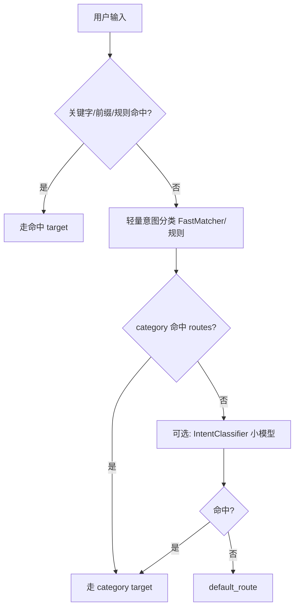
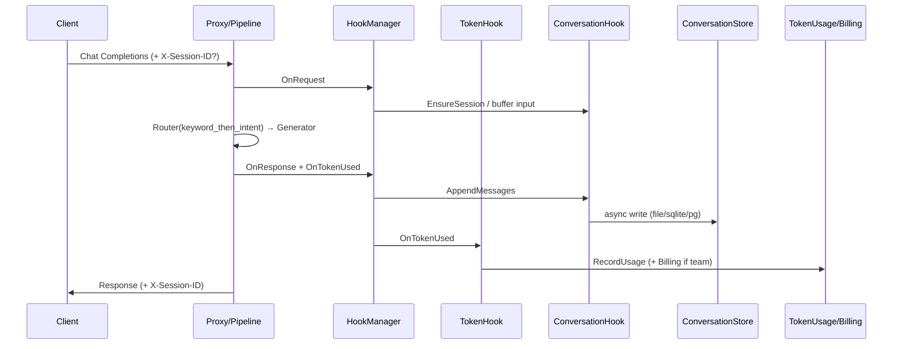

# 技术方案 — 钩子增值能力

> 版本：v0.2.2 | 日期：2026-07-17 | 作者：AI  
> 分支：`feature/v0.2.2`  
> 移植真源：`/Users/caijun/workspaces/proxyclaw`（优先复用/接线，避免重复造轮子）

## 1. 背景与目标

### 1.1 问题描述

Centag 已从 ProxyClaw 精简迁移为核心「大模型代理网关」。钩子接口（`core/pkg/hooks`）、Token 计量（`tokenusage`）、异步计费（`billing`）、请求日志（`RequestLogService` / `user_request_logs`）、路由节点与调度分类器均有底座，但存在以下缺口：

1. **钩子未真正成为增值能力入口**：`HookManager` 基本停留在接口层，Token/计费/对话落库仍分散在 proxy / pipeline 回调里，发行版差异难统一。
2. **对话记录能力不完整**：现有 `user_request_logs` 偏审计摘要，缺少统一的 conversation/session 模型与「用户输入 + 流水线输出」语义；也未按 minimal/gateway/team 做存储后端分流。
3. **浏览检索能力不足**：本期需要 session 分类列表与简单浏览，旧模型不适合直接扩展。
4. **路由流水线**：runtime 默认偏关键字匹配；调度侧已有 `FastMatcher` / `IntentClassifier`，但与 router-mode 运行时路径结合不够，需要「关键字 + 轻量意图/分类」增强。

### 1.2 目标

本版在单一需求目录交付以下闭环：

| # | 目标 | 验收要点 |
|---|------|----------|
| G1 | 以钩子框架为统一入口，完善 Token 计量与计费 | 主链路经 Hook 触发；可按 backend×model 细分 |
| G2 | 新建独立 Conversation/Session 存储抽象 | 统一流程与 API；写路径按发行版分流 |
| G3 | 提供基础浏览能力 | session 列表、session 下消息浏览 |
| G4 | 优化 router-mode：关键字 + 轻量意图/分类 | 可配置策略；未命中有默认回落；可测 |

发行版映射（产品语义）：

| 发行版 | 典型 `edition` | Token/计费 | 对话存储后端 |
|--------|----------------|------------|--------------|
| `dist/minimal` | `minimal` | 个人计量；按 backend、model 独立聚合 | **文件** |
| `dist/gateway` | `personal`（**Profile 固定**） | 同 minimal：个人计量 + backend/model 细分 | **SQLite** |
| `dist/team` | `team` | 用户独立计量 + 计费/配额 | **PostgreSQL** |

> 说明：代码里 `edition` 枚举为 `minimal | personal | team`；`gateway` 为发行包名，运行时对应 `personal`。  
> 配置真源：`config/profiles/gateway/.env.example` 与 `docker-compose.yaml` 均固定 `CENTAG_EDITION=personal`。

### 1.3 非目标

- 不做复杂对话检索（全文搜索、语义检索、导出报表）。
- 不做 Stripe/外部支付对接；team 计费以内部用量事件 + 配额/成本汇总为准。
- 不新增面向垂直业务的 Agent 专用 REST（遵守接口边界）；管理浏览接口挂在 `/api/v1/*` 管理面。
- 不在本期重做 Pipeline StorageHook 的「场景上下文 KV 历史」（agent 运行时记忆）；与审计型对话记录解耦。
- 不把 `llm_classify` 默认改为重型在线 LLM 分类（成本高）；轻量路径优先 FastMatcher / 本地规则，可选小模型分类作为增强。

---

## 2. 方案选型

### 2.1 候选方案对比

| 方案 | 优点 | 缺点 | 推荐 |
|------|------|------|------|
| A. 继续扩展 `user_request_logs` + 散落回调 | 改动小 | 模型语义不对；发行版分流难；钩子仍虚设 | |
| B. 钩子统一入口 + 新建 ConversationStore + 复用/接线 tokenusage/billing | 架构清晰；可移植 ProxyClaw；删除旧路径后熵减 | 迁移与删除需排期 | ⭐ |
| C. 全部做成独立插件进程 | 隔离强 | 过度工程，偏离「薄核心网关」 | |

### 2.2 选定方案

采用 **方案 B**：

1. 实现默认 `HookManager`，在 proxy/pipeline 关键节点触发。
2. Token：`TokenHook` / `BillingHook` 适配现有 `tokenusage.Service` 与 `billing.Service`（优先移植 ProxyClaw 接线方式）。
3. 对话：新建 `ConversationStore` 接口 + file/sqlite/pg 实现；统一 API；完成后删除 `RequestLogService` / `user_request_log` / 相关迁移测试依赖。
4. 路由：在 router-mode 增加 `keyword_then_intent`（或等价）策略——先关键字，未命中再走轻量分类（FastMatcher category / IntentClassifier 可配置）。

---

## 3. 详细设计

### 3.1 钩子框架接线

#### 3.1.1 补齐默认实现

新增（建议路径）：

- `core/pkg/hooks/manager.go` — `DefaultHookManager`（并发安全注册、顺序触发、错误策略：记录日志不阻断主路径，除非显式 `fail_closed`）
- `core/pkg/hooks/adapters_*.go` — 适配器：Token / Billing / Conversation

触发点（最小集合）：

| 时机 | 方法 | 调用方 |
|------|------|--------|
| 请求到达 | `TriggerRequestHooks` | proxy handler / mode dispatcher 入口 |
| 响应完成 | `TriggerResponseHooks` | 非流式完成 / 流式最终聚合后 |
| Token 使用 | `TriggerTokenUsedHooks` | 替代/包裹现有 `maybeRecordTokenUsage` 与 `PersistTokenUsage` |
| 配额超限 | `TriggerQuotaExceededHooks` | team 配额检查失败路径 |

#### 3.1.2 与现有代码关系

- **保留** `tokenusage.Service` 的 DB 写入与统计 API，改为由 TokenHook 适配器调用。
- **保留** `billing.Service` 异步事件通道，由 BillingHook（team）调用 `RecordEvent`。
- **收敛** `wireTokenUsagePersistence` / `maybeRecordTokenUsage`：最终只保留一处「收集 Usage → TriggerTokenUsedHooks」，避免双记。

移植参考：

- ProxyClaw：`core/pkg/server/token_usage_hook.go`、`core/internal/billing/billing.go`
- Centag 已基本同构，重点是 **接线与发行版开关**，不是重写计量算法。

### 3.2 Token 计量与计费

#### 3.2.1 维度与发行版行为

`hooks.TokenUsage` 扩展字段（向后兼容追加）：

```go
type TokenUsage struct {
    UserID       int64
    TenantID     string
    RequestID    string
    SessionID    string
    Model        string
    Backend      string
    InputTokens  int
    OutputTokens int
    TotalTokens  int
    CostUSD      float64
    Success      bool
}
```

| 版本 | 计量主体 | 细分 | 计费 |
|------|----------|------|------|
| minimal / personal(gateway) | 单用户/本机（`user_id` 可为 0 或默认用户） | **必须**可按 `backend`、`model` 独立查询聚合 | 成本估算（pricing）即可，不做多用户扣费 |
| team | 真实 `user_id`（+ `tenant_id`） | 用户 × backend × model | BillingHook → 配额检查/扣减 + 成本汇总 |

已有能力复用：

- `GetModelStats` / `GetBackendStats` / `RecordUsage` / pricing / team_quota / user_quota
- API：`/api/v1/user/token-usage*`、team admin quotas（已存在则对齐文档，缺口补齐）

#### 3.2.2 接口设计（计量/计费，增量）

管理面保持 OpenAPI 风格；若缺口则补：

| 方法 | 路径 | 说明 | 版本 |
|------|------|------|------|
| GET | `/api/v1/user/token-usage` | 汇总 | 全版本 |
| GET | `/api/v1/user/token-usage/models` | 按模型 | 全版本 |
| GET | `/api/v1/user/token-usage/backends` | 按后端 | 全版本 |
| GET | `/api/v1/admin/token-usage/all` | 全员 | team |
| GET | `/api/v1/admin/token-usage/ranking` | 排行 | team |
| POST/GET/PUT | `/api/v1/admin/quotas*` | 配额 | team |

不新增业务专用代理接口。

### 3.3 Conversation / Session 存储抽象

#### 3.3.1 领域模型

```text
Session
  - id, user_id, tenant_id
  - title（可空，默认取首条输入截断）
  - category / labels（用于「分类列表」；可来自路由意图）
  - pipeline_id, proxy_mode
  - created_at, updated_at, message_count

Message (Turn)
  - id, session_id
  - role: user | assistant | system（本期主路径 user + assistant）
  - content（用户输入 / 流水线最终输出）
  - request_id, model, backend, pipeline_id
  - input_tokens, output_tokens, latency_ms, status_code
  - created_at
```

#### 3.3.2 存储接口

建议包：`core/internal/conversation/`（核心层能力）

```go
type Store interface {
    EnsureSession(ctx context.Context, s *Session) (*Session, error)
    AppendMessage(ctx context.Context, m *Message) error
    ListSessions(ctx context.Context, q ListSessionsQuery) ([]*Session, error)
    GetSession(ctx context.Context, id string) (*Session, error)
    ListMessages(ctx context.Context, sessionID string, q PageQuery) ([]*Message, error)
}

// 工厂按 edition 选择实现
// minimal  → FileStore      (JSONL / 目录：var/conversations/)
// personal → SQLiteStore
// team     → PostgresStore
```

约束：

- **流程与 HTTP 接口完全一致**，仅 `Append`/`List` 底层不同。
- 写入异步缓冲（移植 `RequestLogService` 的 channel + batch 思路），失败降级：打日志不阻断代理。
- Session ID：优先请求头（如 `X-Session-ID`），否则新建；响应可回显。

#### 3.3.3 钩子适配

`ConversationLoggingHook` 实现 `StorageHook`（或独立 ConversationHook，若扩展接口）：

- `OnRequest`：解析/创建 session，暂存用户输入摘要到 context。
- `OnResponse`：写入 user + assistant 两条 message（或一轮 turn）。

#### 3.3.4 浏览 API（本期基础能力）

| 方法 | 路径 | 说明 |
|------|------|------|
| GET | `/api/v1/conversations/sessions` | 列表；支持 `category`、`limit`、`offset`、时间范围 |
| GET | `/api/v1/conversations/sessions/:id` | session 详情 |
| GET | `/api/v1/conversations/sessions/:id/messages` | 消息分页 |
| GET | `/api/v1/conversations/categories` | 已有 category 聚合（分类列表） |

权限：

- minimal/personal：本机/当前用户可见全部本地会话。
- team：用户仅看自己的；admin 可按 `user_id` 查询（若本期来不及，admin 可二期，但接口预留 query）。

#### 3.3.5 旧代码删除范围（完成后）

删除或迁移后移除：

| 路径/对象 | 动作 |
|-----------|------|
| `core/internal/logging/request_log_service.go` (+ test) | 删除 |
| `core/pkg/database/user_request_log.go` | 删除 |
| `models` 中 `UserRequestLog` | 删除 |
| 迁移 `027_user_request_logs.*` 的**新环境依赖** | 新增 drop/替换迁移；测试改挂 conversation 表 |
| 任何对 `user_request_logs` 的引用 | 清零 |

保留：`hooks.RequestLog` 结构体名可保留作 LoggingHook 载荷，或重命名避免混淆（实现时二选一，文档同步）。

**不删除**：Pipeline `StorageHook` 的 `save_conversation_history`（KV 场景上下文），除非后续证明与新模型完全重复；本期禁止双写审计对话到两套系统。

### 3.4 路由流水线优化（关键字 + 轻量意图）

#### 3.4.1 现状

- RouterNode 已支持：`keyword_contains` / `keyword_prefix` / `ordered` / `regex_only` / `llm_classify`。
- Scheduler 已有 `FastMatcher`（category→task→backend）与 `IntentClassifier`（可调用小模型）。
- Auto-build 已能按 category 写 generator 的 backend/model。

缺口：runtime 默认路径仍偏纯关键字；与 FastMatcher/轻量分类的「先关键词、后意图」组合策略未产品化。

#### 3.4.2 设计

新增路由策略：`keyword_then_intent`（名称可微调，语义固定）：



配置示例（router 节点 `custom_config`）：

```yaml
routing_strategy: keyword_then_intent
default_route: generator_default
routes:
  code: generator_code
  chat: generator_chat
  translate: generator_translate
intent:
  enable_fast_matcher: true
  enable_llm_classifier: false   # 默认关；开启才走小模型
  confidence_threshold: 0.55
```

Auto-build：继续用现有 `ScheduleWithCategory` / `ScheduleWithStrategy` 为各 category 填 backend/model；新增策略下保证 routes key 与 FastMatcher category 对齐文档。

#### 3.4.3 模块影响

| 模块 | 变更 |
|------|------|
| `core/pkg/pipeline/builtin_nodes.go` | 新策略实现 |
| `core/pkg/scheduler/*` | 暴露轻量分类给 router 调用（接口注入，避免 pipeline→scheduler 循环则通过回调/Capability） |
| `config/initdata/pipeline-templates/` | router-mode 模板默认策略升级 |
| `docs/guide/proxy-modes.md` / mode-behavior-matrix | 同步行为说明 |

依赖方向：若 `pipeline` 不能直接 import `scheduler`，则通过已有 broker / 在 server 组装时注入 `IntentResolver` 接口到 RouterNode。

### 3.5 模块影响范围总览

```text
core/pkg/hooks/          + manager + adapters
core/internal/conversation/   + Store 接口与三后端
core/internal/tokenusage/     接线收敛，少量字段/API 补齐
core/internal/billing/        team BillingHook 适配
core/internal/logging/        删除 RequestLogService（迁移完成后）
core/pkg/database/            conversation 表/迁移；删除 user_request_logs 路径
core/pkg/pipeline/            router 新策略；触发钩子（若在 engine 层）
core/internal/proxy/          钩子触发、session 头处理
core/pkg/server/              组装 HookManager、Conversation API、edition 工厂
dist/*                        确认插件注册含所需 storage/database
web/                          session 列表基础页（若时间紧可 API-first，UI 列为同版应交付项）
docs/api/ + docs/guide/       同步
```

### 3.6 流程图（主链路）



---

## 4. 兼容性与迁移

1. **配置兼容**：旧 `routing_strategy: keyword_contains` 行为不变；新策略显式开启。
2. **数据迁移**：`user_request_logs` → 不强制历史搬家（可提供可选一次性脚本）；默认新会话从空库开始。若需迁移，将 `request_body/response_body` 映射为 message，按 `request_id` 粗粒度建 session。
3. **删除旧代码**：Gate 3 前完成引用清零 + 测试全绿；迁移文件保留「drop table」以确保旧库升级不炸。
4. **发行版**：`CENTAG_EDITION` / bootstrap 默认值与 dist 文档对齐；gateway 文档明确推荐 `personal`。

---

## 5. 风险与应对

> **方案级摘要**。开发实现风险正本见同目录 [`开发风险评估.md`](./开发风险评估.md)（Gate 1/2 以该文件为准）。

| 风险 | 影响 | 概率 | 应对策略 |
|------|------|------|----------|
| 钩子双记 Token | 计量翻倍 | 中 | 单一触发点；集成测试断言计数（R01） |
| 对话异步丢失 | 记录不全 | 中 | 有界队列 + 优雅停机 flush；监控丢弃次数（R02/R05） |
| pipeline↔scheduler 循环依赖 | 编译失败 | 中 | IntentResolver 接口注入（R03） |
| 删除 request_log 遗漏引用 | 编译/测试红 | 中 | `rg user_request_logs` 门禁（R04） |
| 轻量分类误路由 | 选错模型 | 中 | 默认关键字优先；置信度阈值；default_route（R07） |
| 文件存储并发 | minimal 写坏 | 低 | 按 session 文件 + append 锁（R06） |

---

## 6. AI 内审记录

| 检查项 | 结果 |
|--------|------|
| 是否符合「薄核心 + 钩子增值」定位 | ✅ 计量/对话走钩子；存储实现可插拔 |
| 是否违反「禁止业务专用代理接口」 | ✅ 仅管理面 `/api/v1/conversations/*` |
| 发行版矩阵是否与用户决策一致 | ✅ file/sqlite/pg；team 才多用户计费 |
| 旧代码删除范围是否明确 | ✅ request_log 栈；保留 pipeline KV history |
| 路由方案是否落在「关键字+轻量意图」 | ✅ `keyword_then_intent`，重型 LLM 默认关闭 |
| Critical 问题 | **0**（待人工确认后进 Gate 1） |

### 内审备注（非 Critical）

- Web UI 是否同版必交付：建议 API + 最小列表页同版；若排期紧张可在任务计划中标为 P1，但 API 为 P0。
- `gateway` 与 `personal` 命名需在用户文档写清，避免只改 dist 名不改 edition。

---

## 7. 附录

### 7.1 决策确认（已锁定）

1. 需求归档：合并 `docs/versions/v0.2.2/钩子增值能力/`
2. 对话落点：新建 Conversation/Session 抽象；完成后删除旧 request_log 代码
3. 路由范围：关键字 + 轻量意图/分类增强
4. 优先从 ProxyClaw 移植

### 7.2 关键参考路径

| 主题 | 路径 |
|------|------|
| 钩子接口 | `core/pkg/hooks/hooks.go` |
| Token 计量 | `core/internal/tokenusage/` |
| 计费 | `core/internal/billing/` |
| 旧请求日志 | `core/internal/logging/request_log_service.go` |
| Router 节点 | `core/pkg/pipeline/builtin_nodes.go`（RouterNode） |
| 轻量分类 | `core/pkg/scheduler/fast_matcher.go`、`classifier.go` |
| Auto-build | `core/pkg/server/pipeline_autobuild.go` |
| ProxyClaw 产品化方案 | `proxyclaw/docs/versions/v2.1/产品化独立服务/技术方案.md` |

### 7.3 下一步

人工确认本方案后：

1. 更新 `workflow_state.md`：Step 1 ✅，Gate 1 ✅  
2. 执行 `step2-plan` 产出任务计划（可执行验收标准）
