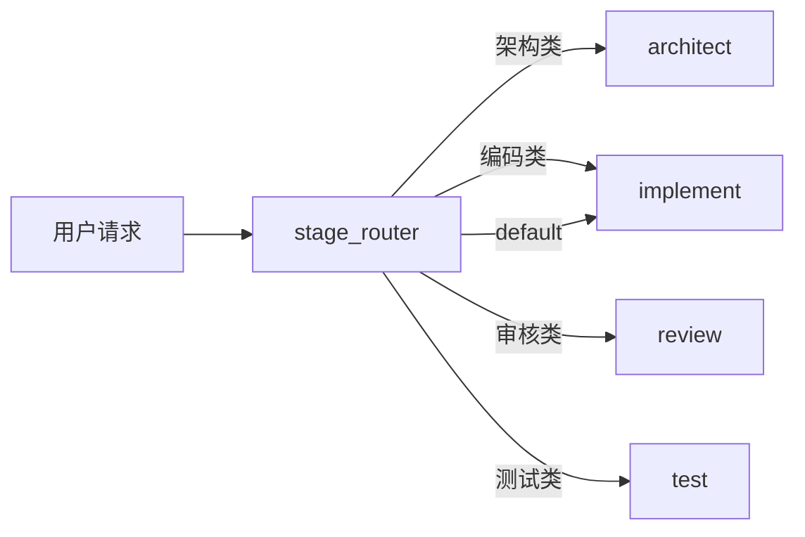
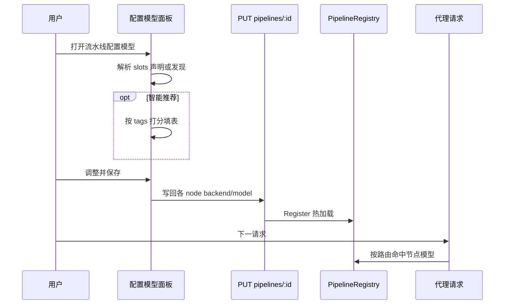

# 技术方案 — 能力槽模型配置

> 版本：v0.2.3 | 日期：2026-07-17 | 作者：AI  
> 分支：`feature/v0.2.3`  
> 前序：v0.2.2 已落地 router-mode 专用「分配模型」雏形；本版升维为通用 **Capability Slot** 框架。

## 1. 背景与目标

### 1.1 问题描述

多类流水线都存在「分类/阶段 → 执行节点」结构，但模型绑定体验割裂：

| 流水线 | 现状 | 痛点 |
|--------|------|------|
| `router-mode` | router + 代码/翻译/摘要/对话 | v0.2.2 仅专用面板；概念未复用 |
| `education-agent`（`education-scene`） | `scene_router` + 解题/讲解/批改/口语/答疑等 | 各节点硬编码 backend/model；首装难按场景选型 |
| `coding-agent` | **单 generator** + 工具调用 | 无法按「架构 / 编码 / 审核 / 测试」分工选型与 prompt |

用户需要：**一套通用规则**定义分类（槽位），并快速为每个槽位绑定后端/模型（手动或按标签智能推荐）。

**产品定位：**

- `router-mode` / `education-agent` / `coding-agent` 是**预设样板**，用于验证通用框架。  
- **主场景**是用户按自己业务在画布上设计 Agent 流水线：自行**新增/调整分类**，再为各分类配置模型与 prompt。

职责拆分：

| 能力 | 入口 | 说明 |
|------|------|------|
| 加/改/删分类（拓扑） | **画布**（含「新增分类」引导） | 关键词/scene → 目标节点；可新建 generator |
| 绑后端/模型 | **配置模型**面板 | 对已有槽位批量绑定；不支持在此改拓扑 |

### 1.2 目标

| # | 目标 | 验收要点 |
|---|------|----------|
| G1 | 定义 **Capability Slot** 契约与发现规则 | 声明优先 + 自动发现兜底；兼容旧 `route_model_targets` |
| G2 | 统一 Web「配置模型」面板 | 任意合格流水线可打开；保存热加载 |
| G3 | 智能推荐（按 tags / Role Profile） | 一键填表，用户确认后保存 |
| G4 | 模板对齐：`router-mode` / `education-agent` / **重构 `coding-agent` 为多阶段** | 均声明 slots；coding 与 edu 同构（验证样板） |
| G5 | **画布支持用户新增分类** | 引导创建「路由关键词 + 执行节点 + route_config + 可选 slot」；保存后出现在配置模型表 |

### 1.3 非目标

- 不在「配置模型」弹窗内增删改路由边（避免与画布双入口改拓扑）。
- 不做运行时「再调一次 LLM 做模型选型」；推荐为静态规则打分。
- 不改造 team 多租户配额语义。
- 不强制 minimal 裁剪业务模板；minimal 若无对应模板，面板仅对已加载流水线生效。
- 不在本版实现完整 Agent IDE（自由编排任意图）；聚焦 **带 router 的分类型 Agent** 的「加分类 + 配模型」闭环。

---

## 2. 方案选型

### 2.1 候选方案对比

| 方案 | 优点 | 缺点 | 推荐 |
|------|------|------|------|
| A. 继续只做 router-mode 专用面板 | 改动小 | 教育/编程无法复用 | |
| B. 通用 Capability Slot + 声明/发现 + 统一面板 + 模板对齐 | 一套规则覆盖三类模板；与画布职责清晰 | 需重构 coding-agent YAML | ⭐ |
| C. 新增 `{{system.slot.*}}` 虚拟变量层 | 配置更「声明式」 | 引擎改动大、调试难、与节点字段双源 | |

### 2.2 选定方案

采用 **方案 B**：

1. 槽位契约落在 `metadata.capability_slots`（及发现算法）。
2. 绑定结果仍写回各节点 `backend` / `model`（及 `config` 同步），运行时零新协议。
3. 将现有 `RouterModelAssignDialog` / `routeModelAssign.ts` **升维**为通用实现（保留旧 API 名作兼容别名或直接重命名）。
4. **coding-agent** 按 education 同构：多阶段 router + 多 generator + 分 prompt + slots。

---

## 3. 详细设计

### 3.1 Capability Slot 契约

```yaml
# metadata.capability_slots[]
- slot_id: string          # 稳定 ID，如 edu.problem_solving / code.implement
  node_id: string          # 流水线节点 ID
  label: string            # UI 展示名
  kind: route | role | stage   # 展示分组，默认 route
  tags: [string]           # 推荐用：code | reasoning | review | cheap | multilingual | explain | default
  hint: string             # 可选说明
  default_follow_system: bool  # 首装是否默认跟随系统默认
```

**解析优先级：**

1. `metadata.capability_slots`（非空）  
2. 旧 `metadata.route_model_targets` → 映射为 slots（`slot_id = node_id`）  
3. **自动发现**：  
   - 收集所有 `type == router` 的 `config.custom_config.routes` 的 **value（目标节点 ID）**（去重）  
   - 并入所有带 `route_config.router_node_id` 的 LLM 节点  
   - 节点 `name` 作 label；无 tags 时默认 `["default"]`  
4. 槽位数 &lt; 2 且无显式声明 → 不展示「配置模型」入口（单节点 coding 旧形态会被重构后覆盖）

### 3.2 写回与热加载

与 v0.2.2 专用面板相同，推广到任意槽位：

| 模式 | 节点字段 |
|------|----------|
| 跟随系统默认 | `backend/model = {{system.default_*}}`，同步 `config` 与 `template_vars` |
| 指定 | 具体 backend_id + model，同步 `config` |

保存：`PUT /api/v1/pipelines/:id` → Registry `Register` → 下一次请求生效。

**本版不强制新增 PATCH API**；若后续需减小 payload，可加 `PATCH .../capability-slots`（非 P0）。

### 3.3 Web 交互 — 配置模型

| 项 | 设计 |
|----|------|
| 入口文案 | **配置模型**（替换/并存「分配模型」） |
| 位置 | 概览流水线卡片、策略管理操作列、编辑器顶栏 |
| 表格列 | 分类/角色、hint、后端、模型、跟随默认 |
| 工具按钮 | 全部跟随系统默认；**按标签重新推荐** |
| 保存 | 校验非跟随行必填 → 写回 → 成功提示 |
| 空态引导 | 若无槽位：提示「请先在画布用『新增分类』添加分类」并提供打开编辑器 |

组件建议：

- `web/src/utils/capabilitySlots.ts`（发现 + 应用 + 兼容 route_model_targets）  
- `web/src/components/pipeline/CapabilitySlotsDialog.vue`（通用面板；可自 RouterModelAssignDialog 重构）  
- 删除或薄包装旧 `routeModelAssign.ts` 以免双份逻辑  

### 3.3b Web 交互 — 画布「新增分类」（G5，正式需求）

用户自建 Agent 时，**不应**要求手写 YAML。画布提供一键/向导式 **新增分类**：

**入口：** 流水线编辑器工具栏「新增分类」（仅当图中存在至少 1 个 router 节点时启用；若无 router，可提示「先添加路由节点」或向导内一并创建简易 router）。

**向导字段（最小集）：**

| 字段 | 说明 |
|------|------|
| 分类名称 | 展示名，兼作默认 generator.name |
| 触发关键词 | 1～N 个，写入所选 router 的 `routes` |
| 节点 ID | 默认由名称生成（可改），新建 generator.id |
| 路由节点 | 默认图中唯一/主 router；多 router 时下拉选择 |
| 是否默认分支 | 可选；写入 `route_config.is_default` / `default_route` |
| 初始 prompt | 可选简短 system_prompt 模板 |
| 推荐标签 tags | 可选多选（code / reasoning / …），写入 `metadata.capability_slots` |

**向导提交后对流水线图的原子变更：**

1. 新增 `generator` 节点（backend/model 默认 `{{system.default_*}}`）。  
2. 设置 `route_config`：`router_node_id`、`route_value`（与 routes 中某一 key 或规范值一致）、`depends_on` 含 router。  
3. 在目标 router 的 `custom_config.routes` 中增加 `关键词 → node_id`（多关键词则多条指向同一节点）。  
4. 若存在 `metadata.capability_slots`，追加一条 slot；若无声明、仅靠发现，则保存后发现算法也能扫到该节点。  
5. 画布刷新；用户可继续改 prompt；再开「配置模型」即可为新分类绑模型。

**删除/改名分类：** 本版允许在 router 节点配置抽屉中删改 `routes` 行，并提示「请同步删除或改名对应执行节点」；完整「删除分类」级联可作为增强（P1，非阻断）。

**与预设模板关系：** education / coding / router-mode 仅预置若干分类作验证与起步；用户可在其上继续「新增分类」，或从空白流水线：加 router → 多次新增分类 → 配置模型。

### 3.4 智能推荐（Role Profile）

静态规则，不调用 LLM：

| tag | 选型倾向 |
|-----|----------|
| `code` | 模型/后端名含 code、coder、codex、deepseek-coder 等 |
| `reasoning` | 旗舰/通用强模型（gpt-4o、claude、glm-4 等，按已启用列表打分） |
| `review` | 偏稳的通用模型（可与 reasoning 同级或略保守） |
| `cheap` / `fast` | flash、mini、haiku、lite |
| `multilingual` / `explain` | 通用旗舰 |
| `default` | 系统默认 backend/model |

流程：读取已启用 backends + supported_models → 按 slot.tags 打分 → 填入表格草稿 → **用户确认保存**。

### 3.5 三类模板对齐

#### 3.5.1 router-mode

- 保留现有四分支结构。  
- `route_model_targets` 升级/并列为 `capability_slots`（可双写一版迁移期）。  
- tags 示例：code / multilingual / cheap / default。

#### 3.5.2 education-agent（education-scene）

现有 `scene_router` + 多 generator 已具备结构。本版：

- 为各 generator 声明 `capability_slots`（解题、讲解、知识思考、作文批改、口语、答疑）。  
- 默认可全部 `default_follow_system: true` 或保留现有具体模型作种子（实现时二选一：**建议种子跟随系统默认**，避免硬编码 `bigmodel` 在无该后端环境失败）。  
- tags：`reasoning` / `explain` / `review` / `multilingual` / `cheap` 等。

#### 3.5.3 coding-agent（重构，与 edu 同构）

将单节点改为 **阶段路由 + 多槽位**：

```text
stage_router (keyword / keyword_then_intent)
  ├─ architect-generator   # 架构/方案设计
  ├─ implement-generator   # 写代码 / 改代码（可保留 tool calling 提示）
  ├─ review-generator      # 代码审核
  └─ test-generator        # 测试 / 调试建议（默认分支可落 implement 或 test）
```

**建议 routes（关键词示例，实现时可微调）：**

| 关键词/意图 | 目标节点 | 槽位 label | tags |
|-------------|----------|------------|------|
| 架构、设计、方案、ADR、refactor plan | architect-generator | 架构设计 | reasoning, code |
| 实现、编写、写代码、fix、bug、实现功能 | implement-generator | 编码实现 | code |
| 审查、review、code review、可读性 | review-generator | 代码审核 | review, code |
| 测试、单测、e2e、调试、debug | test-generator | 测试调试 | code, cheap |
| （default） | implement-generator | 编码实现 | code |

各节点 **不同 system_prompt**（架构重方案与边界；编码重工具与渐进实现；审核重缺陷与规范；测试重用例与回归）。  
`implement-generator` 可继承现网 coding-agent 的 tool-calling 工作流说明。  
`metadata.aligned_proxy_mode`：建议 `coding-agent` 或保持可被快捷码 `#code` 激活的模式名（与现有 shortcut 对齐，实现时核对 `proxymode` / 快捷码表）。  
声明完整 `capability_slots`。



### 3.6 模块影响

| 区域 | 变更 |
|------|------|
| `web/src/utils/*` | 通用 slots 工具；推荐算法 |
| `web/src/components/pipeline/*` | 通用配置对话框；**新增分类向导** |
| `web` 画布 / Editor | 工具栏入口；向导写回 nodes + router.routes + metadata |
| `web/.../HomePipelineCard.vue`、`PipelineModes.vue` | 入口条件改为「有 slots」 |
| `config/initdata/.../router-mode.yaml` | 补 `capability_slots`（验证样板） |
| `config/initdata/.../education-agent.yaml` | 补 slots（验证样板） |
| `config/initdata/.../coding-agent.yaml` | **重构为多阶段**（验证样板） |
| `docs/guide/proxy-modes.md` 等 | 用户自建 Agent：加分类 → 配模型 |
| 后端引擎 | **无强制变更**（除非快捷码/模式注册需登记 coding 新结构） |

### 3.7 流程图（配置与生效）



---

## 4. 兼容性与迁移

| 项 | 策略 |
|----|------|
| 已保存的 router-mode（仅有 route_model_targets 或无 metadata） | 发现算法 + 旧字段映射；打开面板仍可用 |
| 已部署的单节点 coding-agent | 模板升级后 **新环境** 用多阶段；已落库旧定义需用户「从模板重建」或提供一次性覆盖说明（文档写清，不做自动静默改用户库） |
| education 硬编码 bigmodel | 建议改为跟随默认或保留并在文档说明依赖 |
| minimal | 无教育/编程模板时不受影响；有 router-mode 则用通用面板 |

---

## 5. 风险与应对（方案级摘要）

| 风险 | 影响 | 概率 | 应对策略 |
|------|------|------|---------|
| coding 重构破坏依赖单节点的外部集成 | 中 | 中 | 文档说明；shortcut 行为保持；验收用关键词分阶段 |
| 自动发现误收录非路由 LLM 节点 | 低 | 中 | 优先声明；发现仅 routes 目标 + route_config |
| 智能推荐选错模型 | 低 | 中 | 仅填草稿；强制用户确认保存 |
| 与 v0.2.2「分配模型」代码分叉 | 中 | 高 | 统一升维为 capabilitySlots |
| 「新增分类」与手动改 router 抽屉不一致 | 中 | 中 | 向导与抽屉写同一数据结构；单测锁定字段 |

详细开发风险见 `开发风险评估.md`。

---

## 6. 附录

### 6.1 参考

- 现实现雏形：`web/src/utils/routeModelAssign.ts`、`RouterModelAssignDialog.vue`  
- 模板：`config/initdata/pipeline-templates/common/router-mode.yaml`  
- `config/initdata/pipeline-templates/gateway/education-agent.yaml`  
- `config/initdata/pipeline-templates/gateway/coding-agent.yaml`  
- 结论：通用槽位；**画布加分类 + 面板配模型**；edu/code/router 为验证样板  

### 6.2 建议交付切片（供 Step 2 拆任务）

1. Slot 契约 + 发现/兼容单测（TS）  
2. 通用「配置模型」UI + 入口  
3. **画布「新增分类」向导（G5）**  
4. 智能推荐  
5. 三模板 YAML（含 coding 多阶段，作样板）  
6. 文档：用户自建 Agent 操作路径  

### 6.3 Gate 1 确认记录

| # | 议题 | 结论 | 日期 |
|---|------|------|------|
| 1 | Capability Slot 契约与发现优先级 | **认可** | 2026-07-17 |
| 2 | coding-agent 多阶段拆分 | **认可** | 2026-07-17 |
| 3 | 画布可否加分类 | **认可为正式需求（G5）**；edu/code 仅为验证样板；主场景是用户自建 Agent | 2026-07-17 |
| — | LLM 动态选型 | 仍非目标 | 2026-07-17 |
| — | 「配置模型」弹窗内改拓扑 | 仍非目标（拓扑只在画布） | 2026-07-17 |
