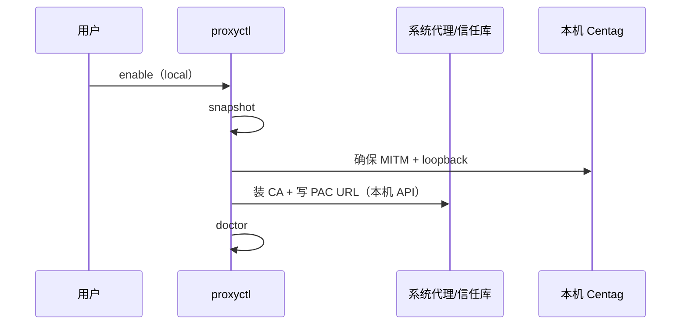
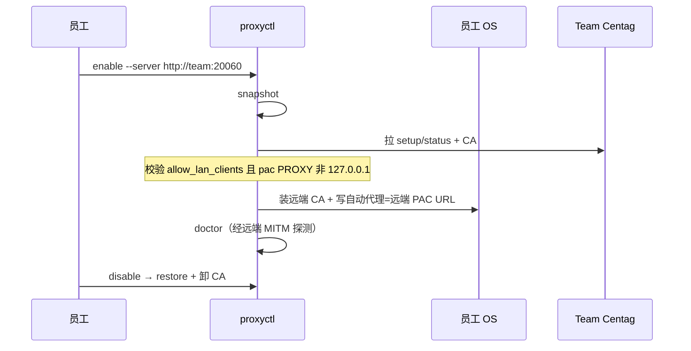

# 技术方案 — 本机系统代理出口（PAC + MITM）

> 版本：v0.2.5 | 日期：2026-07-19 | 作者：AI  
> 分支：`feature/v0.2.5`（自 `main`）

## 0. 前提确认（用户硬条件）

### 0.1 是否 Windows / macOS / Linux 都支持，且可做到无基础一键？

| 结论 | 说明 |
|------|------|
| **协议层：三平台都支持** | MITM（`:8081`）+ PAC（`/api/v1/proxy/pac`）+ CA 下载已是跨平台 Go/HTTP 能力 |
| **产品层：今天还不是「无基础一键」** | 现有能力停在「Web 文案 + 分散脚本」：CA 安装需 sudo/管理员；**没有**统一的「写入系统 PAC / 备份原代理 / 一键回滚」 |
| **M1 目标：可以做到「一键」** | 用各 OS 官方/稳定 API 封装「启用 / 停用」，UI 只留一个大按钮；需提权一次（装 CA / 写系统代理） |

| OS | 一键可行性 | 提权 | 备注 |
|----|------------|------|------|
| **macOS** | **高** | 管理员密码（CA + 可选 networksetup） | `networksetup -setautoproxyurl` / `-setautoproxystate`；CA：`security add-trusted-cert` |
| **Windows** | **高** | UAC（CA + 写用户/机器代理） | WinINET（用户级 IE/系统代理）+ 可选 WinHTTP；CA：`certutil -addstore Root` |
| **Linux** | **中（按桌面）** | 通常 sudo（CA）；桌面代理视 DE | **GNOME**：`gsettings` org.gnome.system.proxy；**KDE**：`kwriteconfig`；无桌面/WSL：降级为「进程环境变量一键脚本」，不强改「系统级」 |

**无基础用户体验（M1 必须达到）**：

1. 用户已启动 Centag（或 Launcher 已拉起）。  
2. 点击「一键启用本机代理」→ 弹系统提权 → 自动：备份现状 → 装 CA（若未装）→ 开 MITM → 写 PAC URL → 探测通过。  
3. 失败则自动回滚（见 0.2），并给出人话错误（服务未开 / 权限拒绝 / 端口占用）。

**不做假一键**：Linux 非 GNOME/KDE 明确提示「将为当前终端/Agent 写入环境包装」，不静默改未知桌面。

### 0.2 是否安全？能否一键回滚且不破坏原环境？

#### 安全性（结论：**可控，必须带约束；默认可接受**）

| 面 | 风险 | M1 强制约束 |
|----|------|-------------|
| MITM 解密 HTTPS | 代理侧可看 LLM 请求明文（含 Key/对话） | 默认 **PAC 白名单**；禁止默认「全局代理」 |
| 信任根 CA | 客户端信任后，经该代理的 HTTPS 可被解密 | CA 私钥只存 **服务端** `certs/`；客户端按指纹装卸；文档标明信任边界 |
| 误伤其它流量 | 全局代理 / 错误 PAC | 默认 PAC；全局模式需二次确认且默认关闭 |
| 本机模式暴露面 | 误绑局域网 | **本机模式**强制 MITM `127.0.0.1` |
| **远端/Team 模式暴露面** | MITM 对局域网可达 | **须显式开启**「允许局域网客户端」；二次确认；PAC 仍只劫持 LLM 域名；默认不建议对公网暴露 8081；文档要求防火墙限源 |
| 残留信任 | 用户忘卸 CA | 客户端「一键停用」默认按指纹卸 CA（可勾选保留） |

相对 Host 劫持（改 hosts + 占 443）：PAC+MITM **更易回滚、冲突更少**，故作主路径。

#### 一键回滚（结论：**必须做成一等能力；现状不足，M1 补齐**）

| 变更项 | 启用时 | 回滚时 |
|--------|--------|--------|
| 系统/用户代理设置 | **先快照**到 `~/.centag/proxy-snapshot.json`（或 Windows `%LOCALAPPDATA%\Centag\`） | 精确恢复：模式（关/手动/PAC）、旧 PAC URL、旧 HTTP(S) 主机端口、例外列表 |
| Centag CA | 记录证书指纹 / 序列号 | `delete-certificate` / `certutil -delstore` / 删掉信任锚；仅删 Centag 指纹，不动其它根 |
| MITM 服务 | `system_proxy.enabled=true` | 关闭监听；不改用户 backends |
| 环境包装脚本 | 若用过 | 删除 wrapper 或还原 shell 配置中的 `# centag-proxy` 标记块 |

**回滚保证（验收用语）**：

- 启用前若用户已有 Clash/公司 PAC：**停用后必须回到启用前状态**，不得变成「代理全关」或「残留 Centag PAC」。  
- 启用失败（任一步）→ **事务式回滚**到快照。  
- 幂等：重复点「启用 / 停用」不叠加损坏。

**现状缺口（实现前必须承认）**：仓库内仅有 CA 安装脚本与 macOS 卸载提示，**没有**代理设置快照/恢复；Windows 诊断脚本端口仍有旧值漂移。M1 交付以「快照 + 回滚」为 Gate，而非只做启用。

---

## 1. 背景与目标

### 1.1 问题描述

个人电脑上的 Agent / 聊天客户端常写死访问 `api.openai.com` 等官方域名。用户希望 **不改 Agent 配置**，通过本机系统级（或等价）代理，把流量接到 Centag 作为大模型出口。

**Team 主场景**：Centag 跑在团队服务器（或某台常开机器）上；多台员工电脑只配 PAC/CA，把 LLM 流量导向该服务器出口——与「本机自建 Centag」同等重要，**本版本一并交付**。

### 1.2 目标

1. **双模式主路径**：  
   - **本机模式**（personal）：本机 Centag + loopback MITM + 一键写本机 PAC。  
   - **远端/Team 模式**：服务端可广告局域网地址；客户端一键指向远端 PAC/CA/MITM。  
2. **硬前置**：见 §0——无基础可用、安全约束、一键回滚不破坏原环境。  
3. **验收**：  
   - 本机：未改 Agent → 进本机 Centag；停用后恢复。  
   - 远端：客户端未改 Agent → 进 **另一台** Centag；停用后恢复；PAC 内 `PROXY` 为可达的服务端地址（非客户端 127.0.0.1）。

### 1.3 非目标（本版本）

- 不产品化 Host 劫持为默认路径（可留高级入口）。  
- 不把 MITM 提升为网关核心协议必选。  
- 不做全局默认代理；**不对公网默认暴露 MITM**（无自动端口映射 / 无公网一键）。  
- 不在本版本保证「所有无视系统代理的 App」无 TUN 可用（Clash TUN 仍属后续 Wave）。  
- Launcher 深度集成可为 P1；M1 至少提供独立 helper + Web 按钮。

---

## 2. 方案选型

### 2.1 候选对比

| 方案 | 设置简单 | 成功率 | 回滚 | 安全面 | 推荐 |
|------|----------|--------|------|--------|------|
| A. PAC + MITM + OS 一键 | 高（M1 后） | 高（认系统代理的 App） | 易（快照） | 可控（PAC+loopback） | ⭐ |
| B. 仅进程 `HTTPS_PROXY` | 很高 | 高（CLI） | 极易 | 更小 | M1 附带 |
| C. Clash 订阅 / TUN | 中 | 很高（TUN） | 中 | 依赖第三方 | Wave 3 |
| D. Host 劫持 | 低 | 中 | 难 | 冲突多 | 非默认 |

### 2.2 选定方案

**M1 = A（本机 PAC+MITM 一键）+ A′（远端/Team PAC+MITM）+ B（进程级 `HTTPS_PROXY`）**。  
理由：personal 与 team 共用同一套代理协议；**多数 CLI Agent 不读 PAC**，故 B 为实际主路径；PAC 服务认系统代理的客户端。  
约束：代理变量仅作用于 Agent 进程，不写全局 shell；MITM 对**非白名单主机**做 CONNECT **TCP 隧道（不解密）**，避免干扰 Agent 非 LLM 上网与用户日常浏览器。

### 2.3 双模式拓扑

```
【本机模式 personal】
  Agent → OS PAC → PROXY 127.0.0.1:8081 → 本机 MITM → 本机 :20060

【远端/Team 模式】
  员工 Agent → OS PAC → PROXY <team-host>:8081 → 服务器 MITM → 服务器 :20060
  员工系统「自动代理配置 URL」= http://<team-host>:20060/api/v1/proxy/pac
  员工信任服务器下发的 CA（同一指纹）
```

---

## 3. 详细设计

### 3.1 组件

```
┌──────────────────────────────────────────────────────────┐
│  Web（服务端）：局域网出口开关 / advertise / 复制员工指引   │
│  Web / proxyctl（客户端）：连接本机 or 团队服务器一键启用   │
└────────────────────────────┬─────────────────────────────┘
                             ▼
┌──────────────────────────────────────────────────────────┐
│  centag-proxyctl                                         │
│  enable [--server URL] | disable | status | doctor       │
│  - snapshot / restore OS proxy                           │
│  - install / uninstall CA（本机或从 --server 下载）        │
│  - 本机模式：ensure 本机 MITM                              │
│  - 远端模式：只配客户端；探测远端 PAC/MITM/CA             │
└────────────────────────────┬─────────────────────────────┘
                             ▼
        Centag API :20060 + MITM :8081（本机或 Team 服务器）
```

建议路径：`apps/proxyctl/`；personal 发行包均带上。

### 3.2 配置扩展（`SystemProxyConfig`）

| 字段 | 默认 | 含义 |
|------|------|------|
| `enabled` / `listen_port` / `pac_enabled` | 现有 | 不变 |
| `listen_addr` | `127.0.0.1` | MITM 绑定；Team 远端模式显式改为 `0.0.0.0` 或网卡 IP |
| `advertise_host` | 空=监听主机名或探测到的主局域网 IP | **写入 PAC 的 PROXY 主机**；禁止在远端模式下仍写 `127.0.0.1` |
| `allow_lan_clients` | `false` | 为 true 时才允许非 loopback `listen_addr`；需二次确认 |

校验规则：

- `allow_lan_clients=false` → 强制 `listen_addr=127.0.0.1`，PAC `ProxyHost=127.0.0.1`。  
- `allow_lan_clients=true` → 必须非空 `advertise_host`（非 loopback）；PAC `PROXY {advertise_host}:{listen_port}`；PAC/CA URL 使用 `http(s)://{advertise_host}:{api_port}/...`。

### 3.3 接口 / 契约

| 能力 | 方式 |
|------|------|
| 开/关 MITM、PAC、LAN 开关 | 配置 API `system_proxy`（扩展字段） |
| PAC / CA | 已有；PAC 内容随 `advertise_host` 变化 |
| 新增 | `GET /api/v1/proxy/setup/status`：含 `mode`（`local`/`lan`）、`advertise_host`、`pac_url`（给员工用的绝对 URL）、`ca_fingerprint`、`listen_is_loopback`、`allow_lan_clients` |
| 本机 OS 代理 | 仅客户端 `proxyctl` 执行 |

### 3.4 数据模型（客户端快照）

`proxy-snapshot.json` 示例字段：

```json
{
  "version": 1,
  "created_at": "...",
  "os": "darwin|windows|linux",
  "client_mode": "local|remote",
  "proxy": { "mode": "off|manual|pac", "pac_url": "", "http": "", "https": "", "exceptions": [] },
  "ca": { "fingerprint_sha256": "", "installed_by_us": true },
  "centag": {
    "api_base": "http://127.0.0.1:20060",
    "mitm_proxy": "127.0.0.1:8081",
    "server_label": "local|team-host"
  }
}
```

### 3.5 模块影响

| 区域 | 变更 |
|------|------|
| `apps/proxyctl/` | enable/disable/doctor；`--server` 远端模式 |
| `web` SystemProxy | 双模式 UI：本机一键 + Team「局域网出口 / 员工连接」 |
| `core/pkg/config` | `listen_addr` / `advertise_host` / `allow_lan_clients` |
| `core/internal/mitm` | 按 `listen_addr` 绑定；默认 loopback |
| `core/internal/pac` + server 组装 | **禁止写死 127.0.0.1**；用 advertise |
| `apps/launcher` | P1 |
| 文档 | 本机 + Team 员工接入两章 |

### 3.6 用户流程

#### 本机模式



#### 远端/Team 模式（两角色）

**管理员（服务器 Web）**：开启「允许局域网客户端」→ 填/探测 `advertise_host` → MITM 听 `0.0.0.0:8081` → 展示员工用 PAC URL、CA 下载、一键命令。

**员工（客户端）**：



**说明**：远端模式下员工机 **不** 启本机 MITM；`disable` **不** 关服务器 `system_proxy`。

---

## 4. 兼容性与迁移

- 已手动配过代理的用户：首次一键启用前强制快照；停用恢复其原配置。  
- 旧脚本（`setup-cert.sh` 等）保留但标注 deprecated，导向 proxyctl。  
- 不自动迁移 Host 代理用户。

---

## 5. 风险与应对（方案级）

| 风险 | 应对 |
|------|------|
| Linux DE 碎片化 | 明确支持矩阵；不支持则 CLI 包装降级 |
| 提权 UX 劝退 | 一次提权完成全部；说明可一键撤销 |
| CA 残留 | 停用默认卸 CA；doctor 检测孤儿证书 |
| 应用不读系统代理 | 文档矩阵 + env 包装；Clash TUN 后续 |
| **Team MITM 局域网暴露** | 默认关；显式 `allow_lan_clients`；二次确认；防火墙文档；PAC 仍白名单 |
| **PAC 仍写 127.0.0.1 导致员工失效** | 服务端校验：LAN 模式禁止 advertise loopback |

详细开发风险见 `开发风险评估.md`。

---

## 6. 里程碑

| 里程碑 | 内容 | 出口 |
|--------|------|------|
| **M1** | 本机一键 + **远端/Team 一键** + Web 双模式 + 快照回滚 | §0 + §7 本机/远端清单 |
| M2 | CLI Agent 环境包装增强 | 更多 Agent 模板 |
| M3 | Clash 订阅/TUN 指南 | 无视系统代理的 App |
| M4 | Host 高级入口 + Launcher 菜单 | 非默认 |

---

## 7. 验收清单（Gate / 人工确认用）

**本机**

- [ ] macOS / Windows / Linux(GNOME)：一键启用/停用；doctor 绿；Agent 零改。  
- [ ] 启用前自定义 PAC：停用后恢复；失败自动回滚。  
- [ ] 默认非全局；本机模式 MITM 仅 loopback。  
- [ ] 停用后按指纹卸 CA（默认）。  

**远端/Team**

- [ ] 服务端开启 LAN 出口后，PAC 内 `PROXY` 为 `advertise_host:mitm_port`（非 127.0.0.1）。  
- [ ] 员工机 `enable --server http://team:20060`：装远端 CA、写远端 PAC URL、doctor 经远端 MITM 成功。  
- [ ] 员工 `disable` 恢复本机代理且 **不** 关闭服务器 MITM。  
- [ ] `allow_lan_clients=false` 时无法把 listen 绑到非 loopback。  

---

## 8. 决策记录

| 日期 | 决策 |
|------|------|
| 2026-07-19 | §0 一键三平台 + 安全回滚确认 |
| 2026-07-19 | **远端/Team PAC 与本机一并做**（team 主场景） |
