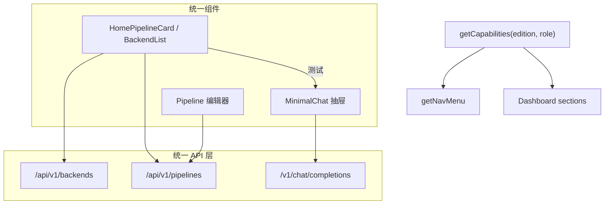

# 技术方案 — 普通用户 WebUI 能力矩阵

> 版本：v0.2.6 | 日期：2026-07-20 | 作者：AI  
> 分支：`feature/v0.2.6`（自 `feature/v0.2.5`）  
> 关联讨论：Personal / Team User 对齐；统一 API；最大复用

## 0. 前提确认（用户硬条件）

| # | 结论 |
|---|------|
| 1 | **backends / pipelines 管理接口全发行版统一**。minimal / personal / team 均走同一套 `/api/v1/backends`、`/api/v1/pipelines`（及前端封装）。首页嵌入与独立页只是 UI 入口差异，**不是**另一套接口。Team User「无权」= `useraccess` + 前端写按钮禁用，不是缺 API。 |
| 2 | **Web 对话无独立产品入口**。仅流水线「测试」打开共用测试对话 UI（`MinimalChat`）。**全发行版一致**；Team Admin 因有流水线编辑，**必须**具备同一入口。 |
| 3 | **最大复用**：不为某一 edition 单独造页面 / 业务 API / 平行组件。允许分离的仅限：发行包入口、Config Profile、构建 tags、默认中间件。UI/业务差异只通过 **capability（edition × role）** 控制显隐与写权限。 |

---

## 1. 背景与目标

### 1.1 问题描述

当前 Personal 与 Team 普通用户导航已部分对齐（`NAV_MENU_PERSONAL` ≈ `NAV_MENU_TEAM_USER`），但仍存在：

1. **入口重复**：首页 lite 已含后端/流水线/用量，侧栏仍有「配置 → 后端/策略」「对话」等完整页入口，认知负担大。  
2. **对话定位混乱**：侧栏「对话」实为接入演示；另有首页测试抽屉与 Agent 接入，三分裂。  
3. **「更多」过深**：接入 / 缓存 / 存储 / 记忆混排；未按「谁配置存储 / 谁查询记忆」拆角色。  
4. **edition 分支易膨胀**：多处 `isPersonalEdition()` 特判，存在为某版单独长逻辑的风险。

Team 超管已是独立运维面（白名单路由），本需求不推翻该模型，仅要求其流水线测试对话与全站共用组件。

### 1.2 目标

1. 建立前端 **Capability 矩阵**（单一真源），由矩阵驱动导航、首页板块、路由意图；Personal 与 Team User **同源生成**。  
2. Personal / Team User：后端与流水线的**主工作台仅在首页**（侧栏不挂独立列表入口）；独立路由页组件与 API **保留复用**（Admin 侧栏、深链编辑）。  
3. 取消独立「对话」导航；全角色（含 Team Admin、minimal）仅从流水线「测试」进入 `MinimalChat`。  
4. 本机代理：Personal + Team User 一等能力（导航上提，页面复用）。  
5. 存储配置 vs 记忆查询按角色拆分（同页模式或导航分组，不新建平行页面族）。  
6. **本版本不新增**面向 Agent 的业务 API；不改 backends/pipelines 协议契约。

### 1.3 非目标

- 不为 personal / team / minimal 各写一套 Dashboard / Backend / Chat 页面。  
- 不删除或替换 `/api/v1/backends`、`/api/v1/pipelines`；不引入「edition 专用管理 API」。  
- 不做真实「聊天产品」重构（多会话产品级 IM）。  
- 不合并 Host / System / Clash 为单文件（可选 P1；本期可只改导航层级）。  
- 不改 Team Admin「人 + 共享资源」运维信息架构主体（仅加测试对话能力 + 存储配置入口）。  
- 不做后端 storage 写接口的新 RBAC 大改（一期以前端能力位 + 既有 admin/useraccess 为主；缺口记入风险）。

---

## 2. 方案选型

### 2.1 候选对比

| 方案 | 优点 | 缺点 | 推荐 |
|------|------|------|------|
| A. Capability 矩阵 + 现有组件复用 | 符合复用原则；与 `dashboard-sections` / `useUserResourceAccess` 演进一致 | 需收敛多处硬编码导航 | ⭐ |
| B. 按 edition 复制导航与页面 | 短期改动局部 | 违反复用原则；三端漂移 | ❌ |
| C. 仅改文案/藏菜单、不抽矩阵 | 改动最小 | 特判继续膨胀；Admin 测试对话易漏 | ❌ |

### 2.2 选定方案

采用 **方案 A**：在 `web/src/utils/` 增加（或由 `dashboard-sections` + nav 合并演进）`getCapabilities(edition, role)`，导航与首页 sections 只消费 capability；页面组件与 API 调用路径保持统一。

---

## 3. 详细设计

### 3.1 分层模型

```
打包/入口（可分离）     dist/*、profiles、BUILD_TAGS
        ↓
统一管理/代理 API      /api/v1/backends、/pipelines、chat completions…
        ↓
统一 Vue 组件          ProviderManagerPanel、HomePipelineCard、
                       Pipeline 编辑器、MinimalChat、Storage、Memory…
        ↓
Capability 矩阵        导航显隐、首页板块、写按钮（叠加 useraccess）
```

### 3.2 Capability 矩阵（目标态）

> 角色：`minimal` | `personal` | `team_user` | `team_admin`  
> `manage*` = 可调用统一 API（写操作另受 `useUserResourceAccess` / 后端鉴权）

| Capability | minimal | personal | team_user | team_admin |
|------------|:-------:|:--------:|:---------:|:----------:|
| `manageBackends` | ✅ | ✅ | ✅* | ✅ |
| `managePipelines` | ✅ | ✅ | ✅* | ✅ |
| `home.backendsPanel` | ✅ | ✅ | ✅ | ✅** |
| `home.pipelinesPanel` | ✅ | ✅ | ✅ | ✅** |
| `nav.backendsPage` | ❌ | ❌ | ❌ | ✅ |
| `nav.pipelinesPage` | ❌ | ❌ | ❌ | ✅ |
| `pipelineTestChat` | ✅ | ✅ | ✅ | ✅ |
| `nav.chatPage` | ❌ | ❌ | ❌ | ❌ |
| `localProxy` | 按需*** | ✅ | ✅ | ❌ |
| `storageConfig` | 按需*** | ✅ | ❌ | ✅ |
| `memoryQuery` | 按需*** | ✅ | ✅ | ❌ |
| `usageBilling` | ✅ | ✅ | ✅ | ❌ |
| `agentSetup` | ❌ | ✅ | ✅ | ❌ |
| `systemConfig` | ❌ | ✅ | ❌ | ✅ |
| `myTenant` | ❌ | ❌ | ✅ | ❌ |
| `userAdmin` / `tenantAdmin` | ❌ | ❌ | ❌ | ✅ |

\* Team User：同一 API；写操作受 `can_add_own_*` + 共用资源白名单。  
\*\* Team Admin 概览已有后端/流水线板块；须打开 `pipelineTestChat`（今日 `liteChatDrawer: false` → **true**，或列表页挂同一测试入口，组件仍为 `MinimalChat`）。  
\*\*\* minimal 默认导航仍仅首页；能力位可 true 但 `MINIMAL_ALLOWED_ROUTE` 继续限制路由（不扩大 minimal 产品面，除非另开需求）。

### 3.3 接口设计

#### 3.3.1 后端 API

| 变更 | 说明 |
|------|------|
| **无新增业务 API** | 符合 harness 接口边界 |
| backends / pipelines | **保持**现有路径与语义；全 edition 继续注册（含 `server_minimal`） |
| chat completions | 测试对话仍走既有 `/v1/chat/completions`（或项目现行代理路径），不新增 `/api/v1/chat-ui` |

可选（P1，非本版必须）：Team User 直链调用 storage 写接口时后端返回 403——若现状已有 admin 校验则复用；否则记风险，前端藏入口为第一道闸。

#### 3.3.2 前端模块（统一，不按 edition 分叉文件）

| 模块 | 变更 |
|------|------|
| `web/src/utils/capabilities.ts`（新）或扩展 `dashboard-sections.ts` | `getCapabilities(edition, isAdmin)` |
| `web/src/utils/nav/*` | `getNavMenu` 改为基于 capabilities 组装；Personal / Team User **同一生成路径** |
| `web/src/utils/edition.ts` | 路由策略改为「按 capability + 深链白名单」；减少裸 `isPersonal` 分支 |
| `web/src/router/index.ts` | 独立 `/chat`：不进导航；可 redirect→dashboard；**测试不依赖该路由**（抽屉挂载在 dashboard / pipelines 页） |
| `Dashboard.vue` / `HomePipelineCard` | 去掉「开始对话→/chat」；保证「测试」打开 `MinimalChat` |
| Team Admin 概览 / 流水线列表 | 开启同一测试入口（复用 `MinimalChat`） |
| `Memory.vue` | 增加 `mode: 'query' \| 'full'`（或等价 props），Team User 仅 query |
| Storage / DataStores | 导航仅 `storageConfig`；组件不复制 |

#### 3.3.3 路由意图（入口策略，非删 API）

| 路径 | 组件/API | personal / team_user | team_admin | minimal |
|------|----------|----------------------|------------|---------|
| `/dashboard` | 首页 | 主工作台 | 运维概览 + 测试对话 | 主工作台 |
| `/backends` | 同组件 + 同 API | **可不挂导航**；访问可 redirect→dashboard 或仍渲染同组件 | 侧栏主入口 | 不挂导航 |
| `/pipelines` 列表 | 同左 | 同左 | 侧栏主入口 | 同左 |
| `/pipelines/create`、`/:id` | 编辑器 | **允许深链**（首页进入） | 允许 | 允许（若路由放开） |
| `/chat` | 历史页 | 无导航；redirect | 无导航；redirect | redirect |
| `/host-proxy` 等 | 本机代理 | 有导航 | 白名单外踢回 | 受限 |
| `/storage`、`/data-stores` | 存储配置 | personal 有；team_user 无 | 有导航 + 扩白名单 | 受限 |
| `/memory` | 记忆 | query/full | query | 无 / 扩白名单否 | 受限 |

**强调**：redirect 列表页 ≠ 禁用 backends API。首页面板继续 `GET/POST /api/v1/backends` 等。

### 3.4 数据模型

无 DB schema 变更。  
前端新增 TypeScript 类型 `Capabilities`（纯客户端）。

### 3.5 模块影响

| 区域 | 影响 |
|------|------|
| `web/src/utils/nav/`、`edition.ts`、`dashboard-sections.ts` | 高 |
| `web/src/views/Dashboard.vue`、pipeline 相关、`MinimalChat` | 中 |
| `web/src/views/Memory.vue`、Storage 导航 | 中 |
| `core/pkg/server` backends/pipelines | **无协议变更**；可选后续加强 storage 鉴权 |
| `docs/guide/multi-tenant.md` | 同步导航描述 |

### 3.6 目标导航（由 capability 生成）

**Personal / Team User（同源）**

```
首页
用量（用量与计费 + 会话；可 Tab）
本机代理（系统 / 主机 / Clash）
记忆（查询向）
更多
  ├ Agent 接入
  ├ 存储配置     ← 仅 personal（team_user 无此节点）
  ├ 日志（可选保留）
  └ 系统         ← personal: 系统配置；team_user: 我的租户
```

去掉：侧栏「配置→后端/策略」、独立「对话」。

**Team Admin**

```
概览（含流水线测试对话入口）
共享资源：共用后端、共用策略、【存储配置】
用户与租户：…
系统：…
```

### 3.7 流程图



### 3.8 实施阶段（供 Step 2 拆任务）

| 阶段 | 内容 |
|------|------|
| **P0** | `getCapabilities`；导航同源生成；去掉 `nav.chatPage`；全角色 `pipelineTestChat`；删「开始对话→/chat」 |
| **P1** | personal/team_user 去掉 `nav.backendsPage/pipelinesPage`；列表页 redirect 策略；深链编辑保留 |
| **P2** | Memory query 模式；storageConfig 导航与 team_admin 白名单 |
| **P3** | 本机代理导航上提；文档 `multi-tenant.md` 同步；可选代理 Tab 合并 |
| **P4 验收** | **强制** UI 浏览器自动化（见 §3.9）；HTTP admin-e2e 仅作补充 |

### 3.9 完工 UI 测试流程（强制 · Browser MCP）

> 操作方式变更大：**准出前必须走浏览器自动化**，不得以 curl/admin-e2e 代替。

| 项 | 路径 |
|----|------|
| 业务正本 | [`docs/harness/skills/centag-ui-browser-test.md`](../../../harness/skills/centag-ui-browser-test.md) |
| Cursor 入口 | `.cursor/rules/centag-ui-browser-test.mdc`（触发：`UI浏览器测试`） |
| 本版本裁剪清单 | [`UI测试流程.md`](./UI测试流程.md) |

**要求摘要**：

1. Agent 调用 Cursor **Browser MCP**（navigate / snapshot / click），按用例 U01–U20 操作真实 WebUI。  
2. team 交付：`team_admin` + `team_user` 两套都跑；personal / minimal 按部署各跑。  
3. P0（U01/U02/U03/U12/U14/U15）适用角色无 fail；Browser 不可用 → `blocked`，**不准出**。  
4. 产物：`/tmp/centag_ui_browser_results.json` + 写入 Step 5 自测记录。  
5. `centag-admin-e2e`（HTTP）仍建议跑，**不能替代**本流程。

Step 2 任务计划须包含「执行 UI 浏览器验收」任务，并映射风险 R05 / R01 / R02。

---

## 4. 兼容性与迁移

- **书签 / 外链**：`/chat` → dashboard；`/backends`、`/pipelines` 列表对普通用户可 redirect，编辑深链不变。  
- **minimal**：仍仅允许 dashboard 路由集合；首页继续用统一 API（已有 `server_minimal` 注册）。  
- **无数据迁移**。  
- **E2E**：HTTP 脚本若断言旧侧栏需更新；**UI 断言以 §3.9 浏览器正本为准**。

---

## 5. 风险与应对（方案级）

> 开发实现风险见同目录 `开发风险评估.md`。

| 风险 | 影响 | 概率 | 应对策略 |
|------|------|------|----------|
| 误伤 pipelines/:id 深链 | 无法编辑策略 | 中 | 守卫只拦「列表意图」，测试覆盖带 id 路径 |
| Team Admin 仍无测试入口 | 违反硬条件 2 | 中 | P0 强制 `pipelineTestChat=true` + 验收清单 |
| Team User 直链 storage | 越权配置 | 中 | 导航隐藏 + 路由踢回；P1 评估 API 403 |
| UI 信息架构回归漏检 | 准出带病 | 中 | 强制 Browser MCP 用例 U01–U20（§3.9） |
| 范围膨胀到代理三页重写 | 排期 | 中 | P3 可选；P0/P1 不合并页面文件 |

---

## 6. 附录

### 6.1 决策日志（设计期）

| 日期 | 决策 | 提出人 |
|------|------|--------|
| 2026-07-20 | Personal ≈ Team User；差异在权限/租户 | 用户 |
| 2026-07-20 | 后端/流水线主入口仅首页（普通用户） | 用户 |
| 2026-07-20 | 对话仅流水线测试；含 Team Admin | 用户 |
| 2026-07-20 | API 全版统一；最大复用；capability 差异 | 用户 |
| 2026-07-20 | 准出强制 Browser MCP UI 验收；HTTP e2e 不可替代 | 用户 |

### 6.2 参考代码

- `web/src/utils/dashboard-sections.ts` — sections 矩阵（将升格/合并）  
- `web/src/utils/nav/team.ts` — `NAV_MENU_TEAM_USER` 复用 personal 分组  
- `web/src/composables/useUserResourceAccess.ts` — Team User 写权限  
- `core/pkg/useraccess/access.go` — 后端白名单  
- `docs/guide/multi-tenant.md` — 导航产品描述（待同步）

### 6.3 文档同步计划（实现期）

- 更新 `docs/guide/multi-tenant.md` § Web 导航  
- 必要时更新 `docs/guide/profile-getting-started.md` 截图/步骤中的「对话」入口表述  
- **不**改 `docs/harness/INTERFACES.md`（无新 API）
