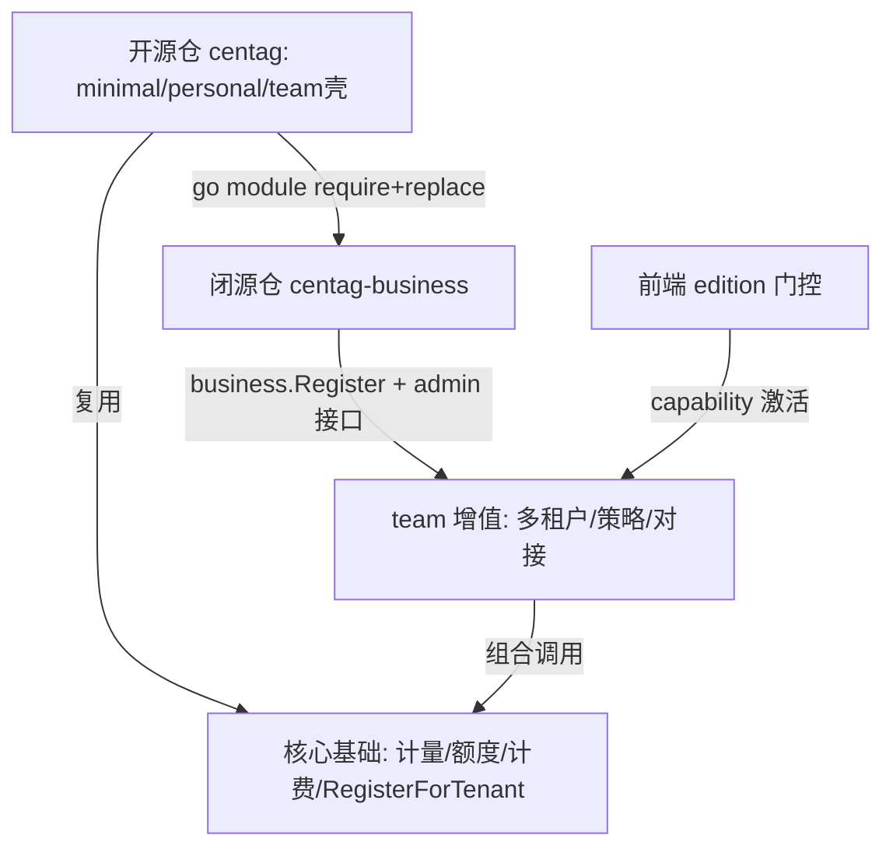

# 技术方案 — 商业化分层（Open Core）

> 版本：v0.2.7 | 日期：2026-07-20 | 作者：Hermes Agent（基于用户决策）

## 1. 背景与目标

### 1.1 问题描述

Centag 是一个 LLM 统一网关（协议适配、后端路由、流水线/钩子/插件、token 计量与计费），当前分 `minimal` / `personal` / `team` 三个发行版。经代码核查：

- `dist/personal/main.go` 与 `dist/team/main.go` **逐字节相同**；start.sh 注释明确"个人全功能 vs 团队版差别在部署默认依赖，不在插件裁剪"——即 **team 目前并未提供个人版之外的功能**。
- 项目已内置"外部业务插件"机制（docs/guide/external-business-plugins.md）：核心二进制不含 `plugins/business/*`，业务实现通过**外部 Go module** 引入，用 `require + replace + blank import + business_* build tags` 接线。
- 前端已有 `web/src/utils/edition.ts` + `capabilities.ts` 的 edition 能力门控；后端核心层已有 `team_quota_service.go`、`RegisterForTenant`（多租户流水线）、`user_quota.go`、`billing.go` 等 team 取向基础能力。

业务目标：以 minimal / personal 作为**免费开源引流**版本，吸引用户，再引导商业用户购买 **team 收费版**。核心约束（用户明确）：

1. 只维护**一套核心代码**（开源仓）；
2. 免费版（minimal / personal）**真正开源**，可自由编译分发；
3. team 增值功能**闭源**；
4. **不能维护两套代码**。

### 1.2 目标

建立"开源核心 + 闭源增值"的 Open Core 分层体系：

- 核心仓库 `centag` **完全开源**（MIT），包含 minimal / personal / team 三发行版的**开源壳**与全部前端 UI。
- 新建**独立闭源仓库 `centag-business`**，承载 team 增值：多用户/多租户管理、可定制用户策略（模型/流水线/额度）、第三方系统对接及后续待挖掘增值点。
- 通过项目已有的"外部业务插件"机制完成两仓接线，核心仓零双份维护。

### 1.3 非目标（防止范围膨胀）

- 本轮**不实现** team 具体功能代码（仅完成方案设计、风险评估与分支/文档落地）；功能代码在后续 Step 3 落地。
- 不修改 minimal / personal 的功能与开源属性。
- 不调整现有单租户计量/额度/计费在开源核心中的基础实现（team 在其上做多租户聚合，不重复实现）。
- 不引入 license 密钥校验到开源核心（license 逻辑归属闭源仓，见 R07）。
- 前端 UI 本轮不新增 team 专属页面（骨架已存在，由闭源后端通过 capability 激活）。

## 2. 方案选型

### 2.1 候选方案对比

| 方案 | 优点 | 缺点 | 推荐 |
|------|------|------|------|
| 方案 A：核心全开源 + `centag-business` 闭源插件仓（外部 business module） | 复用项目已有外部插件机制；单代码库；免费版真正开源；team 闭源；升级核心只更新依赖 | team 增值需在私有仓开发（本就是诉求） | ⭐ |
| 方案 B：同仓 build tags 隔离（team 专属文件 `//go:build team`） | 单仓 | git 无法"部分文件开源"；私有文件仍需另一私有仓注入，复杂度更高；维护心智负担大 | |
| 方案 C：单二进制 + license key 解锁（Open Core 经典） | 分发最简单 | 代码全开源则 team 功能无法隐藏（可逆向解锁），与"免费版真正开源 + team 闭源"冲突 | |

### 2.2 选定方案

**方案 A**：核心仓库 `centag` 完全开源；team 增值通过独立的闭源 Go module `centag-business` 引入，沿用项目已有的 `business_*` build tags + blank import 机制。

选定理由：
1. 项目作者已预埋"外部业务插件"机制（docs/guide/external-business-plugins.md），顺水推舟，非返工。
2. 精确命中全部四条硬约束（单代码库、免费真开源、team 闭源、零双份维护）。
3. 商业上最干净：开源社区打磨网关核心，私有仓装载利润点；核心升级 → 闭源仓 `go get` 更新即可。

## 3. 详细设计

### 3.1 接口设计

**跨仓接线（开源仓 → 闭源仓）：**

- 闭源仓模块路径示例：`github.com/atoml-ai/centag-business`（私有）。
- 开源仓 `dist/team/` 下新增两个文件，用 build tag 隔离：
  - `team_business.go`：`//go:build business_team`，内含 `_ "github.com/atoml-ai/centag-business/..."` 的 blank import，唤醒闭源插件 `init()` 注册。
  - `team_business_stub.go`：`//go:build !business_team`，同包名、空 `init()`/占位导入，保证默认开源构建不含私有代码。
- 闭源仓内部通过项目既有扩展点接入：
  - `BusinessPlugin`：`business.Register()`（plugins/business/ 体系，CAPABILITY_BOUNDARY §3）。
  - 管理接口：`/api/v1/admin/*`（按 ARCHITECTURE 允许的管理能力），用于多租户/子用户/策略的运维管理。
  - 多租户基础能力复用核心已有 `RegisterForTenant`、`team_quota_service`、`user_quota`、`billing`。

**前端门控（已存在，本方案复用）：**

- 前端 `web/src/utils/edition.ts` 的 `TEAM_ONLY_ROUTE_PREFIXES`（`/tenants`、`/system/users`、`/cost`、`/ab-comparison` 等）已就位。
- 后端 `/api/v1/status` 返回 `edition` 与 capability；闭源后端激活时对应 capability 为 true，否则前端路由不可达（天然降级）。

**配置项变更：**

- 无新增强制配置；team 增值相关配置由闭源仓通过既有配置/环境变量机制（`CENTAG_*`）注入。

### 3.2 数据模型

- 开源核心数据模型（用户、额度、用量、计费）**本轮不变**。
- team 多租户数据模型（租户表、子用户、角色、按租户策略）在闭源仓定义，建议复用核心 `RegisterForTenant` 已有的租户键空间，避免与核心表冲突（具体 schema 在 Step 3 设计）。
- 跨仓数据边界：闭源仓不修改核心表结构，仅消费核心暴露的 tenant/quota 接口。

### 3.3 模块影响

| 模块 | 变更 | 说明 |
|------|------|------|
| `dist/team/main.go` | 新增 tag 隔离的 business import 文件 | 默认开源构建用 stub；闭源构建开 `business_team` |
| `core/internal/` | 零修改（或仅增接口契约） | 不得反向依赖闭源仓（R03） |
| `web/src/utils/edition.ts` + `capabilities.ts` | 不变（复用） | team 路由门控已存在 |
| 新增私有仓 `centag-business` | 新建 | 多租户管理、用户策略、第三方对接 |

### 3.4 流程图

## 4. 兼容性与迁移

- **向后兼容**：minimal / personal 行为与现有完全一致，无任何变更。
- **team 开源壳兼容**：默认（无 `business_team` tag）构建出的 team 二进制为"开源占位"形态，不含闭源功能，可自由编译分发；用户购买 team 后通过带 tag 的构建（或预编译二进制）获得增值。
- **版本漂移**：闭源仓 `go.mod` 锁定核心仓具体 tag/commit；建立双向 CI（核心发布新 tag 时触发闭源仓构建校验）。
- **数据迁移**：无（本轮仅文档与分支；功能落地时若需租户表，按 Step 3 独立评估）。

## 5. 风险与应对

> **方案级**风险摘要（选型、架构、兼容）。**开发实现风险**见独立产物：`docs/versions/v0.2.7/commercialization-layered/开发风险评估.md`（Critical=0，High 均已缓解）。

| 风险 | 影响 | 概率 | 应对策略 |
|------|------|------|---------|
| 开源 team 构建误拉私有代码 | team 开源可构建性 | 中 | build tag 隔离 + 开源 stub（R01） |
| 跨仓版本漂移 | 跨仓兼容 | 中 | go.mod 锁版本 + 双向 CI（R02） |
| 核心层反向依赖闭源仓 | 架构合规 | 低 | 仅经插件/管理接口扩展点接入（R03） |
| 许可证传染 | 商业化合法性 | 低 | 核心采用 MIT（R05） |

## 6. 附录

- 已核查证据文件：README.md、AGENT.md、Makefile、go.work、cmd/centag/main.go、dist/{minimal,personal,team}/main.go、start.sh、docs/guide/external-business-plugins.md、docs/harness/CAPABILITY_BOUNDARY.md、sdk/go/plugin.go、web/src/utils/edition.ts。
- 项目研发工作流：docs/harness/workflow/phase-1-design.md（Step 1）。
- 后续步骤：step2-plan（任务规划，触发 Gate 1）。
