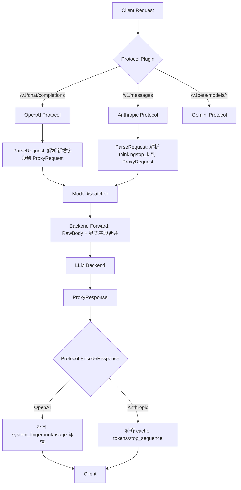

# 技术方案 — 协议对齐与 Models 接口增强

> 版本：v0.2.8 | 日期：2026-07-22 | 作者：AI Agent
> 关联文档：`docs/harness/INTERFACES.md`、`docs/guide/proxy-modes.md`、`验证测试方案.md`
>
> **修订记录（对照源码复核后闭合的 8 项 gap）**：G1 Anthropic RawBody 改存原始 map；G2 Anthropic 错误结构重构为对象；G3 tool_use_id 读取修复；G4 缓存 key 纳入 P0 字段（不可延后）；G5 OpenAI usage total/prompt 算法修正；G6 流式 usage 判据修正；G7 P2 字段占位策略澄清；G8 generateID 恒定登记 residual。详见 `验证测试方案.md §1`。

---

## 1. 背景与目标

### 1.1 问题描述

Centag 当前支持 OpenAI 兼容 (`/v1/chat/completions`)、Anthropic Messages (`/v1/messages`)、Gemini (`/v1beta/models/*`) 及 OpenAI Responses (`/v1/responses`) 四种协议入口。经多个第三方 Agent（如 AutoGPT、LangChain、OpenClaw、Continue.dev 等）接入测试验证后，频繁出现以下兼容性问题：

1. **请求字段缺失导致解析失败或行为异常**：
   - OpenAI：`response_format`（JSON Mode / JSON Schema）、`tool_choice`（对象形式）、`seed`、`n`、`parallel_tool_calls`、`user`、`modalities`、`reasoning_effort` 等字段未解析，直接丢弃。
   - Anthropic：`thinking`（扩展思考配置）、`top_k`、`stream_options`（含 `include_usage`）、`metadata` 未解析。

2. **响应字段缺失导致客户端校验失败**：
   - OpenAI 响应缺少 `system_fingerprint`、`service_tier`、choice 级别 `logprobs`、usage 级别 `completion_tokens_details` / `prompt_tokens_details`。
   - Anthropic 响应缺少 `stop_sequence`、usage 级别 `cache_creation_input_tokens` / `cache_read_input_tokens`。
   - 流式 SSE 中 OpenAI 未在最后一块发送 `usage` 对象（2024-10 后官方行为）， Anthropic 未发送 `thinking` 事件流。

3. **错误响应格式不标准**：
   - 当前错误为简单 `{"error": {"message": "...", "type": "...", "code": "..."}}`，缺少 OpenAI 标准的 `param` 字段及 Anthropic 标准的 `error.type` / `error.error` 结构。

4. **`/v1/models` 接口能力不足**：
   - 当前仅返回 `pipeline.*` 列表（如 `pipeline.direct-backend`），不暴露配置的后端实际支持的模型名。
   - 第三方 Agent 在获取模型列表后无法选择真实后端模型，只能猜测试探。

### 1.2 目标

1. **补齐 OpenAI Chat Completions 协议请求/响应字段**：覆盖 JSON Mode、Tool Choice 对象形式、Seed、N、Parallel Tool Calls、User、Modalities、Reasoning Effort 等高频字段；补齐 Usage 详情、System Fingerprint 等响应字段。
2. **补齐 Anthropic Messages API 协议字段**：覆盖 Thinking 配置、TopK、Stream Options、Metadata；补齐 Cache Token、Stop Sequence 等响应字段。
3. **统一错误响应格式**：按协议类型输出符合 OpenAI / Anthropic 官方规范的错误结构。
4. **增强 `/v1/models` 接口**：同时输出 **Pipeline ID（`pipeline.*`）** 和 **配置后端实际支持的模型列表**；支持流水线 ID 作为模型名；支持 `?type=chat|embedding` 过滤。
5. **保持向后兼容**：已有代理主链路（`modeDispatcher.Dispatch` / `DispatchStream`）不受破坏；新增字段默认不启用时不影响现有行为。

### 1.3 非目标

- **不改** OpenAI Responses API 的深度改造（该协议插件为 `//go:build protocol_openairesponses`，使用面窄，独立排期）。
- **不改** `/v1/completions`（Legacy Completion）的字段补齐——该端点仅做透传，不解析。
- **不改** Gemini 协议的 vision / function calling 流式事件格式（Gemini 协议插件为 `//go:build protocol_gemini`，使用面窄）。
- **不新增** 面向 Agent 的业务专用接口（遵守 `AGENTS.md` §2 接口边界约束）。
- **本轮不实现** `/v1/embeddings` 的模型列表过滤（embeddings 模型列表已在管理端 `/api/v1/backends/:id/models?type=embedding` 支持，代理端以 chat 为主）。

---

## 2. 方案选型

### 2.1 候选方案对比

| 方案 | 优点 | 缺点 | 推荐 |
|------|------|------|------|
| **A. 字段补齐 + RawBody 透传增强** | 解析关键字段进入内部统一格式，其余仍透传 `RawBody`；改动面可控，向后兼容最好 | 仍需维护字段列表，长期可能膨胀 | ⭐ 选定 |
| **B. 全字段建模（struct tag 全覆盖）** | 最完整，所有字段强类型 | 改动面极大，易引入解析兼容性 regression；很多字段 Centag 不处理也无意义 | |
| **C. 纯透传（不做任何解析）** | 零侵入，任何新字段自动支持 | Centag 内部调度/缓存/计费无法感知这些字段（如 `response_format` 影响缓存 key，`tool_choice` 影响调度策略） | |

### 2.2 选定方案

**方案 A（字段补齐 + RawBody 透传增强）**：

- 对 **影响调度、缓存、计费、响应格式** 的字段做显式解析，写入内部 `UnifiedRequest` / `ProxyRequest` 及协议插件数据结构。
- 对 **仅影响后端行为、Centag 不介入处理** 的字段继续保留在 `RawBody` 中，由后端转发时透传。
- 对 **响应字段**，在协议插件的 EncodeResponse / EncodeStreamResponse / FormatStreamChunk 中补齐标准字段（空值或默认值填充，保持结构完整）。

理由：
1. Centag 作为网关必须理解 `response_format`、`tool_choice`、`thinking` 等字段，因为它们影响缓存 key 构造、流水线节点选择、模型匹配逻辑。
2. 纯透传（方案 C）会让语义缓存、问题拆分等内部机制失效。
3. 全字段建模（方案 B）成本过高且回归风险大，很多字段如 `logprobs`、`audio` 当前 Centag 并不介入处理。

---

## 3. 详细设计

### 3.1 接口设计

#### 3.1.1 OpenAI Chat Completions — 请求字段补齐

当前 `plugins/protocol/openai/protocol.go` 中的 `ChatCompletionRequest` 结构体扩展如下（新增字段标记为 **[+]**）：

```go
type ChatCompletionRequest struct {
    Messages         []Message        `json:"messages"`
    Model            string            `json:"model"`
    Stream           bool              `json:"stream,omitempty"`
    Temperature      float64           `json:"temperature,omitempty"`
    MaxTokens        int               `json:"max_tokens,omitempty"`
    TopP             float64           `json:"top_p,omitempty"`
    FrequencyPenalty float64           `json:"frequency_penalty,omitempty"`
    PresencePenalty  float64           `json:"presence_penalty,omitempty"`
    Stop             []string          `json:"stop,omitempty"`

    // [+] 以下为新增字段
    Seed               *int               `json:"seed,omitempty"`
    ResponseFormat     *ResponseFormat    `json:"response_format,omitempty"`  // { "type": "json_object" | "json_schema" | "text" }
    ToolChoice         interface{}        `json:"tool_choice,omitempty"`        // "auto" | "none" | "required" | { "type": "function", "function": { "name": "..." } }
    N                  *int               `json:"n,omitempty"`
    User               string             `json:"user,omitempty"`
    ParallelToolCalls  *bool              `json:"parallel_tool_calls,omitempty"`
    Modalities         []string           `json:"modalities,omitempty"`         // ["text", "audio"]
    Audio              *AudioConfig       `json:"audio,omitempty"`
    Metadata           map[string]string  `json:"metadata,omitempty"`
    ServiceTier        string             `json:"service_tier,omitempty"`
    Store              *bool              `json:"store,omitempty"`
    ReasoningEffort    string             `json:"reasoning_effort,omitempty"`   // "low" | "medium" | "high"
    Logprobs           *bool              `json:"logprobs,omitempty"`
    TopLogprobs        *int               `json:"top_logprobs,omitempty"`
    // Tools 已在内部 types 中定义，需确认链路透传
}

type ResponseFormat struct {
    Type       string          `json:"type"` // json_object | json_schema | text
    JSONSchema *JSONSchemaDef  `json:"json_schema,omitempty"`
}

type JSONSchemaDef struct {
    Name   string      `json:"name"`
    Schema interface{} `json:"schema"`
    Strict *bool       `json:"strict,omitempty"`
}

type AudioConfig struct {
    Voice  string `json:"voice"`
    Format string `json:"format"`
}
```

**`ParseRequest` 改造点**：
1. 继续先 `json.Unmarshal` 到 `rawBody map[string]interface{}` 保留透传能力。
2. 再 `json.Unmarshal` 到扩展后的 `ChatCompletionRequest`。
3. 将解析出的新增字段映射到 `plugin.ProxyRequest` 的**显式字段**（与 §3.2.1 ProxyRequest 扩展对齐，禁止塞进 Metadata 后又依赖 handler 拷贝显式字段导致丢失）：
   - [修订 L2] 映射目标统一为显式字段；Metadata 仅存放"无显式字段承载"的边缘 key。
   - `Seed` → `ProxyRequest.Seed`
   - `ResponseFormat` → `ProxyRequest.ResponseFormat`（类型 `*ResponseFormatSpec`）
   - `ToolChoice` → `ProxyRequest.ToolChoice`（同时保留在 `RawBody` 中供后端透传）
   - `N` → `ProxyRequest.N`
   - `User` → `ProxyRequest.User`
   - `ParallelToolCalls` → `ProxyRequest.ParallelToolCalls`
   - `ReasoningEffort` → `ProxyRequest.Reasoning.Effort` 且 `Specified=true`（映射到已有的 `ReasoningSpec`）
   - [补充 L4] `Tools` → `ProxyRequest.Tools`（与 `UnifiedRequest.Tools` 对齐；供 ModeDispatcher 工具感知调度，非仅经 RawBody 透传）
   - `ServiceTier` / `Store` / `Metadata`（客户端 metadata）→ `ProxyRequest.Metadata["service_tier"]/["store"]/["client_metadata"]`（无显式字段承载，保留在 Metadata；RawBody 仍含原值供后端透传）
   - [修订 G7] `Modalities` / `Audio` / `Logprobs` / `TopLogprobs` —— **P2 占位，本轮不映射到 ProxyRequest、不进 Metadata**，仅经 `RawBody` 透传至后端；结构体位置已占位 `omitempty`。

**Message 结构扩展**：

```go
type Message struct {
    Role             string         `json:"role"`
    Content          MessageContent `json:"content,omitempty"`
    ToolCalls        []ToolCall     `json:"tool_calls,omitempty"`
    ToolCallID       string         `json:"tool_call_id,omitempty"`
    ReasoningContent string         `json:"reasoning_content,omitempty"`
    Name             string         `json:"name,omitempty"`           // [+] function 角色使用
    Refusal          string         `json:"refusal,omitempty"`        // [+] 模型拒绝时填充
}
```

- `name` 字段：当 `role == "function"`（legacy）或 `role == "tool"` 时可携带，用于标识调用者。
- `refusal` 字段：模型拒绝回答时返回，需在 `HandleResponse` 和 `FormatStreamChunk` 中支持。

#### 3.1.2 OpenAI Chat Completions — 响应字段补齐

**非流式响应 `ChatCompletionResponse` 扩展**：

```go
type ChatCompletionResponse struct {
    ID                string   `json:"id"`
    Object            string   `json:"object"`
    Created           int64    `json:"created"`
    Model             string   `json:"model"`
    Choices           []Choice `json:"choices"`
    Usage             Usage    `json:"usage"`
    SystemFingerprint string   `json:"system_fingerprint,omitempty"`  // [+]
    ServiceTier       string   `json:"service_tier,omitempty"`        // [+]
}

type Choice struct {
    Index        int            `json:"index"`
    Message      Message        `json:"message"`
    FinishReason string         `json:"finish_reason"`
    Logprobs     *ChoiceLogprobs `json:"logprobs,omitempty"`  // [+]
}

type ChoiceLogprobs struct {
    Content []TokenLogprob `json:"content,omitempty"`
}

type TokenLogprob struct {
    Token       string  `json:"token"`
    Logprob     float64 `json:"logprob"`
    Bytes       []int   `json:"bytes,omitempty"`
    TopLogprobs []TopTokenLogprob `json:"top_logprobs,omitempty"`
}

type TopTokenLogprob struct {
    Token   string  `json:"token"`
    Logprob float64 `json:"logprob"`
    Bytes   []int   `json:"bytes,omitempty"`
}

type Usage struct {
    PromptTokens            int                     `json:"prompt_tokens"`
    CompletionTokens        int                     `json:"completion_tokens"`
    TotalTokens             int                     `json:"total_tokens"`
    PromptTokensDetails     *TokenDetails           `json:"prompt_tokens_details,omitempty"`     // [+]
    CompletionTokensDetails *CompletionTokenDetails `json:"completion_tokens_details,omitempty"` // [+]
}

type TokenDetails struct {
    CachedTokens int `json:"cached_tokens,omitempty"`
    AudioTokens  int `json:"audio_tokens,omitempty"`
}

type CompletionTokenDetails struct {
    ReasoningTokens     int `json:"reasoning_tokens,omitempty"`
    AudioTokens         int `json:"audio_tokens,omitempty"`
    AcceptedPredictionTokens int `json:"accepted_prediction_tokens,omitempty"`
    RejectedPredictionTokens int `json:"rejected_prediction_tokens,omitempty"`
}
```

**`HandleResponse` 改造点**：
1. 从后端原始响应（`ProxyResponse.RawBody` 或 `Metadata`）中提取 `system_fingerprint`、`service_tier`、usage 详情。
2. 若后端未返回，填充空值或省略（`omitempty`），保持结构完整但不伪造数据。
3. `Created` 字段改为使用真实时间戳（`time.Now().Unix()`）而非固定 `0`。
4. **[修订 G5] usage 修正**：当前 `openai/protocol.go:252` 错算 `TotalTokens = CompletionTokens = resp.TokensUsed`、`PromptTokens = 0`。改为：
   - `PromptTokens`：优先从 `resp.Metadata["prompt_tokens"]`（int）提取；无则 0。
   - `CompletionTokens`：从 `resp.TokensUsed`（或 `resp.UsageCompletionTokens`，按后端填充路径）。
   - `TotalTokens = PromptTokens + CompletionTokens`（禁止等于 CompletionTokens）。
   - 流式总用量同理用 `UsagePromptTokens + UsageCompletionTokens`。

**流式 SSE 响应扩展**：

`FormatStreamChunk` 当前只输出 `delta.content` 和 `finish_reason`。需扩展为：

```go
// 流式 chunk 中新增字段
type StreamDelta struct {
    Content          string     `json:"content,omitempty"`
    Role             string     `json:"role,omitempty"`
    ToolCalls        []ToolCall `json:"tool_calls,omitempty"`  // 流式工具调用增量
    Refusal          string     `json:"refusal,omitempty"`     // [+]
    ReasoningContent string     `json:"reasoning_content,omitempty"` // [+] DeepSeek / OpenAI o1
}
```

**流式结束时的 `usage` 事件**（OpenAI 2024-10 新增行为）：

当 `chunk.Done == true` 时，在 `[DONE]` 之前额外发送一条 SSE 事件：

```
data: {"id":"...","object":"chat.completion.chunk","created":...,"model":"...","choices":[],"usage":{"prompt_tokens":123,"completion_tokens":45,"total_tokens":168}}
```

实现方式：在 `FormatStreamChunk` 中判断 `chunk.Done && (chunk.UsagePromptTokens > 0 || chunk.UsageCompletionTokens > 0)`，构造 `choices: []` + `usage` 的 chunk。

> **[修订 G6]** `StreamChunk` 已含 `UsagePromptTokens` / `UsageCompletionTokens`（`core/pkg/plugin/backend.go:60-62`，`json:"-"` 仅供代理层统计）。**不应**只用聚合的 `TokensUsed > 0` 作为判据——当后端 prompt=0 而 completion>0 时仍须发 usage 事件以符合官方 2024-10 行为；反之 prompt=0 且 completion=0 时不发，仅 `[DONE]`。`usage.total_tokens = UsagePromptTokens + UsageCompletionTokens`。

#### 3.1.3 Anthropic Messages API — 请求字段补齐

当前 `plugins/protocol/anthropic/protocol.go` 中的 `MessagesRequest` 扩展：

```go
type MessagesRequest struct {
    Model       string           `json:"model"`
    MaxTokens   int              `json:"max_tokens"`
    Messages    []Message        `json:"messages"`
    Stream      bool             `json:"stream,omitempty"`
    TopP        float64          `json:"top_p,omitempty"`
    Temperature float64          `json:"temperature,omitempty"`
    System      string           `json:"system,omitempty"`
    Tools       []ToolDefinition `json:"tools,omitempty"`
    ToolChoice  interface{}      `json:"tool_choice,omitempty"`

    // [+] 以下为新增字段
    TopK          int              `json:"top_k,omitempty"`
    Thinking      *ThinkingConfig  `json:"thinking,omitempty"`
    Metadata      *MetadataConfig  `json:"metadata,omitempty"`
    StreamOptions *StreamOptions   `json:"stream_options,omitempty"`
}

type ThinkingConfig struct {
    Type         string `json:"type"`           // "enabled"
    BudgetTokens int    `json:"budget_tokens"`
}

type MetadataConfig struct {
    UserID string `json:"user_id,omitempty"`
}

type StreamOptions struct {
    IncludeUsage bool `json:"include_usage,omitempty"`
}
```

**`ParseRequest` 改造点**：
0. **[修订 G1] 原始请求体透传**：当前 `anthropic/protocol.go:87` `RawBody: anthropicReq`（已解析 struct）破坏"RawBody 透传保留"前提。改为与 OpenAI 一致：先 `json.Unmarshal(body, &rawBody map[string]interface{})` 保留全文，再 unmarshal 到 `MessagesRequest`，`ProxyRequest.RawBody = rawBody`（map）。后端转发以 `RawBody`(map) 为基础，显式字段覆盖。
1. `Thinking` → `ProxyRequest.Reasoning`（映射：`BudgetTokens` → `ReasoningSpec.BudgetTokens`，`Specified=true`）。
2. `TopK` → [修订 G7] **P2 占位，本轮不映射、不进 Metadata**，仅经 RawBody 透传。
3. `Metadata.UserID` → `ProxyRequest.Metadata["anthropic_user_id"]`。
4. `StreamOptions` → `ProxyRequest.Metadata["stream_options"]`（供后端透传）。
6. [补充 L4] `Tools` → `ProxyRequest.Tools`、`ToolChoice` → `ProxyRequest.ToolChoice`（与 OpenAI 侧及 `UnifiedRequest` 对齐；供 ModeDispatcher 工具感知调度，非仅经 RawBody 透传）。
5. **[修订 G3] tool_result 回环修复**：扩展 `ContentBlock` 增 `ToolUseID string \`json:"tool_use_id,omitempty"\``；修复 `extractToolCallID`（当前 `anthropic/protocol.go:384` 错读 `block.Input.(string)`），改为读 `block.ToolUseID`；`convertAnthropicMessages` 中 `tool_result` 块的文本同理回填 `ToolCallID`。确保 Anthropic tool 回环（用户提交 tool_result → 内部 tool_call_id → 后端）不丢标识。

#### 3.1.4 Anthropic Messages API — 响应字段补齐

**非流式响应 `MessagesResponse` 扩展**：

```go
type MessagesResponse struct {
    ID         string         `json:"id"`
    Type       string         `json:"type"`
    Role       string         `json:"role"`
    Content    []ContentBlock `json:"content"`
    Model      string         `json:"model"`
    StopReason string         `json:"stop_reason"`
    StopSequence string       `json:"stop_sequence,omitempty"`  // [+]
    Usage      Usage          `json:"usage"`
}

type Usage struct {
    InputTokens              int `json:"input_tokens"`
    OutputTokens             int `json:"output_tokens"`
    CacheCreationInputTokens int `json:"cache_creation_input_tokens,omitempty"` // [+]
    CacheReadInputTokens     int `json:"cache_read_input_tokens,omitempty"`     // [+]
}
```

**流式响应扩展**：

Anthropic 流式事件当前已覆盖 `message_start`、`content_block_start`、`content_block_delta`、`content_block_stop`、`message_delta`、`message_stop`。

需新增 **thinking 事件流**（Claude 3.7+）：

```
event: content_block_start
data: {"type":"content_block_start","index":1,"content_block":{"type":"thinking","thinking":""}}

event: content_block_delta
data: {"type":"content_block_delta","index":1,"delta":{"type":"thinking_delta","thinking":"..."}}

event: content_block_stop
data: {"type":"content_block_stop","index":1}
```

实现方式：在 `FormatStreamChunk` 中检测 `chunk.ReasoningContent`，若不为空则输出 thinking 事件流（index=1，与 text 的 index=0 区分）。

#### 3.1.5 错误响应格式标准化

**OpenAI 标准错误格式**：

```json
{
  "error": {
    "message": "...",
    "type": "invalid_request_error",
    "param": "messages",
    "code": "context_length_exceeded"
  }
}
```

当前 `openai/protocol.go` 的 `HandleResponse` 中错误处理：

```go
// 改造后：增加 param 字段
c.JSON(500, gin.H{
    "error": gin.H{
        "message": resp.Error.Message,
        "type":    resp.Error.Type,
        "code":    resp.Error.Code,
        "param":   resp.Error.Param,  // [+]
    },
})
```

需扩展 `plugin.ErrorResponse`：

```go
type ErrorResponse struct {
    Message string `json:"message"`
    Type    string `json:"type"`
    Code    string `json:"code"`
    Param   string `json:"param,omitempty"`  // [+]
}
```

**Anthropic 标准错误格式**：

Anthropic 错误结构为：

```json
{
  "type": "error",
  "error": {
    "type": "invalid_request_error",
    "message": "..."
  }
}
```

当前 `anthropic/protocol.go` 的 `HandleResponse` 中错误处理**[修订 G2] 不正确**：`anthropic/protocol.go:108` 写 `"error": resp.Error.Message`（字符串），而 Anthropic 规范要求 `error` 为对象 `{"type":..,"message":..}`。须重构为：

```go
c.JSON(500, gin.H{
    "type":  "error",
    "error": gin.H{
        "type":    resp.Error.Type,     // 如 "invalid_request_error"
        "message": resp.Error.Message,
    },
})
```

并统一错误 code 映射（`backend.ClassifyClientError` 已有 code，透出 error.type/subtype）。新增单测断言 `error` 为 object、含 `type` 与 `message` 两键。

#### 3.1.6 `/v1/models` 接口增强设计

**当前行为**：`ListModels` 仅返回 `pipeline.*` 列表（`pipeline.direct-backend`、`pipeline.smart-scheduling` 等）。

**目标行为**：同时返回两类模型条目：

| 类型 | ID 格式 | 示例 | 用途 |
|------|---------|------|------|
| Pipeline | `pipeline.{pipeline_id}` | `pipeline.direct-backend` | 供 Agent 按场景选择 |
| Backend Model | `{backend_model_name}` | `gpt-4o`、`claude-3-5-sonnet-20241022` | 供 Agent 直接指定后端模型 |

**实现设计**：

```go
func (h *Handler) ListModels(c *gin.Context) {
    modelType := c.DefaultQuery("type", "chat") // chat | embedding | all

    var data []gin.H

    // 1. 添加 Pipeline 条目（已有逻辑）
    for _, p := range h.listModelsPipelines() {
        data = append(data, gin.H{
            "id":       "pipeline." + p.ID,
            "object":   "model",
            "created":  0,
            "owned_by": "centag",
        })
    }

    // 2. [+] 添加配置后端的 supported_models 条目
    backendMgr := backend.GetManager()
    if backendMgr != nil {
        seen := make(map[string]struct{})
        for _, b := range backendMgr.GetAll() {
            if !b.Enabled {
                continue
            }
            for _, sm := range b.SupportedModels {
                name := sm.ActualModel
                if name == "" {
                    name = sm.RequestedModel
                }
                if name == "" {
                    continue
                }
                if _, ok := seen[name]; ok {
                    continue
                }
                seen[name] = struct{}{}

                // 根据 modelType 过滤
                if modelType != "all" {
                    if modelType == "embedding" && !isEmbeddingModel(name) {
                        continue
                    }
                    if modelType == "chat" && isEmbeddingModel(name) {
                        continue
                    }
                }

                data = append(data, gin.H{
                    "id":       name,
                    "object":   "model",
                    "created":  0,
                    "owned_by": b.Name, // 用后端名称作为 owned_by，方便区分来源
                })
            }
        }
    }

    c.JSON(200, gin.H{
        "object": "list",
        "data":   data,
    })
}
```

**管理端接口同步**：

管理端 `GET /api/v1/backends/:id/models` 已有 `?type=chat|embedding|all` 过滤，逻辑保持一致。

---

### 3.2 数据模型

#### 3.2.1 内部统一类型扩展（`core/pkg/types/types.go` 和 `core/pkg/plugin/protocol.go`）

当前 `UnifiedRequest` 和 `ProxyRequest` 需扩展以下字段：

```go
// ProxyRequest (core/pkg/plugin/protocol.go)
type ProxyRequest struct {
    Messages         []Message       `json:"messages"`
    Model            string          `json:"model"`
    Stream           bool            `json:"stream"`
    BackendID        string          `json:"backend_id,omitempty"`
    Temperature      float64         `json:"temperature,omitempty"`
    MaxTokens        int             `json:"max_tokens,omitempty"`
    TopP             float64         `json:"top_p,omitempty"`
    FrequencyPenalty float64         `json:"frequency_penalty,omitempty"`
    PresencePenalty  float64         `json:"presence_penalty,omitempty"`
    Stop             []string        `json:"stop,omitempty"`
    System           string          `json:"system,omitempty"`
    Reasoning        ReasoningSpec   `json:"reasoning,omitempty"`
    Metadata         map[string]any  `json:"metadata,omitempty"`
    RawBody          any             `json:"-"`
    Headers          map[string]string `json:"-"`

    // [+] 以下为新增字段（从 Metadata 提升为显式字段，方便内部处理）
    Tools             []ToolDefinition    `json:"tools,omitempty"`          // 与 UnifiedRequest.Tools 对齐
    ToolChoice        interface{}         `json:"tool_choice,omitempty"`    // 与 UnifiedRequest.ToolChoice 对齐
    ResponseFormat    *ResponseFormatSpec `json:"response_format,omitempty"` // P0
    Seed              *int                `json:"seed,omitempty"`            // P1
    N                 *int                `json:"n,omitempty"`               // P1
    User              string              `json:"user,omitempty"`            // P1
    ParallelToolCalls *bool               `json:"parallel_tool_calls,omitempty"` // P1
    Modalities        []string            `json:"modalities,omitempty"`      // P2 占位（见下方 G7 澄清）
    TopK              int                 `json:"top_k,omitempty"`           // P2 占位（见下方 G7 澄清） // Anthropic 使用
}

type ResponseFormatSpec struct {
    Type       string      `json:"type"`
    JSONSchema interface{} `json:"json_schema,omitempty"`
}
```

> **[修订 G7] P2 字段占位策略澄清**：`Modalities` / `TopK`（及 §3.1.1 的 `logprobs`/`top_logprobs`/`audio`）虽在结构体占位（`omitempty`），但本轮**不实装** ParseRequest 映射、不在 `handler.copyProxyRequestFields` 中拷贝、不进缓存 key。仅保留结构体位置与 RawBody 透传通道，待 v0.2.9。CI 检查：`rg 'Modalities|TopK|Logprobs' plugins/protocol/openai/protocol.go plugins/protocol/anthropic/protocol.go core/internal/proxy/handler.go` 中 ParcelRequest 映射行应为 0；若误加映射即范围蔓延，触犯 R11。本澄清与风险登记 R11"P2 字段无独立任务项"一致。

**注**：`ProxyResponse` 中的 `Error` 需扩展 `Param` 字段：

```go
type ErrorResponse struct {
    Message string `json:"message"`
    Type    string `json:"type"`
    Code    string `json:"code"`
    Param   string `json:"param,omitempty"`  // [+]
}
```

#### 3.2.2 后端转发时的透传策略

`ModeDispatcher` 将 `ProxyRequest` 转发给后端时，需将显式字段和 `RawBody` 合并为完整请求体。当前 `internal/proxy/handler.go` 中构造的 `proxyReq` 只拷贝了基础字段：

```go
// 改造点：拷贝新增字段（集中到 helper，避免分散遗漏；R05）
proxyReq := &plugin.ProxyRequest{
    Model:       req.Model,
    Messages:    req.Messages,
    Temperature: req.Temperature,
    MaxTokens:   req.MaxTokens,
    Stream:      req.Stream,
    RawBody:     req.RawBody,
    // [+] P0/P1 字段
    ResponseFormat:    req.ResponseFormat,
    ToolChoice:        req.ToolChoice,
    Seed:              req.Seed,
    N:                 req.N,
    User:              req.User,
    ParallelToolCalls: req.ParallelToolCalls,
    Reasoning:         req.Reasoning,
    // [修订 G7] Modalities / TopK 为 P2 占位，本轮不拷贝
}
```

后端插件（`plugins/backend/`）在构造实际 HTTP 请求时，优先使用 `RawBody` 作为基础，然后用显式字段覆盖（确保解析值优先于原始值）。

> **[修订 G4 / 必做任务 TC] 缓存 key 纳入 P0 字段**：当前 `core/internal/cache/proxy_cache.go:78` `GetRequestKey(model, messages, temperature, maxTokens)` 签名不含新增 P0 字段，与方案选型"response_format 影响缓存 key"自相矛盾。**本任务不可延后**（§5 不再写"独立任务跟进"）。改造：
> 1. `GetRequestKey` 增参 `responseFormat *ResponseFormatSpec, toolChoice interface{}, seed *int`（或改接收 `*plugin.ProxyRequest` 以降低签名漂移）。
> 2. `keyData` map 追加这 3 字段的稳定序列化（注意 `tool_choice` 为 `interface{}`，须 `json.Marshal` 后取 hash，对 nil/对象/string 统一）。
> 3. 同步更新所有调用点（`proxy_cache.go` 内 + 预测接口 `NormalizeMessagesForKey` 路径）。
> 4. 旧缓存因 key 变更将全部失效——属预期，须在自测记录登记，不在本次回写兼容。
> 5. 单测：`TestCacheKey_DiffersByResponseFormat/Seed/ToolChoice` + `TestCacheKey_StableForSameInput`（见 `验证测试方案.md §3.8`）。
> **CI 检查**：`rg 'GetRequestKey' ./core/internal/cache/ ./core/internal/proxy/` 调用点签名一致性。

---

### 3.3 模块影响

| 模块 | 文件 | 变更范围 | 说明 |
|------|------|---------|------|
| **协议插件** | `plugins/protocol/openai/protocol.go` | 高 | 请求/响应结构扩展、ParseRequest 新增字段映射、HandleResponse 补齐字段、FormatStreamChunk 支持 usage 结束事件 |
| **协议插件** | `plugins/protocol/anthropic/protocol.go` | 高 | 请求/响应结构扩展、thinking 流式事件、错误格式 |
| **统一类型** | `core/pkg/types/types.go` | 中 | UnifiedRequest 扩展（Tools/ToolChoice 已存在，新增 ResponseFormat 等） |
| **插件接口** | `core/pkg/plugin/protocol.go` | 中 | ProxyRequest 扩展字段、ErrorResponse 扩展 Param |
| **代理处理** | `core/internal/proxy/handler.go` | 中 | proxyReq 构造拷贝新增字段、ListModels 增强 |
| **流式重建** | `core/internal/proxy/handler_stream_reconstruct_test.go` | 中 | 测试用例更新以覆盖新增字段 |
| **后端连接** | `core/pkg/backend/openai_connection.go` | 低 | 错误分类可能需新增 Param 信息 |
| **路由** | `core/pkg/server/server.go` | 低 | 无需变更（路由已注册 `/v1/models`） |
| **管理端** | `core/pkg/server/backend_handler.go` | 低 | `GetModels` 已有 type 过滤，逻辑复用 |
| **LLM 服务** | `core/internal/llm/openai_chat.go` | 低 | 内部 LLM 调用结构可保持最小子集，不受影响 |
| **测试** | `plugins/protocol/openai/protocol_test.go` | 高 | 新增字段解析/序列化测试 |
| **测试** | `plugins/protocol/anthropic/protocol_test.go` | 高 | 新增字段解析/序列化测试 |
| **测试** | `core/internal/proxy/list_models_test.go` | 中 | 覆盖后端模型列表输出 |
| **文档** | `docs/api/`、`docs/guide/` | 中 | API 文档更新 |

---

### 3.4 流程图



---

## 4. 兼容性与迁移

### 4.1 向后兼容

- **新增字段均使用 `omitempty`**：旧客户端不发送这些字段时，JSON 序列化不会包含空值，响应结构保持原样。
- **`RawBody` 透传保留**：即使新增字段解析失败，原始请求体仍通过 `RawBody` 到达后端，后端可以自行解析。
- **Pipeline 模型名保留**：`pipeline.*` 前缀的模型 ID 继续存在，已有 Agent 使用不受影响。
- **错误响应升级**：新增 `param` 字段为 `omitempty`，不影响旧客户端解析。

### 4.2 配置迁移

- 无需数据库 schema 变更。
- `BackendConfig.SupportedModels` 已存在，无需新增表或字段。
- 版本发布说明中需提醒：第三方 Agent 现在可以在 `/v1/models` 中看到真实后端模型名，可能需要更新其模型选择逻辑。

---

## 5. 风险与应对

> **方案级**风险摘要。开发实现风险见独立产物：`docs/versions/v0.2.8/protocol-alignment/开发风险评估.md`。

| 风险 | 影响 | 概率 | 应对策略 |
|------|------|------|---------|
| 字段解析兼容性 regression | 旧客户端请求被错误解析 | 中 | 保留 RawBody 透传作为 fallback；新增字段解析失败不阻断主链路 |
| 响应字段膨胀导致客户端反序列化失败 | 某些严格类型的 SDK 报错 | 低 | 所有新增响应字段使用 `omitempty`；不伪造数据 |
| Models 接口返回模型过多 | 某些 Agent 下拉列表过长 | 中 | 支持 `?type=chat\|embedding\|all` 过滤；默认 `type=chat` |
| 流式 usage 结束事件与旧客户端不兼容 | 旧客户端解析 SSE 时遇到非预期事件 | 低 | 该事件为 OpenAI 2024-10 官方新增，主流 SDK 已支持；可配置开关（本版本暂不加开关，直接跟随官方） |
| Anthropic thinking 事件流格式变动 | Anthropic 官方 thinking 协议仍在演进 | 中 | thinking 事件按当前官方文档实现；如后续变动，在 patch 版本跟进 |
| 缓存 key 未包含新增字段导致缓存污染 | `response_format`/`tool_choice`/`seed` 不同但缓存 key 相同，命中错误缓存 | 中 | **[修订 G4] 本轮同步更新缓存 key 生成逻辑（`cache.ProxyCache`），将新增 P0 显式字段纳入 key 计算；旧缓存全部失效属预期，不得延后**（详见 §3.2.2 任务 TC） |

---

## 6. 附录

### 6.1 参考文档

- OpenAI Chat Completions API Reference: https://platform.openai.com/docs/api-reference/chat
- OpenAI Models API Reference: https://platform.openai.com/docs/api-reference/models
- Anthropic Messages API Reference: https://docs.anthropic.com/en/api/messages
- Anthropic Streaming: https://docs.anthropic.com/en/api/messages-streaming
- Centag 接口约束：`docs/harness/INTERFACES.md`
- Centag 架构约束：`docs/harness/ARCHITECTURE.md`

### 6.2 字段优先级汇总

| 协议 | 字段 | 优先级 | 影响面 | 处理方式 |
|------|------|--------|--------|---------|
| OpenAI | `response_format` | P0 | 缓存 key、后端透传 | 显式解析 → ProxyRequest.ResponseFormat |
| OpenAI | `tool_choice` (对象) | P0 | 调度策略、后端透传 | 显式解析 → ProxyRequest.ToolChoice |
| OpenAI | `seed` | P1 | 缓存 key | 显式解析 → Metadata / ProxyRequest.Seed |
| OpenAI | `n` | P1 | 响应格式（多 choices） | 显式解析 → Metadata / ProxyRequest.N |
| OpenAI | `parallel_tool_calls` | P1 | 后端透传 | 显式解析 → Metadata |
| OpenAI | `reasoning_effort` | P1 | 映射到 ReasoningSpec | 显式解析 → ProxyRequest.Reasoning.Effort |
| OpenAI | `user` | P1 | 追踪/计费 | 显式解析 → Metadata |
| OpenAI | `system_fingerprint` | P1 | 响应格式 | 从后端响应提取， HandleResponse 填充 |
| OpenAI | `usage.details` | P1 | 响应格式 | 从后端响应提取， HandleResponse 填充 |
| OpenAI | `logprobs` / `top_logprobs` | P2 | 响应格式 | **[G7] 仅结构体占位，本轮不解析、不进 Metadata**；响应字段 `omitempty` 占位，经 RawBody 透传 |
| OpenAI | `modalities` / `audio` | P2 | 后端透传 | **[G7] 仅结构体占位，本轮不解析、不进 Metadata**；经 RawBody 透传 |
| Anthropic | `thinking` | P0 | 调度策略、流式事件 | 显式解析 → ProxyRequest.Reasoning；流式输出 thinking 事件 |
| Anthropic | `stream_options` | P1 | 流式 usage | 显式解析 → Metadata |
| Anthropic | `top_k` | P2 | 后端透传 | **[G7] 仅结构体占位，本轮不解析、不进 Metadata**；经 RawBody 透传至后端 |
| Anthropic | `cache tokens` | P1 | 响应格式 | 从后端响应提取， HandleResponse 填充 |
| 通用 | 错误 `param` | P1 | 错误响应格式 | ErrorResponse 扩展 Param 字段 |
| 通用 | `/v1/models` 后端模型 | P0 | 模型发现 | ListModels 增强，追加后端 supported_models |

### 6.3 Residual 登记（非本版本范围，可选顺手修）

| ID | 问题 | 证据 | 处置 |
|----|------|------|------|
| G8 | `randomString`（`openai/protocol.go:432`、`anthropic/protocol.go:450`）`charset[i%len]` 恒定，导致所有 `chatcmpl-`/`msg-` 响应 ID 同值，影响追踪/客户端去重 | 对照源码 | 非协议对齐范围；建议顺手改 `rand.Intn` 或用 `crypto/rand`/uuid。若不修须在自测记录登记残余，不纳入本版本验收 |
