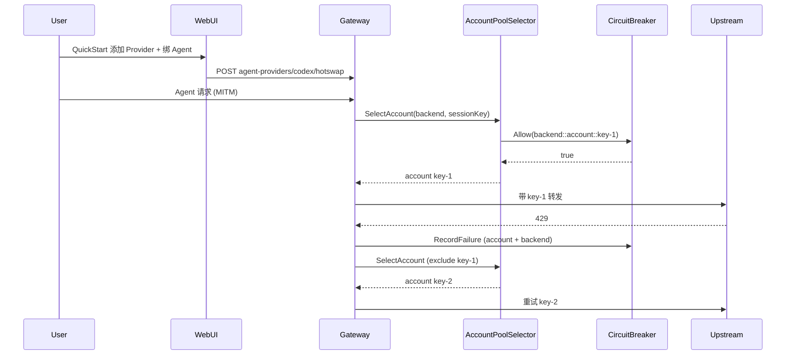

# 技术方案 — Provider/Agent 本地接入与账户池

> 版本：v0.2.9 | 日期：2026-07-23 | 作者：AI  
> 分支：`feature/v0.2.9`（自 v0.2.8）  
> 关联文档：`docs/harness/INTERFACES.md`、`docs/guide/system-proxy-egress.md`、对比报告 Centag vs cc-switch  
> 前置版本：v0.2.5（本机代理）、v0.2.6（WebUI 能力矩阵）、v0.2.8（协议对齐）、v0.2.9 npm 搭便车（已发）  
> 更新记录：2026-07-23 新增 G6（Raw 流水线优化）、G7（前端可配置性与入口优化）

---

## 1. 背景与目标

### 1.1 问题描述

v0.2.8 完成协议对齐后，Centag 在**服务端网关能力**上已领先 opencodex/cc-switch，但个人开发者接入体验仍有明显缺口：

1. **账户池缺失**：每个 Backend 仅支持单 `api_key`；429/401 时只能后端级 fallback，无法在同一 Provider 内轮转多 Key（opencodex 杀手锏）。
2. **熔断器不完整**：现有熔断仅基于滑动窗口**失败次数**；高并发下偶发成功会掩盖整体故障。cc-switch 支持 60–70% 错误率阈值触发。
3. **本地接入「能用不好用」**：v0.2.5 已实现 MITM/PAC/`centag wrap`，但 WebUI 以复制命令为主；Agent 接入（`AgentSetup.vue`）与 Provider 切换、本机代理三条路径未打通。
4. **Provider 管理「有骨架缺体验」**：
   - 预设仅 ~20 个（cc-switch 50+）；
   - 卡片无熔断状态、无账户池指示；
   - `FallbackBackends` 无 UI；
   - 无「设为某 Agent 默认 Provider」快捷操作。
5. **多 Agent 接入「有 API 缺闭环」**：
   - `AgentProviderConfig` + `HotSwap` API 已实现，WebUI 未消费；
   - `AgentSetup` 走流水线选型，与 Provider 卡片、AgentProvider 路由脱节；
   - 普通用户切换 Provider 后 Agent 无感（MITM 路径）或需手动重写配置（直连路径）。

### 1.2 目标

本版本（v0.2.9 业务主交付）达成以下目标：

| # | 目标 | 验收口径 |
|---|------|----------|
| G1 | **账户池**：Backend 级多凭证轮转 + 会话亲和 + 账户级熔断 | 3 Key 池、429 自动切换、同 thread 不漂移 |
| G2 | **错误率熔断**：`error_rate_threshold` 热生效 | 窗口内错误率 ≥ 阈值触发 Open，与失败次数 OR 关系 |
| G3 | **本地接入闭环**：Web 一键启用本机代理 + Agent 接入向导串联 | Personal 用户 5 步内完成「装 Centag → 开代理 → 加 Provider → Agent 可用」 |
| G4 | **Provider 管理好用**：预设 40+、卡片增强、一键绑定 Agent | 对齐 cc-switch Provider 面板核心体验（不含 MCP/Skills） |
| G5 | **多 Agent 接入好用**：HotSwap UI + Provider↔Agent 联动 | Claude Code / Codex / Gemini CLI 等 8 工具切换 Provider 即时生效 |
| G6 | **Raw 流水线优化**：纯请求转发 + 301/302 跳转 | raw-forward 模式仅做请求转发，不做任何处理，支持 301/302 跳转 |
| G7 | **前端可配置性与入口优化**：功能入口按使用频率动态调整 | 所有需求在前端体现可配置性，入口位置根据使用频率调整（如多 Agent 接入提升为顶级菜单） |

### 1.3 非目标

- **不做** MCP / Skills / Prompts 跨工具双向同步（cc-switch 战场）。
- **不做** 系统托盘快切、Deep Link（`centag://`）、云同步（长期项）。
- **不做** Codex 模型选择器注入、ChatGPT OAuth 账户池（opencodex 战场）。
- **不做** 面向 Agent 的新业务 REST 接口（遵守 `AGENTS.md` §2）；仅增强既有 `/api/v1/backends`、`/api/v1/agent-providers`、`/api/v1/agents/*`。
- **不重构** Pipeline / 计费 / 多租户核心链路。
- **npm 打包**已在 v0.2.9 搭便车发版，本方案不重复交付。
- **不改变** G3 本地接入闭环的已实现功能，仅进行体验优化和入口调整。

---

## 2. 方案选型

### 2.1 总体架构：三条接入路径统一

```
                    ┌─────────────────────────────────────┐
                    │         Centag WebUI / npm          │
                    │  Provider 面板 │ Agent 接入 │ 本机代理 │
                    └────────┬────────────┬───────────────┘
                             │            │
              ┌──────────────▼────────────▼──────────────┐
              │           管理 API 层                     │
              │  /backends  /agent-providers  /agents   │
              └──────────────┬───────────────────────────┘
                             │
              ┌──────────────▼───────────────────────────┐
              │         网关核心（Go）                    │
              │  AccountPoolSelector → CircuitBreaker    │
              │  AgentProviderRouter → BackendPlugin     │
              └──────────────┬───────────────────────────┘
                             │
         ┌───────────────────┼───────────────────┐
         ▼                   ▼                   ▼
   路径 A: MITM        路径 B: 配置写入      路径 C: 直连 API
   (零改 Agent)        (WriteConfig)        (base_url 指向 Centag)
   centag wrap         AgentSetup 一键       传统网关模式
```

| 路径 | 适用场景 | cc-switch 对齐点 |
|------|----------|------------------|
| **A. MITM 透明**（推荐） | Personal 本机；Agent 不改配置 | 等效 cc-switch 本地代理 127.0.0.1:15721 |
| **B. 配置写入** | 需显式 base_url 的 Agent | 对齐 cc-switch「写入 Agent 本地配置」 |
| **C. 直连网关** | 远程/Team；已有 base_url 习惯 | Centag 传统模式 |

**选定**：三路径并存，WebUI 向导按 Agent 类型推荐默认路径（Claude Code/Codex → A 优先）。

### 2.2 各子模块选型

#### 2.2.1 账户池

| 方案 | 优点 | 缺点 | 推荐 |
|------|------|------|------|
| A. `BackendConfig.account_pool` 嵌套结构 | 最小侵入；与单 Key 向后兼容 | 账户与后端耦合 | ⭐ |
| B. 独立 `account_pools` 表，多 Backend 共享 | 可跨 Backend 共享 Key | 复杂度高；超本版范围 | |
| C. 多 Backend 模拟池（同 Provider 建 3 个 backend） | 零代码 | 运维负担；无法会话亲和 | |

**选定 A**：在 `BackendConfig` 增加 `AccountPool`，调度层新增 `AccountPoolSelector`。

#### 2.2.2 错误率熔断

| 方案 | 优点 | 缺点 | 推荐 |
|------|------|------|------|
| A. 扩展 `CircuitBreakerSettings` + 引擎计数 total | 热生效；与现有 failure_threshold 并存 | 需改 scheduler | ⭐ |
| B. 仅监控告警，不触发熔断 | 零风险 | 不满足需求 | |

**选定 A**：`error_rate_threshold`（0=禁用）与 `failure_threshold` **OR** 触发；增加 `min_requests_in_window`（默认 10）防止低流量误熔断。

#### 2.2.3 Provider / Agent 体验

| 方案 | 优点 | 缺点 | 推荐 |
|------|------|------|------|
| A. 增强现有组件 + 打通 API | 符合 v0.2.6 复用原则 | 需梳理多处 UI | ⭐ |
| B. 新建 cc-switch 式独立桌面 App | 体验最佳 | 偏离服务端定位 | |

**选定 A**：在 `ProviderManagerPanel`、`AgentSetup.vue` 上迭代，不新建平行页面族。

---

## 3. 详细设计

### 3.1 账户池（G1）

#### 3.1.1 数据模型

```go
// core/pkg/backend/backend.go

// BackendAccount 账户池中的单个凭证
type BackendAccount struct {
    ID        string `json:"id"`                  // 池内唯一，如 "key-1"
    Label     string `json:"label,omitempty"`     // 显示名，如 "免费 Key A"
    APIKey    string `json:"api_key,omitempty"`   // 明文仅写入；响应用 has_api_key
    Enabled   bool   `json:"enabled"`             // 默认 true
    Weight    int    `json:"weight,omitempty"`     // 加权轮询，默认 1
    CreatedAt string `json:"created_at,omitempty"`
}

// AccountPoolConfig 账户池配置（非空时优先于 BackendConfig.APIKey）
type AccountPoolConfig struct {
    Strategy string           `json:"strategy"` // round_robin | least_usage | sticky_session
    Accounts []BackendAccount `json:"accounts"`
}

// BackendConfig 扩展
type BackendConfig struct {
    // ... 现有字段 ...
    APIKey      string             `json:"api_key,omitempty"`       // 兼容：无 pool 时使用
    AccountPool *AccountPoolConfig `json:"account_pool,omitempty"`  // [+] 新增
}

// BackendAccountResponse API 响应用（掩码 api_key）
type BackendAccountResponse struct {
    ID        string `json:"id"`
    Label     string `json:"label,omitempty"`
    HasAPIKey bool   `json:"has_api_key"`
    Enabled   bool   `json:"enabled"`
    Weight    int    `json:"weight,omitempty"`
    // 运行时状态（只读）
    CircuitState   string  `json:"circuit_state,omitempty"`   // closed/open/half-open
    ErrorRate      float64 `json:"error_rate_percent,omitempty"`
    RequestsWindow int     `json:"requests_in_window,omitempty"`
}
```

**账户级熔断器 key**：`{backendID}::account::{accountID}`，复用 `CircuitBreakerManager`，与 backend 级熔断独立。

#### 3.1.2 调度策略

新建 `core/pkg/backend/account_pool.go`：

| 策略 | 行为 | 适用 |
|------|------|------|
| `round_robin` | 健康账户间轮询 | 多 Key 均摊 |
| `least_usage` | 选窗口内请求量最低者 | 配额敏感 |
| `sticky_session` | 按 `X-Session-ID` / OpenAI `user` / Anthropic `metadata.user_id` 绑定账户 | 会话连续 |

**选择流程**：

```
请求进入 BackendPlugin
  → AccountPool 为空？→ 使用 BackendConfig.APIKey（现有路径）
  → 过滤：enabled && 账户熔断器 Allow()
  → 按 strategy 选一个 account
  → 注入 api_key 到 upstream 请求
  → 成功/失败 → 记录到账户级 + backend 级熔断器
  → 429/401/403 → 标记账户失败，同请求内重试下一账户（MaxRetries 约束）
```

**会话亲和 key 提取优先级**：
1. Header `X-Session-ID`
2. OpenAI 请求体 `user` 字段
3. Anthropic 请求体 `metadata.user_id`
4. 无 key → 退化为 `least_usage`

#### 3.1.3 API 变更

| 方法 | 路径 | 说明 |
|------|------|------|
| GET | `/api/v1/backends/:id/accounts` | 列出账户（掩码 + 运行时状态） |
| POST | `/api/v1/backends/:id/accounts` | 添加账户 |
| PUT | `/api/v1/backends/:id/accounts/:accountId` | 更新账户 |
| DELETE | `/api/v1/backends/:id/accounts/:accountId` | 删除账户 |
| POST | `/api/v1/backends/:id/accounts/:accountId/reset-breaker` | 重置账户熔断 |

CRUD Backend 时 `account_pool` 随 body 一并读写；Import/Export 包含完整 pool（含 api_key）。

#### 3.1.4 WebUI

`BackendEditorDialog.vue` 增加「账户池」Tab：
- 账户列表（Label、状态点、错误率、启用开关）
- 添加/编辑 Key（密码框）
- 策略下拉
- 空池时提示「使用单 Key 模式」

`ProviderManagerPanel.vue` 卡片增加：
- 账户数 badge（如「3 Keys」）
- 池健康汇总（全绿/部分黄/全红）

---

### 3.2 错误率熔断（G2）

#### 3.2.1 配置扩展

```go
// core/pkg/config/config.go
type CircuitBreakerSettings struct {
    FailureThreshold    int     `json:"failure_threshold"`
    SuccessThreshold    int     `json:"success_threshold"`
    TimeoutSec          int     `json:"timeout_sec"`
    WindowSec           int     `json:"window_sec"`
    RateLimitWeight     int     `json:"rate_limit_weight"`
    ErrorRateThreshold  float64 `json:"error_rate_threshold,omitempty"`  // [+] 0=禁用，如 65 表示 65%
    MinRequestsInWindow int     `json:"min_requests_in_window,omitempty"` // [+] 默认 10
}
```

同步至 `scheduler.CircuitBreakerConfig`。

#### 3.2.2 引擎变更

`core/pkg/scheduler/circuit_breaker.go`：

```go
type CircuitBreaker struct {
    // ... 现有 ...
    requests []time.Time  // [+] 窗口内全部请求（含成功）
}

func (cb *CircuitBreaker) RecordAttempt(success bool) {
    // 记录 requests；失败时追加 failures
    // Closed 状态下：
    //   trigger_open = len(failures) >= FailureThreshold
    //                 OR (len(requests) >= MinRequests && errorRate >= ErrorRateThreshold)
}
```

**向后兼容**：`error_rate_threshold=0` 或未设置 → 仅 failure_threshold 生效（现有行为）。

#### 3.2.3 WebUI

`Config.vue` 熔断器区块增加：
- 错误率阈值（%），0 表示禁用
- 最小请求数（窗口内）

`ProviderManagerPanel.vue` 卡片 health-dot 三色逻辑对齐 cc-switch：
- 绿：healthy + 熔断 closed
- 黄：half-open 或 error_rate > 30%
- 红：unhealthy 或熔断 open

消费已有 `GET /api/v1/backends/circuit-breaker` API。

---

### 3.3 本地接入闭环（G3）

#### 3.3.1 范围：收口 v0.2.5 体验缺口

| 能力 | 现状 | 本版目标 |
|------|------|----------|
| 系统 PAC 一键启用 | `centag wrap enable` CLI | WebUI 调用 wrap 子进程 / 复制一键命令 + 状态检测 |
| 快照回滚 | wrap snapshot 已实现 | WebUI 展示「已启用/已停用」+ 停用按钮 |
| 出口 Key | API 已有 | 向导 Step 1 自动 ensure |
| Agent 零配置 | MITM 域名白名单 | 向导明确「推荐：无需改 Agent 配置」 |

#### 3.3.2 统一接入向导（新组件）

新建 `web/src/views/QuickStart.vue`（或增强 `AgentSetup.vue` 为 Tab 向导）：

```
Step 1  启动 Centag        → 检测 :20060 健康
Step 2  启用本机代理        → ensure egress key + MITM 状态 + wrap 指引/一键
Step 3  添加 Provider      → 跳转 Provider 面板 / 内嵌预设快添
Step 4  绑定 Agent          → 选 Agent 类型 → HotSwap backend → 可选 WriteConfig
Step 5  验证                → 探测 + 测试请求（MinimalChat 或 curl 模板）
```

Personal / Team User 导航入口：`agentSetup` capability 升级为 `quickStart`。

#### 3.3.3 SystemProxy.vue 增强

- 「一键启用」按钮：macOS/Windows 调 `centag wrap enable`（通过新 API 或前端 shell 指引）
- 展示 MITM / PAC / 出口 Key / 域名数 四态仪表盘
- 链接到 QuickStart Step 5 验证

#### 3.3.4 后端（可选轻量 API）

| 方法 | 路径 | 说明 |
|------|------|------|
| GET | `/api/v1/proxy/wrap/status` | 读取 wrap snapshot 状态（是否已 enable） |
| POST | `/api/v1/onboarding/checklist` | 返回五步完成状态（供 QuickStart 渲染） |

> 若 wrap 状态读取跨平台复杂度高，P1 降级为纯前端检测（setup/status + 20060 health），不阻断 G3。

---

### 3.4 Provider 管理增强（G4，对齐 cc-switch）

#### 3.4.1 预设扩充

`web/public/shared/provider-registry.js` 扩充至 **40+** 预设，对齐 cc-switch 常用列表：

| 分类 | 新增/补齐示例 |
|------|---------------|
| 国内中转 | 硅基流动、DeepSeek、Moonshot、智谱、百川、MiniMax、阶跃 |
| 国际聚合 | OpenRouter、Together、Groq、Fireworks、Anyscale |
| 官方 | Azure OpenAI、Bedrock 入口、Vertex AI |
| 本地 | Ollama、LM Studio、vLLM |
| 特殊 | GitHub Copilot 代理入口（OpenAI 兼容）、Custom OpenAI |

每条预设含：`id, name, type, base_url, env_key, icon, default_models[]`。

#### 3.4.2 Provider 卡片增强

`ProviderManagerPanel.vue`：

| 增强 | 说明 |
|------|------|
| 熔断/健康三色点 | 见 §3.2.3 |
| 账户池 badge | 见 §3.1.4 |
| 「设为 Agent 默认」| 下拉选 Agent 类型 → 调 `POST /agent-providers/:id/hotswap` |
| Fallback 链编辑 | 在 BackendEditorDialog 增加多选 fallback backends |
| 延迟显示 | 探测结果 `response_time` 展示（已有 health_status） |
| 默认 Provider 星标 | 复用 `defaultBackendId`，视觉对齐 cc-switch 当前选中 |

#### 3.4.4 Import/Export 增强

- 导入预览：冲突列表（同名 id 跳过/覆盖可选，默认跳过保持现有行为）
- 导出可选「脱敏」（不含 api_key，仅 has_api_key）

---

### 3.5 多 Agent 接入增强（G5，对齐 cc-switch）

#### 3.5.1 Agent ↔ Provider 联动

```
用户在 Provider 卡片点「设为 Codex 默认」
  → POST /api/v1/agent-providers/codex/hotswap { backend_id }
  → AgentProviderConfig.backend_id 更新
  → 后续 codex 请求（MITM 或直连）自动路由到该 backend
  → 若用户走 WriteConfig 路径，可选同步写本地配置
```

#### 3.5.2 AgentSetup.vue 重构

| 现状 | 目标 |
|------|------|
| 必选流水线 | 改为「Provider 优先」：选 Backend → 自动填充 AgentProvider |
| 无 HotSwap | 增加 Provider 下拉 + 实时切换 |
| 与 MITM 无关 | 顶部显示接入路径推荐（MITM / 写配置 / 直连） |
| 8 工具不全 | 对齐 seed：claude-code, codex, gemini-cli, opencode, openclaw, hermes + 常用扩展 |

#### 3.5.3 新/增强 API 消费

| API | WebUI 用途 |
|-----|-----------|
| `GET /api/v1/agent-providers` | Agent 面板列表 |
| `POST /api/v1/agent-providers/:id/hotswap` | 一键切换 Provider |
| `GET /api/v1/agent-providers?agent_type=` | 查当前绑定 |
| `POST /api/v1/agents/generate-config` | 生成配置片段 |
| `POST /api/v1/agents/write-config` | 桌面版写入本地 |
| `GET /api/v1/agents/types` | Agent 卡片列表 |

#### 3.5.4 Agent Provider 管理页（Personal 可读）

`AgentProviders.vue` 当前 Admin-only；本版通过 capability 开放 **只读 + HotSwap** 给 Personal/Team User：
- 看各 Agent 当前绑定的 Backend
- 切换 Backend（写 HotSwap）
- 不可删改 Agent 类型定义

---

### 3.6 Raw 流水线优化（G6）

#### 3.6.1 现状分析

当前 `raw-forward` 模式（`ModeRawForward`）的实现位于 `core/pkg/pipeline/transparent_forward_node.go`，主要功能：
- 接收客户端原始 HTTP 请求
- 解析 `X-Target-URL` 或通过 `hostproxy` 确定目标地址
- 转发请求到上游服务器
- 返回响应给客户端

**问题**：当前实现虽然名为"原始转发"，但仍包含一些处理逻辑（如模型重写、响应格式转换等），不符合"纯请求转发"的语义。

#### 3.6.2 优化目标

| 项 | 目标 |
|----|------|
| 纯转发 | raw-forward 模式仅做请求转发，不做任何请求/响应处理 |
| 301/302 跳转 | 支持上游返回 301/302 时直接透传跳转，不自动跟随 |
| 性能优化 | 减少不必要的 JSON 解析和 body 重写 |
| 配置化 | 是否自动跟随跳转可通过配置控制 |

#### 3.6.3 技术方案

**方案选择**：扩展 `TransparentForwardNode`，新增 `RawForwardMode` 配置项

```go
// core/pkg/pipeline/transparent_forward_node.go

type RawForwardConfig struct {
    // FollowRedirects 是否自动跟随 301/302 跳转（默认 false，直接透传）
    FollowRedirects bool `json:"follow_redirects,omitempty"`
    // MaxRedirects 最大跳转次数（仅 FollowRedirects=true 时生效）
    MaxRedirects int `json:"max_redirects,omitempty"`
    // SkipBodyProcessing 跳过请求/响应体处理（默认 true）
    SkipBodyProcessing bool `json:"skip_body_processing,omitempty"`
}
```

**执行流程**：

```
请求进入 raw-forward 模式
  → 解析目标地址（X-Target-URL / hostproxy）
  → 构建转发请求（保留原始 method/headers/body）
  → 发送请求到上游
  → 上游响应：
    - 2xx/3xx/4xx/5xx：直接透传响应（不解析 body）
    - 301/302 + FollowRedirects=true：自动跟随跳转（MaxRedirects 限制）
    - 301/302 + FollowRedirects=false：透传 301/302 响应
```

**关键变更**：

1. **新增配置读取**：
   - 从 Pipeline 配置或环境变量读取 `RawForwardConfig`
   - 默认值：`FollowRedirects=false`, `MaxRedirects=5`, `SkipBodyProcessing=true`

2. **请求处理优化**：
   - 当 `SkipBodyProcessing=true` 时，跳过 `convertResponsesBodyToChatCompletions` 等转换
   - 直接使用客户端原始 body 转发

3. **响应处理优化**：
   - 当 `SkipBodyProcessing=true` 时，跳过 `extractChatCompletionResult` 等解析
   - 直接透传上游响应（包括 headers、status code、body）

4. **301/302 跳转支持**：
   - 检测上游响应状态码是否为 301/302
   - 根据 `FollowRedirects` 配置决定是否自动跟随
   - 自动跟随时，从 `Location` header 获取跳转地址

#### 3.6.4 API 变更

| 方法 | 路径 | 说明 |
|------|------|------|
| GET | `/api/v1/config/raw-forward` | 读取 raw-forward 配置 |
| PUT | `/api/v1/config/raw-forward` | 更新 raw-forward 配置 |

#### 3.6.5 WebUI

`Config.vue` 或独立 `RawForwardConfig.vue`：
- 跟随跳转开关
- 最大跳转次数
- 跳过请求/响应体处理开关

---

### 3.7 前端可配置性与入口优化（G7）

#### 3.7.1 目标

1. **功能入口动态调整**：根据使用频率调整菜单入口位置
2. **配置项可访问**：所有功能配置在前端可访问和修改
3. **用户体验优化**：高频功能提升为顶级入口，低频功能折叠

#### 3.7.2 入口位置调整策略

**当前菜单结构**（Personal/Team User）：
```
首页
用量（用量与计费、会话记录）
本机代理（系统代理、主机代理、Clash 规则）
记忆
更多 → Agent（Agent 接入、Agent 供应商）
      → 存储配置（存储管理、数据存储管理、缓存监控、缓存评估）
      → 日志
      → 系统（我的租户、系统配置、降级策略）
```

**调整后菜单结构**（基于使用频率）：
```
首页
用量（用量与计费、会话记录）
本机代理（系统代理、主机代理、Clash 规则）
Agent 接入（Agent 接入、Agent 供应商）  ← 提升为顶级菜单
记忆
更多 → 存储配置（存储管理、数据存储管理、缓存监控、缓存评估）
      → 日志
      → 系统（我的租户、系统配置、降级策略）
```

**调整依据**：
- Agent 接入是高频功能（G3/G5 核心目标）
- 与系统代理同级，便于用户快速访问
- 减少「更多」菜单层级，提升操作效率

#### 3.7.3 配置项可访问性

**新增配置页面/入口**：

| 配置项 | 当前位置 | 调整后位置 |
|--------|----------|------------|
| Raw Forward 配置 | 无 | 系统配置 → 高级设置 |
| Agent 接入默认路径 | 无 | Agent 接入 → 设置 |
| 本机代理高级选项 | SystemProxy.vue 其它 Tab | 保持不变 |
| 功能入口顺序 | 硬编码 | 用户可自定义（可选） |

**实现方案**：

1. **新增配置 API**：
   - `GET /api/v1/config/ui-preferences`：读取 UI 偏好（菜单顺序、默认入口等）
   - `PUT /api/v1/config/ui-preferences`：更新 UI 偏好

2. **前端配置管理**：
   - 在「系统配置」页增加「UI 偏好」Tab
   - 支持拖拽调整菜单顺序（可选）
   - 支持重置为默认顺序

3. **配置存储**：
   - 存储在 `system_config` JSON 中
   - Key: `ui_preferences`
   - 默认值：基于使用频率的推荐顺序

#### 3.7.4 实现优先级

| 优先级 | 功能 | 说明 |
|--------|------|------|
| P0 | Agent 接入提升为顶级菜单 | 直接修改 `buildWorkerNav` 逻辑 |
| P1 | Raw Forward 配置入口 | 新增配置页面/Tab |
| P2 | 用户自定义菜单顺序 | 需要新增 UI 偏好存储和拖拽 UI |

---

### 3.8 模块影响范围

| 模块 | 变更 |
|------|------|
| `core/pkg/backend/` | AccountPool 模型、Selector、CRUD |
| `core/pkg/scheduler/circuit_breaker.go` | error_rate、requests 计数 |
| `core/pkg/config/config.go` | CircuitBreakerSettings 扩展、RawForwardConfig 新增 |
| `core/pkg/circuitbreaker/global.go` | 账户级 key 支持 |
| `plugins/backend/openai/`（及 anthropic 等） | 请求前选账户、注入 key |
| `core/internal/agent/` | 无模型变更；HotSwap 已有 |
| `core/pkg/server/backend_handler.go` | 账户 CRUD、熔断状态聚合 |
| `core/pkg/server/agent_handler.go` | onboarding checklist（可选） |
| `core/pkg/pipeline/transparent_forward_node.go` | Raw Forward 配置、跳转支持 |
| `core/pkg/server/config_handler.go` | Raw Forward 配置 API |
| `web/public/shared/provider-registry.js` | 预设扩充 |
| `web/src/components/backends/*` | 账户池 UI、卡片增强 |
| `web/src/views/AgentSetup.vue` | Provider 优先向导 |
| `web/src/views/SystemProxy.vue` | 一键启用增强 |
| `web/src/views/QuickStart.vue` | 新：五步闭环 |
| `web/src/views/Config.vue` | Raw Forward 配置 Tab |
| `web/src/utils/nav/shared.ts` | 菜单结构调整（Agent 接入提升） |
| `web/src/utils/nav/visibility.ts` | 菜单可见性逻辑 |
| `docs/guide/system-proxy-egress.md` | 更新闭环文档 |
| `docs/api/` | backends accounts、熔断配置、raw-forward 配置 |

---

### 3.9 流程图



---

## 4. 兼容性与迁移

| 项 | 策略 |
|----|------|
| 无 account_pool 的 Backend | 行为不变，使用单 api_key |
| 有 account_pool 但 accounts 为空 | 校验拒绝保存 |
| error_rate_threshold 未配置 | 默认 0（禁用），仅 failure_threshold |
| Import 旧备份 | 无 account_pool 字段，正常导入 |
| 账户级 + backend 级熔断 | 独立 key；账户 open 不影响 backend 整体（除非全部账户 open） |
| AgentProvider 已有配置 | HotSwap 仅改 backend_id，兼容 |
| npm @0.2.9 已发 | 业务二进制下次 Step 6 覆盖发版 |

**无需数据库迁移**：Backend 与 AgentProvider 均存 `system_config` JSON；账户池随 BackendConfig 序列化。

---

## 5. 风险与应对（方案级摘要）

| 风险 | 影响 | 概率 | 应对 |
|------|------|------|------|
| 账户池重试导致延迟翻倍 | 用户体验 | 中 | MaxRetries 上限；429 快速切换；记录 metrics |
| 会话亲和 key 提取不准 | 会话漂移 | 中 | 文档说明；支持显式 X-Session-ID |
| 错误率熔断误触发 | 可用性 | 低 | min_requests_in_window 默认 10 |
| Web 一键 wrap 跨平台权限 | 启用失败 | 中 | 降级为 CLI 指引 + doctor |
| Provider 预设 URL 过时 | 添加失败 | 中 | 预设标「需确认 base_url」；可编辑 |
| HotSwap 与 MITM 双路径用户困惑 | 支持成本 | 中 | QuickStart 明确推荐路径 A |
| Raw Forward 301/302 跳转循环 | 性能 | 低 | MaxRedirects 限制；默认不自动跟随 |
| 菜单结构调整用户不适应 | 用户体验 | 低 | 提供「恢复默认」选项；渐进式调整 |

> 开发实现风险详见同目录 `开发风险评估.md`。

---

## 6. 验收标准（Gate 3 预览）

| ID | 场景 | 命令/操作 |
|----|------|-----------|
| AC1 | 3 Key 池 429 轮转 | 集成测试 mock upstream |
| AC2 | sticky_session 同 user 同 account | 连续两请求断言同一 key |
| AC3 | error_rate 65% 触发熔断 | 单元测试 13/20 失败 |
| AC4 | QuickStart 五步 UI 可走通 | WebUI 手工 + capability 检查 |
| AC5 | Provider 卡片 HotSwap Codex | API + UI 点击后 agent_provider.backend_id 变更 |
| AC6 | 无 account_pool 后端回归 | 现有 backend 测试全绿 |
| AC7 | Import/Export 含 account_pool | 导出再导入断言 accounts 数量 |
| AC8 | Raw Forward 纯转发 | 请求不包含任何处理逻辑，直接透传上游响应 |
| AC9 | Raw Forward 301/302 跳转 | 配置 FollowRedirects=true 时自动跟随跳转 |
| AC10 | Agent 接入顶级菜单 | Personal/Team User 菜单中 Agent 接入为顶级入口 |
| AC11 | Raw Forward 配置入口 | 系统配置页面可访问 Raw Forward 配置 |

---

## 7. 附录

### 7.1 cc-switch 对齐矩阵（本版范围）

| cc-switch 能力 | 本版 | 说明 |
|----------------|:----:|------|
| Provider 预设 50+ | ✅ 40+ | 本版目标 40，后续迭代补齐 |
| Provider CRUD 卡片 | ✅ | 增强 |
| 一键切换 Provider | ✅ | HotSwap + UI |
| 多 Key per Provider | ✅ | 账户池 |
| 429 failover | ✅ | 账户级 |
| 熔断三色状态 | ✅ | 错误率 + 健康 |
| 8 Agent 工具 | ✅ | seed + UI |
| 本地代理 | ✅ | MITM 路径 |
| Raw Forward 优化 | ✅ | 纯转发 + 301/302 跳转 |
| 前端入口优化 | ✅ | 基于使用频率调整菜单 |
| MCP/Skills 管理 | ❌ | 非目标 |
| 系统托盘 | ❌ | 非目标 |
| Deep Link | ❌ | 非目标 |

### 7.2 相关文件索引

- 账户池插入点：`plugins/backend/openai/backend.go` Proxy 入口
- 熔断：`core/pkg/scheduler/circuit_breaker.go`
- Agent 路由：`core/internal/proxy/handler.go` `applyAgentProviderConfig`
- Provider UI：`web/src/components/backends/ProviderManagerPanel.vue`
- 本机代理：`apps/wrap/`、`web/src/views/SystemProxy.vue`
- Raw Forward：`core/pkg/pipeline/transparent_forward_node.go`
- Raw Forward 配置：`core/pkg/config/config.go`、`core/pkg/server/config_handler.go`
- 菜单结构：`web/src/utils/nav/shared.ts`、`web/src/utils/nav/visibility.ts`
- Agent 接入：`web/src/views/AgentSetup.vue`、`web/src/views/QuickStart.vue`
