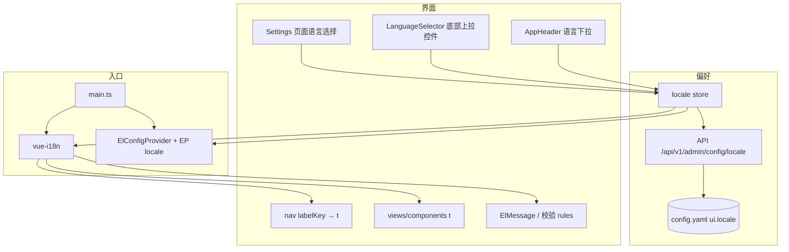
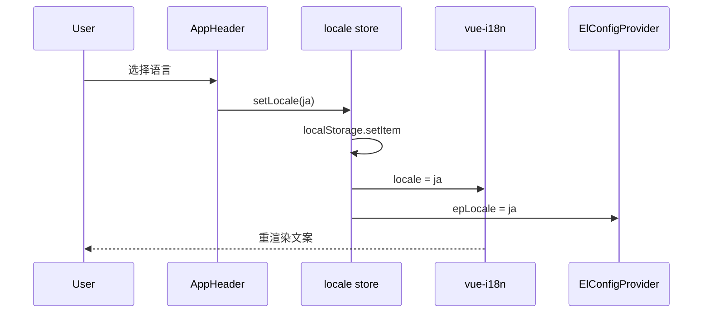

# 技术方案 — i18n-github-promo（国际化与 GitHub 推广）

> 版本：v0.3.0 | 日期：2026-07-24 | 作者：AI  
> 分支：`feature/v0.3.0`（自 `feature/v0.2.9`）  
> 关联参考：[cc-switch](https://github.com/farion1231/cc-switch)、[opencodex](https://github.com/lidge-jun/opencodex)  
> 范围：`web/` 全量 UI 多语言 + 根目录多语言 README（简洁推广页）

---

## 1. 背景与目标

### 1.1 问题描述

Centag 面向 GitHub 开源推广时存在两道门槛：

1. **仓库首页难读**：根 `README.md` 以中文运维细节为主（目录树、发行版分支约定、sudo 权限说明），缺少「30 秒看懂用途 → 一键安装 → 截图 → 支持」的推广结构；无多语言入口。
2. **管理端仅中文**：`web/`（约 67 个 Vue 文件）硬编码中文，无 `vue-i18n`；Element Plus 未挂 locale（内置控件偏英文），与页面中文混杂；无语言偏好持久化。

参考项目形态：

| 项目 | README | UI i18n |
|------|--------|---------|
| cc-switch | 英文主 README + `README_ZH/JA/DE`；首屏：一句话价值 + 截图 + Quick Start | react-i18next（zh/zh-TW/en/ja） |
| opencodex | 英文主 README + `README.zh-CN/ja/ko/ru`；首屏：一句话 + 架构图 + `npm install` | GUI 独立 |

### 1.2 目标

| # | 目标 | 验收口径 |
|---|------|----------|
| G1 | **全 UI 多语言** | 所有可路由页面、导航、布局壳、常用 ElMessage/校验文案可切换；覆盖 6 语种 |
| G2 | **语言可切换可持久化** | Header 语言切换；`localStorage` 记忆；与 Element Plus / dayjs locale 同步 |
| G3 | **README 推广化** | 英文 `README.md` 首屏简洁：**安装方法须在首页显眼位置**（标题/一句话之后立刻给出，不可藏到文末）；用途一句话 + 安装命令 + 截图 + 语言链接 + Support；细节下沉链接 |
| G4 | **README 多语言文件齐全** | `README.md`(en) + `README.zh-CN.md` + `README.ja.md` + `README.ko.md` + `README.ru.md` + `README.es.md` 互相链接 |
| G5 | **截图资产** | `docs/assets/readme/` 至少 2 张 UI 截图（Dashboard / Agent 接入或 Backend），中英环境各可选用 |
| G6 | **Team 版介绍** | README 简述团队版能力（实现在 [`centag-pro`](https://github.com/atoml-ai/centag-pro)）；**不展开安装/源码细节**；更多详情与合作统一引导至 `centag@atoml.com` |

### 1.3 非目标

- **不做** 后端 Go 运行时错误消息 / API 错误体的服务端 i18n（管理端展示侧可本地映射常见码；本版不改 Gin 消息体系）。
- **不做** `docs/guide/`、`docs/api/`、Harness 文档的全量翻译（仅 README + WebUI）。
- **不做** 官方独立营销站 / docs-site（可后续）。
- **不做** 赞助商表格、Trendshift 等运营位（README 保持干净）。
- **不做** RTL 布局、无障碍（a11y）专项。
- **不重构** 导航/能力矩阵业务逻辑；仅把 label/title 抽为 key。
- **不改变** 代理协议、计费、Pipeline 行为。
- **不在本仓 README 展开** Team 版安装步骤、构建命令或 `centag-pro` 源码结构；仅功能卖点 + 联系邮箱。

---

## 2. 方案选型

### 2.1 UI i18n 候选

| 方案 | 优点 | 缺点 | 推荐 |
|------|------|------|------|
| A. `vue-i18n` + JSON/YAML 分语言包 | Vue 生态标准；Composition API；与 Element Plus 常见集成 | 首次需全量抽文案 | ⭐ |
| B. 自研 `t()` + 手写 map | 无新依赖 | 缺复数/插值/懒加载；维护差 | |
| C. 仅浏览器翻译扩展 | 零开发 | 不可控、GitHub 推广无效 | |

### 2.2 文案组织候选

| 方案 | 优点 | 缺点 | 推荐 |
|------|------|------|------|
| A. 按域拆分：`locales/<lang>/{common,nav,views/...}.json` + 合并 | 可并行、冲突少 | 需 index 合并 | ⭐ |
| B. 单文件 `locales/<lang>.json` | 简单 | 6 语 × 大文件难审 | |
| C. 组件旁 `.i18n.ts` | 局部清晰 | 全局检索/补齐语言难 | |

### 2.3 README 结构候选

| 方案 | 优点 | 缺点 | 推荐 |
|------|------|------|------|
| A. 英文主 README 极简 + 6 语平行文件（用户确认） | 对齐参考项目；推广友好 | 多文件需同步结构 | ⭐ |
| B. 单 README + 折叠多语言段落 | 少文件 | GitHub 首屏冗长 | |

### 2.4 选定方案

1. **UI**：引入 `vue-i18n`（Composition API，`legacy: false`）。
2. **语言包**：`web/src/locales/<locale>/*.json`，入口 `index.ts` 合并；首期 6 locale：`en` / `zh-CN` / `ja` / `ko` / `ru` / `es`。
3. **组件库**：`ElConfigProvider` 绑定 Element Plus 对应 locale；`dayjs.locale` 同步。
4. **偏好**：`localStorage` key `centag.locale`；缺省：`navigator.language` 映射，未命中则 `en`（GitHub 默认受众）。
5. **README**：根目录英文 `README.md` + 五份平行语言文件；共享截图目录 `docs/assets/readme/`。

---

## 3. 详细设计

### 3.1 接口设计

本需求**不新增**面向 Agent 的业务 API（遵守 `AGENTS.md` §2）。

| 类型 | 变更 |
|------|------|
| HTTP API | 新增 `/api/v1/admin/config/locale` 读写接口（GET/PUT） |
| 配置文件 | `config/secrets/config.yaml` 新增 `ui.locale` 字段 |
| 前端偏好 | 从后端配置文件读写，不再使用 localStorage |

语言切换需后端 round-trip 保存到配置文件，启动时从配置文件加载。

### 3.2 数据模型

**配置文件变更**（`config/secrets/config.yaml`）：

```yaml
ui:
  locale: "en"  # 默认值；支持: en, zh-CN, ja, ko, ru, es
```

**后端 API**：

| 接口 | 方法 | 说明 |
|------|------|------|
| `/api/v1/admin/config/locale` | GET | 获取当前语言设置 |
| `/api/v1/admin/config/locale` | PUT | 保存语言设置 |

**前端状态**（`stores/locale.ts`）：

```ts
type AppLocale = 'en' | 'zh-CN' | 'ja' | 'ko' | 'ru' | 'es'

// 从后端 API 读写配置
// pinia: locale + setLocale(next) → i18n.global.locale + Element Plus + dayjs + document.documentElement.lang
```

**启动时自动检测逻辑**：

1. 优先级：配置文件 `ui.locale` > 浏览器语言 `navigator.language` > 默认 `en`
2. 配置文件存在且有效 → 使用配置值
3. 配置文件不存在或无效 → 检查 `navigator.language` 映射
4. 映射无匹配 → 使用默认 `en`

浏览器语言映射：

| `navigator.language` | 映射 |
|----------------------|------|
| `zh*` | `zh-CN` |
| `ja*` | `ja` |
| `ko*` | `ko` |
| `ru*` | `ru` |
| `es*` | `es` |
| 其它 | `en` |

### 3.3 模块影响

| 区域 | 变更 |
|------|------|
| `web/package.json` | 依赖 `vue-i18n` |
| `web/src/main.ts` | `app.use(i18n)`；可选包一层 `ElConfigProvider`（或在 `App.vue`/`WebLayout`） |
| `web/src/locales/**` | 新建 6 语语言包 |
| `web/src/i18n/` | `createI18n`、locale 切换工具、Element Plus locale map |
| `web/src/views/**`、`components/**` | 硬编码文案 → `t('key')` / `<i18n-t>` |
| `web/src/utils/nav/**` | label 改为 i18n key（如 `nav.backends`），渲染时 `t(item.labelKey)` |
| `web/src/router/index.ts` | `meta.titleKey`；`afterEach` 用 `t(titleKey)` 设 `document.title` |
| `web/src/stores/locale.ts` | 新建 locale store，从后端 API 读写配置 |
| `web/src/components/layout/AppHeader.vue` | 语言下拉 |
| `web/src/components/LanguageSelector.vue` | **新增**：页面底部上拉控件语言选择器 |
| `web/src/views/Settings.vue` | **新增**：系统设置页面语言选择 |
| `web/src/utils/format.ts` | dayjs locale 随切换更新 |
| `internal/server/router.go` | **新增**：`/api/v1/admin/config/locale` 路由 |
| `internal/handler/admin.go` | **新增**：locale 读写 handler |
| `internal/config/config.go` | **新增**：`UI.Locale` 配置字段 |
| 根 `README.md` + `README.*.md` | 重写 / 新增 |
| `docs/assets/readme/` | 截图 PNG |
| `docs/versions/README.md` | 索引增加 v0.3.0 |

**发行版**：minimal / personal / team 共用同一 `web/` 构建产物；语言包打进前端 bundle（首期不做按语言懒加载拆包，避免复杂度；若体积明显膨胀可二期 `import()`）。

### 3.4 UI i18n 实施分层



**Key 命名约定**（强制）：

```
common.*          # 通用：保存、取消、删除、加载中…
nav.*             # 顶栏导航
layout.*          # Header / StatusBar / LiveLog
auth.login.*      # 登录
dashboard.*       # 概览
backends.*        # 后端
agentSetup.*      # Agent 接入
…                 # 每路由一域，camelCase 域前缀
errors.*          # 前端可映射的常见错误提示
```

插值：`t('backends.deleteConfirm', { name })`；禁止拼接半截翻译句。

**覆盖优先级（实现顺序）**：

1. P0：`i18n` 基建 + Header 切换 + `common`/`nav`/`layout`/`auth`/`dashboard`
2. P1：其余全部 `views/` + 高频 `components/`
3. P2：长文案（Pipeline 编辑器提示、帮助气泡）、表格空状态、图表坐标轴

**「所有 UI 页面」定义**：`router` 中可到达的每个页面标题、页内用户可见标签/按钮/空状态/表单校验/ElMessage；调试用 console 与代码注释不翻译。

**Team 包路由**：`teamPackRoutes` 若在本仓为 stub，仅翻译 stub 可见文案；pro 仓页面在 pro 侧跟进（本方案在决策日志注明）。

### 3.5 Element Plus / dayjs 同步

```ts
const epLocaleMap = {
  en: enEp,
  'zh-CN': zhCnEp,
  ja: jaEp,
  ko: koEp,
  ru: ruEp,
  es: esEp,
}
```

切换语言时同步：

1. `i18n.global.locale.value = locale`
2. `appStore` / provider 的 `epLocale` 更新（触发 `ElConfigProvider`）
3. `dayjs.locale(dayjsMap[locale])`
4. `document.documentElement.lang = locale`

### 3.6 README 信息架构（各语言文件同构）

根 `README.md`（English）建议章节（**保持短**）：

1. **Title + one-liner**（What Centag is）
2. **Language switcher** 链接到各 `README.*.md`
3. **Badges**（可选：license / release / go version）
4. **Install（强制置顶、显眼）** — 用户确认：首页显眼位置必须写明安装方法  
   - 主推一条可复制命令（推荐 `install.sh` 一键安装），代码块紧贴标题区下方  
   - 次行可选：`npm` / `npx` 一行备选  
   - 安装后：`centag` → 打开 `http://localhost:20060`  
   - **禁止**把安装说明只放在文末、折叠块或外链深处；故障长文（sudo/EACCES）仍下沉链接  
5. **Why Centag**（3–5 条 bullet，非长文）
6. **Screenshots**（1–2 张表格/并排）
7. **Editions**（minimal / personal 开源一行；**Team 单独短节**，见下）
8. **Team（commercial）** — 用户确认：只介绍能力，引导商务联系  
   - 说明 Team 在私有仓 `centag-pro` 交付，不在本开源仓提供完整构建  
   - **功能要点**（短 bullet，六语同构；文案可按现有产品能力微调，避免夸大）：  
     - 多用户 / 组织与权限（团队协同）  
     - 用量、计费与成本可视（团队治理）  
     - 企业向运维与策略能力（相对 personal 的增强面）  
   - 收尾固定句式（各语言翻译）：  
     > For more details or partnership inquiries, contact **centag@atoml.com**.  
   - **禁止**：贴 Team 安装脚本、pro 克隆步骤、价格表、长篇对比矩阵  
9. **Documentation**（链到 `docs/`、关键 guide）
10. **Support**（Issues / Discussions；商务/Team → `centag@atoml.com`）
11. **License**

> **首屏约束**：打开 GitHub 仓库默认 README 时，无需滚动（或仅极少滚动）即可看到「安装命令」代码块。六语平行文件同构，安装块位置一致。

明确从首页**移出或折叠为链接**的内容：

- 完整目录树 → `docs/` 或保留极简树
- `sudo` / `EACCES` 长说明 → `apps/centag-npm/README.md`（安装主命令仍留在首页）
- 启动器全部 flag → `apps/launcher/README.md`
- 发版 skill 链接可留一行

平行文件命名（与 opencodex 风格一致）：

| 文件 | 语言 |
|------|------|
| `README.md` | English（默认） |
| `README.zh-CN.md` | 简体中文 |
| `README.ja.md` | 日本語 |
| `README.ko.md` | 한국어 |
| `README.ru.md` | Русский |
| `README.es.md` | Español |

各文件顶部互链：

```markdown
English | [简体中文](README.zh-CN.md) | [日本語](README.ja.md) | [한국어](README.ko.md) | [Русский](README.ru.md) | [Español](README.es.md)
```

截图路径统一：`docs/assets/readme/dashboard.png`、`docs/assets/readme/agent-setup.png`（文件名语言无关；UI 语言以英文截图为主利于 GitHub 默认页，可另附 `*-zh.png` 若需要）。

### 3.7 流程图（可选）



---

## 4. 兼容性与迁移

| 项 | 策略 |
|----|------|
| 已有用户 | 无配置文件 → 按浏览器语言映射；中文环境仍默认中文 |
| 旧 README 中文读者 | `README.zh-CN.md` 承接原中文内容的精简版；细节链回 docs |
| 书签 / 外链 | 根 `README.md` URL 不变（内容变英文） |
| 发行版静态资源 | 重建 frontend 后随 `static/` 发布；无 DB 迁移 |
| centag-pro | Team 专属页面若在 pro 仓，需同分支跟进 i18n（本仓 team stub 只保证不崩） |

回滚：去掉 `vue-i18n` 依赖并恢复硬编码成本高；以 Git 分支回滚为准。语言包缺失 key 时 vue-i18n fallback 到 `en`，避免空白。

---

## 5. 风险与应对（方案级）

| 风险 | 影响 | 概率 | 应对策略 |
|------|------|------|---------|
| 文案量大导致漏翻 / 漏抽 key | 页面中英混杂 | 高 | 分域语言包 + CI/脚本检查「模板残留中日韩」；fallback `en` |
| 6 语翻译质量不齐 | 推广观感差 | 中 | en/zh-CN 人工精修；ja/ko/ru/es 可用 AI 初译 + 抽检；标注「community translations welcome」 |
| README 6 份不同步 | 安装命令过期 | 中 | 规定「结构同构、命令以 en 为准同步」；Step 2 拆同步检查任务 |
| Bundle 体积增大 | 弱网加载 | 低 | 首期全量打包；超阈值再懒加载 |
| 导航自测 `nav.selftest` 依赖中文 | 测试红 | 中 | 改为断言 key 或 `t()` 结果可配置 locale |

详细开发风险见同目录 `开发风险评估.md`。

---

## 6. 附录

### 6.1 已确认产品决策

| # | 决策 |
|---|------|
| 1 | 分支：`feature/v0.3.0` ← `feature/v0.2.9` |
| 2 | 语言：en, zh-CN, ja, ko, ru, es |
| 3 | README：英文默认；**所有语言均另开文件** |
| 4 | 需求目录：`docs/versions/v0.3.0/i18n-github-promo/` |
| 5 | README **首页显眼位置必须写明安装方法**（Install 紧贴标题区；六语同构） |
| 6 | README 增加 **Team 版简介**（功能卖点 only；实现在 centag-pro；详情/合作 → `centag@atoml.com`） |
| 7 | **语言配置保存到配置文件**（`config/secrets/config.yaml` 的 `ui.locale` 字段），非 localStorage |
| 8 | **页面底部语言选择器**：上拉控件，方便用户快速切换语言 |
| 9 | **系统设置页面语言选择**：在 Settings 页面提供语言配置选项 |
| 10 | **启动时自动检测**：优先配置文件 → 浏览器语言 → 默认 `en` |

### 6.2 参考

- cc-switch README 结构与 `locales/`
- opencodex 多语言 README 命名与极简首屏
- Element Plus 多语言：https://element-plus.org/en-US/guide/i18n.html
- vue-i18n：https://vue-i18n.intlify.dev/

### 6.3 建议验收清单（供 Step 2/4）

- [ ] 6 种语言均可从 Header 切换且刷新后保持
- [ ] 页面底部语言选择器可正常切换语言
- [ ] 系统设置页面语言选择可正常工作
- [ ] 语言选择保存到配置文件，重启后保持
- [ ] 启动时自动检测浏览器语言并设置（无配置文件时）
- [ ] Login / Dashboard / Backends / Agent Setup / Profile 抽检无硬编码中文（在 `en` 下）
- [ ] Element Plus 分页/日期文案随语言变化
- [ ] 根 README 英文首屏可在一屏内理解用途与安装
- [ ] Install 代码块位于标题/语言切换之后、Why/截图之前（六语文件位置一致）
- [ ] Team 节含功能要点 + `centag@atoml.com`，无安装/构建细节
- [ ] 6 个 README 文件顶部互链可点
- [ ] `npm run lint:ci` 与既有 `test:ui-caps` / nav selftest 通过
