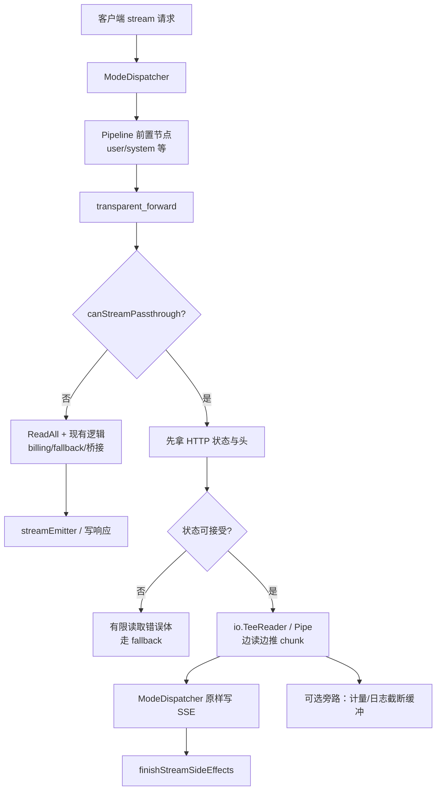
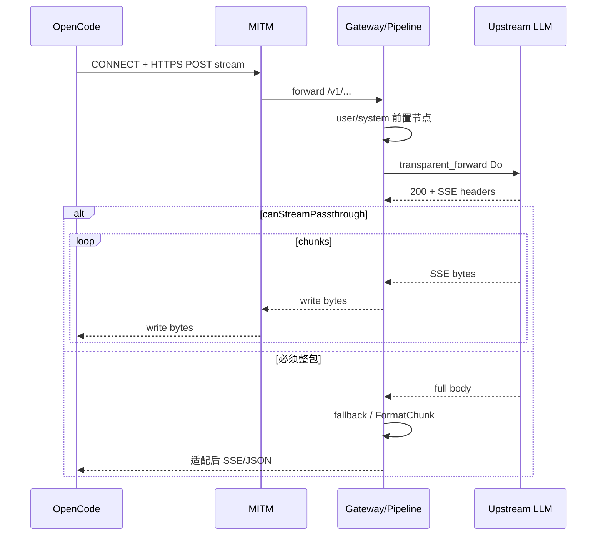

# 技术方案方案 — 条件流式透传与内存治理

> **状态：⏸ 搁置（SHELVED）— 2026-07-25**  
> **禁止**自动进入 Step 2/3 编码或当作当前迭代任务执行。仅保留方案备查；重新启动须用户明确指令（如「恢复 conditional-stream-passthrough」）。

> 版本：v0.3.1 | 日期：2026-07-25 | 作者：AI  
> 分支：`feature/v0.3.1`（或后续发布列车分支）  
> 触发场景：`centag wrap run -- opencode` 经 MITM → Centag 代理完成大型长时任务时，进程内存与系统响应逐渐恶化

## 1. 背景与目标

### 1.1 问题描述

用户通过 **wrap** 启动 OpenCode，流量路径为：

```
OpenCode --HTTPS_PROXY--> Centag MITM(:8081) --> Centag Gateway(:20060) --> 上游 LLM
```

`wrap` 本身只注入环境变量并 `exec` 子进程，**不驻留转发**；半小时级大型任务后系统变慢，静态排查结论如下。

#### 根因 A（内存尖峰，主因）— 流式响应被整包缓冲

引擎契约（见 `docs/guide/mode-behavior-matrix.md`）：

> 引擎内部所有节点统一非流式执行，由顶层 `StreamAdapter` 按 `req.Stream` 决定是否分块。

透明/直连出站节点实现为：

| 环节 | 现状 | 后果 |
|------|------|------|
| `transparent_forward` | `io.ReadAll(resp.Body)` 读完整个上游响应 | 长 SSE 全进堆 |
| `attachTransparentRequestMetadata` | `raw_request_body` 再存一份 `string(bodyBytes)` | 大上下文请求体多份拷贝 |
| `streamEmitter` / ModeDispatcher | 节点结束后才向客户端写出 | 峰值 ≈ 请求体×N + 完整 SSE×M，多轮并发叠加 |
| `controlledHTTPClient` | SSE 的 `ContentLength` 常为 `-1`，无 `LimitReader` | 响应体积无硬上限 |

OpenCode 长会话中，messages / tools / 历史工具结果线性增长；每轮再缓冲完整回答 → RSS 阶梯上涨、GC 停顿变长，体感「越来越慢」。

#### 根因 B（CPU / GC 压力）— MITM 每次握手重签证书

| 环节 | 现状 |
|------|------|
| `cert.GenerateCertForDomain` | 注释写「不用缓存」，每次 `rsa.GenerateKey(2048)` |
| `mitm.GetCertificate` | 每次 CONNECT/TLS 握手都调用生成 |
| `certCache` | 只存公钥证书、不存私钥，**无法复用握手证书** |

wrap 下 Agent 全量 HTTPS 走代理，CONNECT 频繁 → 半小时内大量密钥生成，CPU 与临时分配抬升。

#### 根因 C（连接池碎片）— 每请求新建 Transport

| 位置 | 现状 |
|------|------|
| `mitm.forwardToBackend` / `forwardToOriginal` | 每次 `&http.Client{Transport: &http.Transport{...}}` |
| `capability_broker.controlledHTTPClient.Do` | 每次 `gatewayEgressTransport` Clone |

空闲连接挂在即将丢弃的 Transport 上，依赖 GC 回收，高并发下表现为内存锯齿。

#### 已排除 / 次要

- **wrap 进程**：无常驻缓冲，不是泄漏源。
- **AccountPool sticky `sessions`**：只增不删（中危，本方案可顺带 TTL，非主线）。
- **OpenCode 自身上下文增长**：客户端也会涨内存，需与网关分开观测；本方案只治理 Centag 侧。

### 1.2 目标

| # | 目标 | 验收要点 |
|---|------|----------|
| G1 | **条件流式透传**：对「可透传」出站路径，上游 SSE 边读边写客户端，禁止整包 `ReadAll` | wrap + OpenCode `#t/#tf`（及符合条件的 `#d`）长流式：网关峰值堆显著下降；首 token 延迟下降 |
| G2 | **失败语义可预期**：4xx/5xx 与「尚未写出 body」的错误仍可走现有计费降级 / Fallback；一旦开始透传写出则不再无感换模 | 契约单测 + 手工场景覆盖 |
| G3 | **MITM 证书复用**：按 SNI 缓存完整 `tls.Certificate`（含私钥） | 同域名二次握手不再 `GenerateKey` |
| G4 | **共享出站 Transport**：MITM 与 CapabilityBroker 使用进程级复用客户端 | 无 per-request Transport；空闲连接受 `MaxIdleConns`/`IdleConnTimeout` 约束 |
| G5 | **可观测**：提供 heap/goroutine 观测手段（pprof 或等价），便于复现半小时任务 | 文档给出采样步骤；可选配置开关 |
| G6 | **默认兼容**：未命中流式透传条件时行为与现状一致 | 回归：Responses 桥接、billing fallback、后处理节点、非流式 JSON |

### 1.3 非目标

- **不做**全引擎、全模式真流式（审核 / 翻译 / 优化 / 聚合等仍可整包）。
- **不做** OpenCode `/v1/responses` 的完整「边读边 FormatChunk」重写（本阶段对该路径**保持缓冲**或明确标记后续 Phase）。
- **不改变**对外协议路径（仍为 `/v1/chat/completions`、`/v1/messages`、`/v1/responses` 等）。
- **不把**流式逻辑塞进 HTTP 中间件硬编码垂直分支；判定落在 pipeline 出站节点 + ModeDispatcher 写出口。
- **不治理** OpenCode / Node 客户端进程内存。
- **不**在本方案内做跨租户限流产品化（可另开需求）；仅允许出站 `LimitReader` / 配置上限作为防护。

---

## 2. 方案选型

### 2.1 候选方案对比

| 方案 | 优点 | 缺点 | 推荐 |
|------|------|------|------|
| A. 仅修证书缓存 + 共享 Transport | 改动小、风险低、立刻缓解「变慢」 | **不解决** SSE 整包缓冲的内存尖峰 | 作为 Phase 0 必做 |
| B. 全引擎节点真流式 | 架构彻底 | 破坏 Fallback / 后处理 / Responses 桥接；排期与回归巨大 | |
| C. **条件流式透传** + Phase 0 基础设施 | 对准主因；业务风险可控；可开关回滚 | 需清晰准入条件与双路径测试 | ⭐ |
| D. 仅加大机器 / 调 GOGC | 无代码成本 | 不治本；长任务仍会顶满 | |

### 2.2 选定方案

采用 **方案 C（主）+ 方案 A（Phase 0）**：

1. **Phase 0（基础设施）**：证书复用、共享 Transport、可选 pprof —— 低风险，先落地。
2. **Phase 1（条件流式透传）**：仅当请求满足「可透传流式」谓词时，出站节点以流式管道把上游 body 推到 ModeDispatcher；否则保持今日整包语义。
3. **Phase 2（可选增强）**：Responses 流式桥接、sticky session TTL、CONNECT 多请求复用 —— 单独评估，不阻塞 G1–G4。

**选择理由**：用最小业务风险换最大内存收益；与现有「节点非流式 + 顶层适配」契约兼容——只在**最后出站且可透传**处打开真流式旁路，而不是推翻整条流水线。

---

## 3. 详细设计

### 3.1 条件谓词（何时走真流式）

同时满足才进入流式透传路径（名称可实现为 `canStreamPassthrough`）：

| 条件 | 说明 |
|------|------|
| 客户端 `stream=true` | 非流式仍整包 |
| 出站节点为 `transparent_forward`（或未来显式标记 `supports_stream_passthrough`） | generator / processor 链默认不进入 |
| 将产出 `raw_passthrough=true` 的语义 | 透明 `#t/#tf`、跳板 `#j`；直连 `#d` 在**未**做 Responses 桥接且策略允许时可选开启 |
| **非** `responses_to_chat` | `/v1/responses` → chat 上游再 FormatChunk：**本阶段整包** |
| 流水线末端无「必须见全文」的强制后处理 | 若配置了 `output_post_ops.stream_mode=buffer` 或审核等，则整包；`skip` 可流式 |
| 上游响应：HTTP 2xx 且 `Content-Type` 含 `event-stream`（或体前缀像 SSE） | 否则按错误/JSON 整包（有限 `LimitReader`）处理 |

不满足任一条件 → **完全保持现状**（`ReadAll` + 现有 fallback / FormatChunk）。

### 3.2 总体数据流



### 3.3 模块影响

| 模块 | 变更 |
|------|------|
| `core/pkg/pipeline/transparent_forward_node.go` | 增加流式 Execute 分支；错误路径保留有限缓冲；成功 SSE 通过 channel / 回调推送 |
| `core/pkg/pipeline/engine.go` | 流式执行路径识别「节点流式输出」：允许在节点执行期间向 `resultCh` 推 raw SSE 片段，而不仅在全部节点结束后 `streamEmitter` |
| `core/internal/proxy/mode_dispatcher.go` | `writeStreamResponse`：消费 raw passthrough 流；避免再把完整 Content 二次 Adapt |
| `core/pkg/pipeline/capability_broker.go` | 进程级共享 `http.Transport`；`Do` 不再每次 Clone |
| `core/internal/mitm/mitm_server.go` | 共享 `http.Client`；可选：流式透传时 MITM 已是 `io.Copy`（保持） |
| `core/internal/cert/cert_manager.go` | `map[string]*tls.Certificate`（含私钥）缓存；命中直接返回；可选上限 + TTL |
| `core/pkg/server` 或 bootstrap | 可选注册 `net/http/pprof`（配置开关，默认关或仅 loopback） |
| 文档 | `docs/guide/proxy-modes.md` / `mode-behavior-matrix.md` 增补「条件流式透传」语义 |

### 3.4 接口与配置设计

**对外 HTTP API**：无新增业务路由。

**配置项（建议，均可默认安全值）**：

| 配置键（示意） | 默认 | 含义 |
|----------------|------|------|
| `pipeline.stream_passthrough.enabled` | `true`（或先 `false` 灰度） | 总开关 |
| `pipeline.stream_passthrough.modes` | `transparent-proxy,transparent-fast,fixed-egress` | 允许的代理模式 |
| `pipeline.stream_passthrough.max_error_body_bytes` | `64KiB` | 错误体读取上限 |
| `pipeline.stream_passthrough.tee_usage_max_bytes` | `256KiB` 或 `0` | 旁路计量缓冲上限；`0` 表示不 tee 全文 |
| `mitm.cert_cache_ttl` / `max_entries` | 24h / 1024 | 证书缓存 |
| `server.pprof.enabled` / `addr` | `false` | 观测 |

节点级可选（`custom_config`）：

```yaml
# transparent_forward
stream_passthrough: auto   # auto | force | never
```

- `auto`：走全局谓词  
- `force`：在仍满足安全约束（非 responses 桥接等）时强制尝试  
- `never`：始终整包（调试 / 兼容）

### 3.5 数据模型

- **无**数据库表变更。
- 运行时新增：
  - `tlsCertCache map[string]cachedCert`（内存）
  - 可选：`PipelineStreamResult` 扩展字段，如 `RawSSE []byte` / `RawSSEReader` 标记，与现有 `Chunk` 互斥。

### 3.6 关键语义细则

#### 3.6.1 何时仍必须整包

1. HTTP 状态 ≥ 400，或计费/额度失败检测需要 body。  
2. `responses_to_chat == true`。  
3. 需要 `FormatChunk` 重包（非 raw passthrough）。  
4. 下游节点声明需要完整 `Content`（`output_post_ops.stream_mode=buffer`、audit 等）。  
5. 总开关关闭或模式不在白名单。

#### 3.6.2 一旦开始向客户端写 SSE

- **禁止**再切换后端无感重试（避免半截双流）。  
- 上游中途断开：结束 SSE（可选 trailer / 最后 error event，与现网行为对齐）。  
- 计量：优先用响应头 / 最后 usage 事件；tee 缓冲有上限，超限则 usage 降级为「未知/仅 header」。

#### 3.6.3 与 Prompt Strategy（同版本其它需求）关系

- `user_prompt_ops` / system 策略在**出站前**改写 `raw_request_body`，与本方案正交。  
- `output_post_ops`：`stream_mode=skip` 与流式透传兼容；`buffer` 则禁用透传流式。

### 3.7 Phase 0 详细要点（证书与 Transport）

**证书缓存伪代码语义**：

```text
GetCertificate(SNI):
  if cert, ok := cache.Get(SNI); ok && !expired(cert) { return cert }
  cert = GenerateNew(SNI)           // 含 privkey
  cache.Set(SNI, cert)
  return cert
```

**共享 Transport**：

- MITM：`Server` 持有 `backendClient` / `directClient`（`Proxy: nil`）。  
- Broker：`DefaultCapabilityBroker` 持有 `egressTransport`，`controlledHTTPClient.Do` 复用。  
- 参数：`MaxIdleConns`、`MaxIdleConnsPerHost`、`IdleConnTimeout` 可配置。

### 3.8 测试计划（方案级）

| 类型 | 用例要点 |
|------|----------|
| 单元 | `canStreamPassthrough` 真值表；证书缓存命中不再 GenerateKey（可 hook）；Transport 单例 |
| 单元 | 流式透传：上游分块 SSE → 客户端按序收到；中途 cancel 不泄漏 goroutine |
| 单元 | 4xx + 计费关键词仍触发 billing fallback（整包路径） |
| 契约 | `#t` stream + chat completions；`#d` + responses 仍走桥接（非整包破坏） |
| 手工 | wrap + OpenCode 长任务 15–30min：采样 RSS / pprof heap，对比开关前后 |

### 3.9 流程图（写路径）



---

## 4. 兼容性与迁移

| 项 | 策略 |
|----|------|
| 默认行为 | 建议先 `enabled=false` 或仅 personal 默认开；Team 灰度 |
| 旧客户端 | 无协议变更；仅网关内部是否缓冲变化 |
| 存量流水线模板 | 无需强制改 YAML；谓词基于模式与 metadata |
| 回滚 | 关 `stream_passthrough.enabled` + 发版回退；证书/Transport 改动可独立保留 |
| 文档 | 更新 mode 行为矩阵「流式」列：区分「假流式（整包再切）」与「条件真流式」 |

---

## 5. 风险与应对

> **方案级**风险摘要。开发实现风险另见同目录 `开发风险评估.md`（Step 1 强制环节，本文件落盘后补齐）。

| 风险 | 影响 | 概率 | 应对策略 |
|------|------|------|----------|
| 流式已写出后无法换模 | 计费失败时客户端看到中断而非静默换后端 | 中 | 仅 2xx+SSE 才开始写；错误体仍整包；文档声明语义 |
| 谓词误判进入流式 | 后处理/桥接失效 | 中 | 真值表单测；`responses_to_chat` 硬排除；默认白名单模式 |
| tee 计量不准 | usage 报表偏差 | 中 | 上限截断 + 优先解析末包 usage；监控告警 |
| 证书缓存密钥驻留内存 | 进程被 dump 时域名证书暴露面略增 | 低 | 缓存有上限；与现「每次生成」比可接受；不落盘私钥到新路径（可选停磁盘写） |
| 引擎双路径复杂度 | 维护成本 | 中 | 集中谓词函数；禁止散落 if；契约测试锁行为 |
| 与 prompt-strategy 同车发布冲突 | 合并冲突 / 回归 | 中 | 模块边界清晰（出站流 vs 策略算子）；共享回归集 |

---

## 6. 分期落地

| 阶段 | 内容 | 对应目标 | 建议顺序 |
|------|------|----------|----------|
| Phase 0 | 证书缓存、共享 Transport、pprof 开关 | G3 G4 G5 | 先做 |
| Phase 1 | `canStreamPassthrough` + transparent_forward 流式旁路 + ModeDispatcher 消费 | G1 G2 G6 | 主交付 |
| Phase 2 | Responses 流式桥接、session TTL、CONNECT keep-alive | 增强 | 可选 |

---

## 7. 成功标准（摘要）

1. Phase 0 后：同 SNI 握手 CPU 显著下降（pprof 中 `rsa.GenerateKey` 占比下降）。  
2. Phase 1 后：透明模式长流式场景下，单请求网关堆不再持有完整 SSE；30 分钟 wrap+OpenCode 压测 RSS 增长斜率明显低于改造前。  
3. 回归：billing fallback、`/v1/responses` 桥接、非流式 JSON、后处理 buffer 路径行为与改造前一致（或文档记录的有意差异仅限「流式中途不可静默换模」）。

---

## 8. 附录

### 8.1 关键代码锚点（排查时）

| 主题 | 路径 |
|------|------|
| 整包读上游 | `core/pkg/pipeline/transparent_forward_node.go`（`io.ReadAll`） |
| 请求体元数据 | `core/internal/proxy/mode_dispatcher.go`（`attachTransparentRequestMetadata`） |
| 流式契约说明 | `docs/guide/mode-behavior-matrix.md` §流式行为 |
| 证书每次生成 | `core/internal/cert/cert_manager.go`（`GenerateCertForDomain`） |
| MITM 每请求 Transport | `core/internal/mitm/mitm_server.go`（`forwardToBackend`） |
| Broker 每请求 Clone | `core/pkg/pipeline/capability_broker.go`（`gatewayEgressTransport`） |
| wrap 仅注入环境 | `apps/wrap/internal/engine/run.go`（`Run` / `PrepareProcessEnv`） |

### 8.2 参考

- 本仓库代理模式：`docs/guide/proxy-modes.md`
- 流式解耦背景：`docs/exec-plans/active/2026-06-05-pipeline-stream-decoupling.md`（若仍存在）
- Go `http.Transport` 生命周期：未 `CloseIdleConnections` 的丢弃 Transport 会延迟回收空闲连接

### 8.3 决策待确认（人工）

| # | 议题 | 建议默认 |
|---|------|----------|
| D1 | 总开关默认开还是关？ | 先关，personal 可开；或 personal 默认开、team 默认关 |
| D2 | `#d` 直连是否纳入 Phase 1 白名单？ | Phase 1 仅 `#t/#tf/#j`；`#d` Phase 1.1 |
| D3 | Phase 1 是否包含 Responses 流式？ | **否**，整包保留 |
| D4 | pprof 默认是否仅 loopback？ | 是 |
