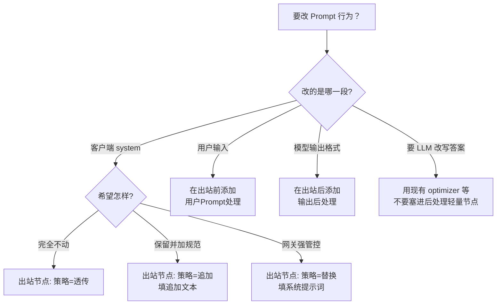

# Prompt 策略 — 前端配置操作说明

> 版本：v0.3.1 | 需求：prompt-strategy  
> 入口：Web 管理端 → **流水线 / 代理模式画布** → 点击节点打开 **节点配置** 抽屉  
> 对应实现预期：扩展现有 `NodeConfigDrawer`（今日已有「是否注入系统提示词」开关）

---

## 1. 你在配什么（一张总图）

请求在流水线里经过三段可配能力（不必每条流水线都开全）：

```text
客户端请求
    │
    ▼
┌─────────────────────┐
│ ① User 入站处理      │  ← 节点：用户 Prompt 处理
│ 检查 / 精简          │     （画布上放在出站节点「前面」）
└─────────┬───────────┘
          ▼
┌─────────────────────┐
│ ② System 策略        │  ← 配在：出站转发 / 生成器
│ 透传 / 追加 / 替换   │     （不单独占一个节点）
└─────────┬───────────┘
          ▼
┌─────────────────────┐
│ ③ 调用大模型         │  ← 出站转发 或 生成器
└─────────┬───────────┘
          ▼
┌─────────────────────┐
│ ④ Output 后处理      │  ← 节点：输出后处理
│ JSON 规范化等        │     （画布上放在出站节点「后面」）
└─────────┬───────────┘
          ▼
      返回客户端
```

| 配置对象 | 在画布上点谁 | 抽屉里看哪一块 |
|----------|--------------|----------------|
| System 策略 | **出站转发** 或 **生成器** | 「出站策略 / 模型与 Prompt」→ **System Prompt 策略** |
| User 入站 | **用户 Prompt 处理** 节点 | 「User 检查 / 优化」 |
| Output 后处理 | **输出后处理** 节点 | 「输出算子」 |

---

## 2. 推荐画布拓扑（三种常见用法）

### 2.1 只要改 System（最常见，改透明/直连）

```text
[ 出站转发 ] ──► 结束
     │
     └─ 抽屉里选：透传 / 追加 / 替换
```

对应今日：透明模式 ≈ 透传；直连模式 ≈ 替换。

### 2.2 企业规范：入站检查 + System 追加 + 输出 JSON

```text
[用户Prompt处理] ──► [出站转发/生成器] ──► [输出后处理]
       │                    │                    │
    检查/截断            策略=追加            抽 JSON
```

### 2.3 场景包（生成器）

```text
[用户Prompt处理] ──► [生成器] ──► [输出后处理] ──► …
                         │
                    System=替换或追加
```

---

## 3. 操作路径（逐步点哪里）

```text
首页 / 流水线列表
        │
        ▼
  打开某条流水线（画布编辑）
        │
        ├─► 需要 User/Output？ → 左侧/插件面板「添加节点」
        │         拖到出站节点前/后，连线
        │
        └─► 点击目标节点
                  │
                  ▼
           右侧「节点配置」抽屉
                  │
                  ├─ 改 System → 见 §4
                  ├─ 改 User   → 见 §5
                  └─ 改 Output → 见 §6
                  │
                  ▼
           点「保存」→ 流水线保存成功 → 下一请求生效
```

---

## 4. System Prompt 策略（出站转发 / 生成器）

### 4.1 界面示意

```text
┌─ 节点配置 ──────────────────────────────────────┐
│ 基本信息                                        │
│ …                                               │
│                                                 │
│ ▼ System Prompt 策略                            │
│                                                 │
│   策略  ○ 透传（不改客户端）                      │
│         ○ 追加（保留客户端 + 加尾巴）             │
│         ● 替换（用网关提示词覆盖）                 │
│                                                 │
│   ┌─ 策略=追加时显示 ─────────────────────────┐ │
│   │ 追加位置  [ 接在客户端 system 后面 ▾ ]     │ │
│   │ 追加文本                                   │ │
│   │ ┌─────────────────────────────────────┐   │ │
│   │ │ 输出使用中文。以标准 JSON 格式输出。  │   │ │
│   │ └─────────────────────────────────────┘   │ │
│   └───────────────────────────────────────────┘ │
│                                                 │
│   ┌─ 策略=替换时显示 ─────────────────────────┐ │
│   │ 系统提示词内容                             │ │
│   │ ┌─────────────────────────────────────┐   │ │
│   │ │ 你是企业知识助手……                    │ │ │
│   │ └─────────────────────────────────────┘   │ │
│   │ [人格预设 �助手……                    │ │ │
│   │ └─────────────────────────────────────┘   │ │
│   │ [人格预设 ▾]  [恢复默认]                   │ │
│   └───────────────────────────────────────────┘ │
│                                                 │
│                              [取消]  [保存]      │
└─────────────────────────────────────────────────┘
```

> 相对今日 UI：把「是否注入系统提示词」开关，升级为上面的 **三选一策略**。  
> 兼容：关注入 = 透传；开注入 = 替换。

### 4.2 怎么选（对照表）

| 你想要的效果 | 选 | 还要填什么 |
|--------------|----|------------|
| 客户端 system 原样进模型（透明代理） | **透传** | 不用填提示词 |
| 保留客户端角色设定，再加「用中文 / 出 JSON」 | **追加** | 填「追加文本」 |
| 完全用网关人格，丢掉客户端 system（直连管控） | **替换** | 填「系统提示词内容」 |

### 4.3 三分钟示例：追加「输出使用中文」

1. 画布点击 **出站转发**（或直连模板里的出站节点）。  
2. 策略选 **追加**。  
3. 追加位置保持默认「接在客户端 system 后面」。  
4. 追加文本粘贴：

```text
输出使用中文。
```

5. 保存流水线 → 用原客户端 system 再发一请求验证。

---

## 5. User 入站：用户 Prompt 处理节点

### 5.1 何时需要加这个节点

- 要拦/打码疑似密钥、敏感词  
- 要限制 user 过长、做空白折叠  

不需要则**不要加**（零开销）。

### 5.2 画布位置

```text
必须在「出站转发 / 生成器」之前：

  ✅  [用户Prompt处理] → [出站转发]
  ❌  [出站转发] → [用户Prompt处理]   （太晚，请求已发出）
```

### 5.3 界面示意

```text
┌─ 节点配置 · 用户 Prompt 处理 ───────────────────┐
│                                                 │
│ ▼ 检查                                          │
│   [✓] 启用检查                                  │
│   命中后动作  [ 打码脱敏 ▾ ]   ← log / 打码 / 拦截 │
│   敏感规则    （可选：词表 / 正则，高级可折叠）     │
│                                                 │
│ ▼ 优化（规则）                                   │
│   [✓] 启用优化                                  │
│   最大字符数  [ 32000 ]                          │
│   [✓] 折叠多余空白                               │
│                                                 │
│ ▼ 专用模型预处理（高级 / 后期）                   │
│   [ ] 启用          ← Phase A 灰色禁用或隐藏      │
│   说明：预留，有专用模型服务后再开                 │
│                                                 │
│                              [取消]  [保存]      │
└─────────────────────────────────────────────────┘
```

### 5.4 命中动作怎么选

| 动作 | 效果 | 建议 |
|------|------|------|
| 仅记录 | 只打日志，请求照常 | 试运行 |
| 打码脱敏 | 替换命中片段后再转发 | **默认推荐** |
| 拦截 | 不调后端，返回错误 | 强管控环境显式开启 |

---

## 6. Output：输出后处理节点

### 6.1 画布位置

```text
必须在「出站转发 / 生成器」之后：

  ✅  [出站转发] → [输出后处理]
  ❌  [输出后处理] → [出站转发]
```

### 6.2 界面示意

```text
┌─ 节点配置 · 输出后处理 ─────────────────────────┐
│                                                 │
│ ▼ 字符串算子（可多选）                            │
│   [✓] 去掉首尾空白                               │
│   [✓] 去掉 Markdown 代码围栏（```json）           │
│   [✓] 提取 JSON                                  │
│   [ ] 压缩 JSON（重新序列化）                     │
│                                                 │
│   JSON 无效时  ○ 原样放行  ○ 包一层错误对象        │
│                                                 │
│ ▼ 流式请求                                       │
│   ○ 跳过（默认，推荐）                            │
│   ○ 缓冲完整后再处理（有延迟）                     │
│                                                 │
│ ▼ 专用模型后处理（高级 / 后期）                   │
│   [ ] 启用          ← Phase A 占位                │
│                                                 │
│                              [取消]  [保存]      │
└─────────────────────────────────────────────────┘
```

### 6.3 和「优化模式 / 摘要插件」怎么区分

| 需求 | 用哪个 |
|------|--------|
| 只要合法 JSON、去掉 \`\`\` 围栏 | **输出后处理**（本说明 §6） |
| 要用大模型改写/摘要/翻译答案 | 画布另加 **optimizer / summarizer / translator** 节点 |

二者可串联：`生成 → 输出后处理 →（可选）摘要`。

---

## 7. 配置决策速查（流程图）



---

## 8. 与今日 UI 的对应（迁移心智）

| 今日（已有） | 升级后 |
|--------------|--------|
| 出站转发 · 开关「是否注入系统提示词」= 关 | 策略 = **透传** |
| 同上 = 开 + 填写提示词 | 策略 = **替换** |
| （无） | 策略 = **追加** + 追加文本 |
| （无独立节点） | 可选：**用户 Prompt 处理** / **输出后处理** |

保存方式不变：抽屉保存节点 → 画布保存流水线 → `PUT /api/v1/pipelines/:id` 热生效。

---

## 9. Phase A 前端范围（**必做**，实现时对照）

> Web 是 Phase A **验收入口**：无抽屉可配、无画布可挂节点，不得宣称本需求 Phase A 完成。

| 项 | Phase A | 说明 |
|----|---------|------|
| System 三选一 + 追加文本框 | ✅ **必做** | 替换现有布尔「是否注入」；兼容读写旧字段 |
| 用户 Prompt 处理：可添加节点 + 表单 | ✅ **必做** | 检查/优化基础项；保存进 pipeline |
| 输出后处理：可添加节点 + 表单 | ✅ **必做** | 算子多选；流式默认「跳过」 |
| i18n（至少 zh-CN / en） | ✅ **必做** | `nodeConfig` / 节点类型文案 |
| 专用模型预处理/后处理表单 | 占位 | 开关禁用 + 文案「后续版本」 |
| 独立「策略中心」全局页 | ❌ 不做 | 一律画布节点 / 出站配置抽屉 |

---

## 10. 验收时怎么点一遍（手工）

1. 打开 `direct-backend` 类流水线 → 出站节点 → 确认为 **替换**（或旧开关开启）。  
2. 改为 **追加**，追加「输出使用中文」→ 保存 → 客户端带自己的 system 请求 → 模型侧应同时看到两者意图。  
3. 在出站前加 **用户 Prompt 处理**，命中动作选「仅记录」→ 发带假密钥的 user → 日志有命中、请求仍成功。  
4. 在出站后加 **输出后处理**，勾选去围栏 + 提取 JSON → 非流式请求得到干净 JSON。  
5. 改回 **透传** → 行为回到透明代理。
